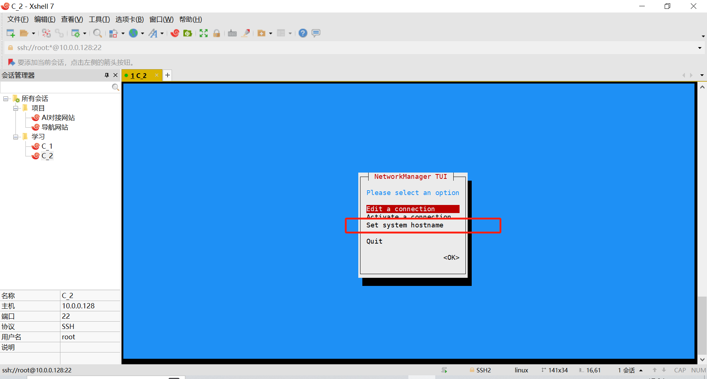

重要配置文件：
1. /etc/sysconfig/network-scripts/ifcfg-eth0：网卡配置文件

  ```bash
  [root@oldboy oldboy]# cat /etc/sysconfig/network-scripts/ifcfg-eth1
  HWADDR=00:0C:29:C4:6F:D9     #MAC地址 网卡的物理地址(网卡的一个标识)
  TYPE=Ethernet                 #以太网
  BOOTPROTO=none           #
  IPADDR=10.0.0.129        #IP地址
  PREFIX=24                #子网掩码
  GATEWAY=10.0.0.254       #网关
  DNS1=223.5.5.5           #DNS1 域名解析为IP。
  DNS2=202.106.0.20        #DNS2 域名解析为IP。
  NAME=eth1   #设备名
  UUID=cf363dd6-05ce-37d3-8caa-242f64883a8f #唯一标识
  ONBOOT=yes    #网卡随着linux开启启动
  ```

  

2. /etc/resolv.conf：Linux系统过时的DNS客户端配置文件
[root@oldboy oldboy]# cat /etc/resolv.conf 
# Generated by NetworkManager
nameserver 223.5.5.5
nameserver 202.106.0.20
重启网卡时候，网卡配置文件里的DNS设置会覆盖这里的设置。
配置客户端DNS有两种方法;
1.网卡配置文件里设置（优先）
2.直接在/etc/resolv.conf里配置（很容易被覆盖）

3. /etc/hostname：主机名配置文件
查主机名：
[root@oldboy ~]# hostname
oldboy
[root@oldboy ~]# uname -n
oldboy

修改主机名：
1.nmtui



2.hostnamectl set-hostname oldboy
3.vim /etc/hostname

4. /etc/hosts：系统本地的DNS解析文件(局域网  域名和IP解析文件)
10.0.0.129  oldboy
10.0.0.129  oldboy www.oldboyedu.com  www.baidu.com

内部测试，临时访问。服务器之间联系会用主机名的形式