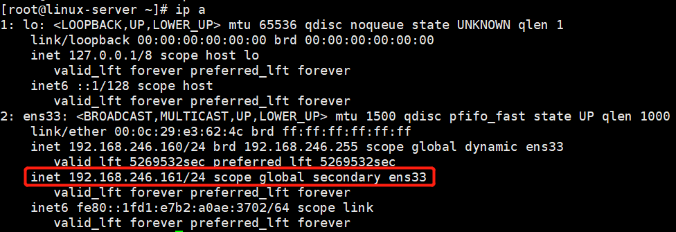
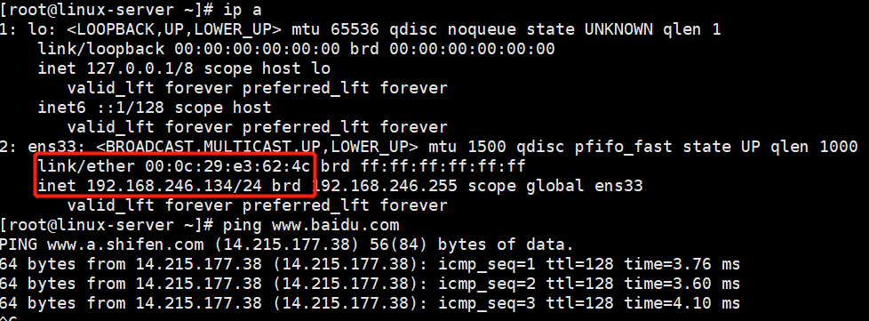
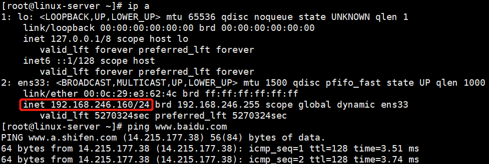
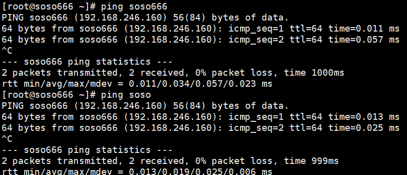

# Linux网络管理

## 1、网络管理概念

```shell
网络接口和名称 ：网卡
ip地址
网关
主机名称
路由
```

## 2、管理工具

```shell
net-tools:     #安装包
ifconfig  netstat  准备要废掉了。

iproute:    #安装包
ip  #提供ip命令
```

## 3、认识网卡

```shell
lo网卡 :本地回环网卡，本机上的服务自己访问自己时用的
#网卡里面信息
ip 地址
子网掩码
广播地址
mac地址
```

### 3.1、查看网卡

```shell
[root@linux-server ~]# ip a   #方式一
[root@linux-server ~]# ifconfig  #方式二
```

### 3.2、临时设置ip

`方式如下`

```shell
[root@linux-server ~]# ip a a 192.168.246.161/24 dev ens33
```



删除设置的临时ip

```shell
[root@linux-server ~]# 

add------添加
del------删除
```

启动关闭网卡

```shell
启动：
#ifconfig 网卡名  up  #方式一
#ifup  网卡名  #方式二
```

```shell
关闭网卡            
# ifconfig 网卡名 down  #方式一
# ifdown 网卡名   #方式二
```

## 4、网关

```shell
网关：网络的关卡：是为了访问其他网络。
```

### 4.1、静态路由和动态路由

路由器在转发数据时，需要先在路由表中查找相应的路由，有三种途径

> （1）直连路由：路由器自动添加和自己直连的路由
>
> （2）静态路由：管理员手动添加的路由
>
> （3）动态路由：由路由协议动态建立的路由

静态路由

> 缺点
> 	不能动态的反映网络拓扑，当网络发生变化的时候，管理员必须手动的改变路由
>
> 优点
> 	不会占用路由器太多的cpu和RAM资源，也不会占用太多带宽。

默认路由

>  (1) 实际上默认路由是一种特殊的静态路由，指的是当 路由表中与包的目的地址之间没有匹配的表项时，路由器能够做出选择。如果没有默认路由，那么目的地址在路由表中没有匹配表项的包将被丢弃。
>
>  (2)默认路由（Default route），如果IP数据包中的目的地址找不到存在的其它路由时，路由器会默认的选择的路由。
>
>  默认路由为0.0.0.0
>

动态路由

> 动态路由是与静态路由相对的一个概念，指路由器能够根据路由器之间的交换的特定路由信息自动地建立自己的路由表，并且能够根据链路和节点的变化适时地进行自动调整。当网络中节点或节点间的链路发生故障，或存在其它可用路由时，动态路由可以自行选择最佳的可用路由并继续转发报文。

### 4.2、Linux路由操作

```shell
查看路由表：
[root@linux-server ~]# ip r #r:route。查看路由和网关
default via 192.168.246.2 dev ens33 proto static metric 100 
192.168.246.0/24 dev ens33 proto kernel scope link src 192.168.246.160 metric 100

#via:通过的意思，相当于下一跳
```

### 4.3、添加静态路由删除静态路由

```shell
[root@linux-server ~]# ip r add 192.168.223.0/24 via 192.168.246.2  #添加路由
[root@linux-server ~]# ip r del 192.168.223.0/24 #删除路由
#via  表示通过的意思，下一跳
```

## 5、设置永久静态ip

```shell
[root@linux-server ~]# cd /etc/sysconfig/network-scripts/  #网卡配置文件存放路径
[root@linux-server network-scripts]# cp ifcfg-ens33 ifcfg-ens33.bak #将源文件备份
[root@linux-server network-scripts]# vi ifcfg-ens33 #编辑网卡配置文件
TYPE="Ethernet"         #网络类型：以太网类型
PROXY_METHOD="none"   
BROWSER_ONLY="no"
BOOTPROTO="static"    #默认值none或static 这两种属于静态获取ip地址，dhcp自动获取ip
IPADDR=192.168.246.134 #设置静态ip地址
GATEWAY=192.168.246.2 #设置网关，nat模式网关是2，桥接为1.
NETMASK=255.255.255.0  #设置掩码或者
#PREFIX=24
DEFROUTE="yes"  #是否设置默认路由，yes表示该配置
NAME="ens33"    #网卡名称，可以不存在
DEVICE="ens33"   #设备名称
ONBOOT="yes"    #开机启动
DNS1=114.114.114.114 #dns全国通用地址，dns最多可以设置三个
DNS2=8.8.8.8 #谷歌的dns
DNS3=202.106.0.20 #北京的DNS。
```

```shell
重启网络---修改完配置文件一定要重启网络
# systemctl restart network   #rhel7
# /etc/init.d/network restart  红帽5、6里面的。
```

```shell
TYPE="Ethernet"
PROXY_METHOD="none"
BROWSER_ONLY="no"
BOOTPROTO="static"
DEFROUTE="yes"
IPV4_FAILURE_FATAL="no"
IPV6INIT="yes"
IPV6_AUTOCONF="yes"
IPV6_DEFROUTE="yes"
IPV6_FAILURE_FATAL="no"
IPV6_ADDR_GEN_MODE="stable-privacy"
NAME="ens33"
UUID="12e72b48-b8be-4cad-afaa-c4bc7f9fe993"
DEVICE="ens33"
ONBOOT="yes"
IPADDR=192.168.178.132
GATEWAY=192.168.178.2
NETMASK=255.255.255.0
DNS1=114.114.114.114
DNS2=8.8.8.8
DNS3=202.106.0.20
IPV6_PEERDNS=yes
IPV6_PEERROUTES=yes
IPV6_PRIVACY=no
```



`编辑DNS配置文件设置DNS`

```shell
[root@linux-server ~]# vi /etc/resolv.conf   #添加如下内容
nameserver 114.114.114.114    #指定dns地址
```

`设置动态ip`

```shell
[root@linux-server ~]# vi /etc/sysconfig/network-scripts/ifcfg-ens33 
TYPE="Ethernet"
PROXY_METHOD="none"
BROWSER_ONLY="no"
BOOTPROTO="dhcp"   #只需要将这里修改为dhcp。
DEFROUTE="yes"
NAME="ens33"
DEVICE="ens33"
ONBOOT="yes"

重启网络
[root@linux-server ~]# systemctl restart network
```



## 6、查看mac地址

```shell
[root@soso666 ~]# ifconfig
arp协议：地址解析协议。

查看某个IP的MAC地址
[root@soso666 ~]# arping -I ens33 192.168.246.135  #要查看的ip地址
-I：指定使用那快网卡ping
```

## 7、开启路由转发

```shell
临时设置
[root@linux-server ~]# echo 1 > /proc/sys/net/ipv4/ip_forward #默认是零，没有开路由。1表示开启
永久设置 
# vim  /etc/sysctl.conf---添加如下内容
net.ipv4.ip_forward = 1
# sysctl  -p    #立即生效
```

## 8、修改主机名

```shell
方式一
[root@linux-server ~]# hostname #查看主机名
[root@linux-server ~]# hostnamectl set-hostname linux-server  #主机名
方式二
[root@linux-server ~]# vi /etc/hostname   ---编辑配置文件
soso666
[root@linux-server ~]# reboot 
[root@soso666 ~]#
```

## 9、配置本地解析

```shell
写法：ip   主机名
[root@soso666 ~]# vi /etc/hosts    ---添加如下内容
127.0.0.1   localhost localhost.localdomain localhost4 localhost4.localdomain4
::1         localhost localhost.localdomain localhost6 localhost6.localdomain6
192.168.246.130 soso666 soso   #添加解析
```



## 10、修改网卡

将CentOS7修改网卡为eth0

```shell
1.修改网卡配置文件
[root@linux-server ~]# cd /etc/sysconfig/network-scripts/
[root@linux-server network-scripts]# mv ifcfg-ens33 ifcfg-eth0  #改名
[root@linux-server network-scripts]# vim ifcfg-eth0  #只需要修改配置文件中的名称
NAME="eth0"
DEVICE="eth0"
2.GRUB添加kernel参数
[root@linux-server ~]# vim /etc/sysconfig/grub   #在文件中最后一行添加
GRUB_CMDLINE_LINUX="...... net.ifnames=0 biosdevname=0" #告诉系统关闭原来命名功能
3.执行命令生效---#加载配置文件
[root@linux-server ~]# grub2-mkconfig -o /boot/grub2/grub.cfg
4.重启机器
 # reboot
[root@linux-server ~]# cd /etc/sysconfig/network-scripts/
```


