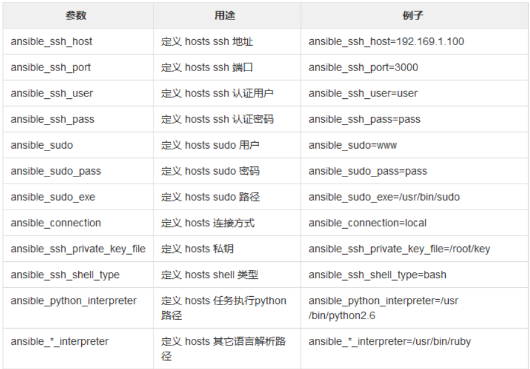
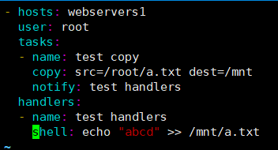
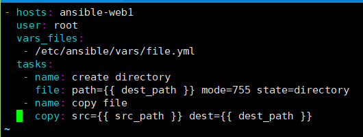
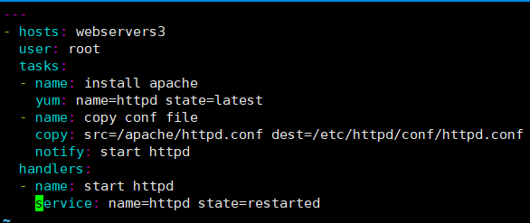

# 企业级自动化运维工具Ansible

# 一、介绍

### 1.自动化运维工具对比

```shell
1.Puppet:基于 Ruby 开发,采用 C/S 架构,扩展性强,基于SSL,远程命令执行相对较弱；
2.SaltStack:基于 Python 开发,采用 C/S 架构,相对 puppet 更轻量级,配置语法使用YAML,使得配置脚本更简单.需要配置客户端以及服务器端。每台被控制节点需要安装agent；
3.Ansible:基于Python开发,分布式,无需客户端,轻量级,配置语法使用YAML语言,更强的远程命令执行操作；
```

### 2.Ansible简介

**ansible是自动化运维工具，基于Python开发，分布式,无需客户端,轻量级，实现了批量系统配置、批量程序部署、批量运行命令等功能，ansible是基于模块工作的,本身没有批量部署的能力。真正具有批量部署的是ansible所运行的模块,ansible只是提供一种框架。**

```shell
Ansible特性
    1)、no agents：不需要在被管控主机上安装任何客户端,更新时,只需在操作机上进行一次更新即可（不用安装客户端。分布式的）
    2)、no server：无服务器端,使用时直接运行命令即可
    3)、modules in any languages：基于模块工作,可使用任意语言开发模块
    4)、yaml,not code：使用yaml语言定制剧本playbook
    5)、ssh by default：基于SSH工作
    6)、strong multi-tier solution：可实现多级指挥
```


```shell
 connection plugins：连接插件,负责和被监控端实现通信,默认使用SSH连接。
 host inventory：主机清单,是一个配置文件里面定义监控的主机。
 modules : 模块,核心模块、command模块、自定义模块等。
 plugins : modules功能的补充,包括连接插件,邮件插件等。
 playbook：编排,定义 Ansible 多任务配置文件,非必需。
```

# 二、ansible安装

### 1、 准备环境----关闭防火墙和selinux

```shell
环境:
主机：4台  1个控制节点 3个被控制节点
解析：本地互相解析(所有机器)
# vim /etc/hosts
192.168.1.10 ansible-web1
192.168.1.11 ansible-web2
192.168.1.12 ansible-web3
192.168.1.9  ansible-server  (控制节点服务器端)
配置ssh公钥认证：控制节点需要发送ssh公钥给所有被控制节点
[root@ansible-server ~]# ssh-keygen
[root@ansible-server ~]# ssh-copy-id -i 192.168.1.10  #所有被控节点机器

所有机器：
systemctl stop firewalld && setenforce 0
```

### 2、安装

```shell
安装：控制节点
 1. 配置EPEL网络yum源
 [root@ansible-server ~]# yum install -y epel-release
 2. 安装ansible
 [root@ansible-server ~]# yum install -y ansible
 3.查看版本
 [root@ansiable-server ~]# ansible --version
 4.看帮助
 [root@ansible-server ~]# ansible --help
```

### 3、ansible基础----inventory主机清单

官方文档:  http://docs.ansible.com/ansible/intro_inventory.html#>

**inventory文件通常用于定义要管理主机的认证信息，例如ssh登录用户名、密码以及key相关信息。**

```shell
查看配置文件：
[root@ansible-server ~]# rpm  -qc ansible
/etc/ansible/ansible.cfg
/etc/ansible/hosts		#ansible主机清单文件
-q:---query查询

1.主配置文件：
/etc/ansible/ansible.cfg  #主要设置一些ansible初始化的信息，比如日志存放路径、模块、等配置信息

2.主机清单文件:
默认位置/etc/ansible/hosts
```

```shell
语法:
1.添加主机或者主机组：
[root@ansible-server ~]# vim /etc/ansible/hosts  #在最后追加被管理端的机器
ansible-web1                      #单独指定主机，可以使用主机名称或IP地址
2.添加主机组：
[webservers]        #使用[]标签指定主机组 ----标签自定义
192.168.10.11        #如果未解析添加ip
ansible-web2      #解析添加主机名
3.组可以包含其他组：
[webservers1]     #组一
ansible-web1
[webservers2]     #组二
ansible-web2
[weball:children]      #children-照写 #weball包括两个子组
webservers1        #组一
webservers2        #组二
4.为一个组指定变量，组内每个主机都可以使用该变量：
[weball:vars]         #设置变量,vars--照写
ansible_ssh_port=22     
ansible_ssh_user=root   
ansible_ssh_private_key_file=/root/.ssh/id_rsa  
#ansible_ssh_pass=test      #也可以定义密码，如果没有互传秘钥可以使用密码。
```

 Ansible Inventory 常见的内置参数：



```shell
查看组内主机列表：
语法：ansible  组名  --list-hosts
[root@ansible-server ~]# ansible  weball --list-hosts
  hosts (2):
    ansible-web1
    ansible-web2
====================================
扩展:自定义主机列表使用密码登录：（了解）
[root@ansible-server ~]# vim /opt/hostlist
[all:vars]
ansible_ssh_port=22
ansible_ssh_user=root
ansible_ssh_private_key_file=/root/.ssh/id_rsa
#ansible_ssh_pass=test

[all]
ansible-web1
ansible-web2
使用:
[root@ansible-server ~]# ansible -i /opt/hostlist all -m ping -o
小注释：如果不通，手动连接第一次，第一次需要手动输入密码。"第一次"
-i:指定清单文件
注意：这里的ping并不是真正意义上的ping而是探测远程主机ssh是否可以连接！判断ssh端口是否存活
```

### 4、测试

```shell
语法：
# ansible  <pattern>   -m <module_name>   -a <arguments>
pattern--主机清单里定义的主机组名,主机名,IP,别名等,all表示所有的主机,支持通配符,正则
-m module_name: 模块名称,默认为command
-a arguments: 传递给模块的参数
-o  单行显示
```

使用案例：

```shell
使用ping模块检查ansible节点的连通性：
1.指定单台机器：
[root@ansible-server ~]# ansible ansible-web1 -m ping -o

2.同时指定多台机器：
[root@ansible-server ~]# ansible ansible-web1,ansible-web2 -m ping -o

3.指定组名:
[root@ansible-server ~]# ansible  webservers1 -m ping -o

```

```shell
执行shell命令：
[root@ansible-server ~]# ansible webservers1 -m shell -a 'uptime'
ansible-web1 | CHANGED | rc=0 >>
 23:32:47 up  5:24,  3 users,  load average: 0.00, 0.01, 0.05
不加 -m  默认是 command 模块
[root@ansible-server ~]# ansible webservers1 -a 'uptime'
ansible-web1 | CHANGED | rc=0 >>
 23:34:01 up  5:25,  3 users,  load average: 0.16, 0.05, 0.06
```

```shell
1.给节点增加用户:
[root@ansible-server ~]# ansible webservers1 -m shell -a 'useradd tom'
ansible-web1 | CHANGED | rc=0 >>
[root@ansible-server ~]# ansible webservers1  -m shell -a 'grep tom /etc/passwd'
ansible-web1 | CHANGED | rc=0 >>
tom:x:1000:1000::/home/tom:/bin/bash
重定向输出到本地文件中：
[root@ansible-server ~]# ansible webservers1 -m shell -a 'df -Th' > /opt/a.txt
[root@ansible-server ~]# cat /opt/a.txt 
ansible-web1 | CHANGED | rc=0 >>
Filesystem              Type      Size  Used Avail Use% Mounted on
/dev/mapper/centos-root xfs        18G  1.1G   17G   6% /
devtmpfs                devtmpfs  226M     0  226M   0% /dev
tmpfs                   tmpfs     237M     0  237M   0% /dev/shm
tmpfs                   tmpfs     237M  4.7M  232M   2% /run
tmpfs                   tmpfs     237M     0  237M   0% /sys/fs/cgroup
/dev/sda1               xfs      1014M  125M  890M  13% /boot
tmpfs                   tmpfs      48M     0   48M   0% /run/user/0
```


### 5、Ad-Hoc

ad hoc其实就是执行简单的命令——一条命令。对于复杂的命令则为 playbook。

```shell
帮助文档:
列出ansible支持的模块:
-l：获取列表
-s module_name：获取指定模块的使用信息
看所有模块（A10，华为，docker，EC2，aws等等广大厂商设备）
[root@ansible-server ~]# ansible-doc -l
查看模块使用信息，了解其功能:
[root@ansible-server ~]# ansible-doc -s yum
```

常用模块

```shell
1.远程复制备份模块：copy
模块参数详解：
src=:指定源文件路径
dest=:目标地址（拷贝到哪里）
owner:指定属主
group:指定属组
mode:指定权限,可以以数字指定比如0644
backup:在覆盖之前将原文件备份，备份文件包含时间信息。有两个选项：yes|no
[root@ansible-server ~]# vim a.txt  #创建一个测试文件
123123
[root@ansible-server ~]# ansible weball -m copy -a 'src=/root/a.txt dest=/opt owner=root group=root mode=644' -o
[root@ansible-server ~]# vim a.txt  #追加如下内容
123123
234234
[root@ansible-server ~]# ansible weball -m copy -a 'src=/root/a.txt dest=/opt/ owner=root group=root mode=644 backup=true' -o
注释：如果文件没有变化，不会备份。只有文件内容不同，才会做备份。

登录被控制机器其中一台查看
[root@ansible-web1 ~]# cat /opt/a.txt.15301.2019-09-01\@00\:35\:18~

[root@ansible-server ~]# ansible weball -m shell -a 'mv /mnt/auka.txt /tmp' -o
移动被控制节点的文件
```


```shell
2.软件包管理 yum模块
安装apache
[root@ansible-server ~]# ansible webservers1 -m yum -a "name=httpd state=latest" -o
state=     #状态是什么，干什么
state=absent       用于remove安装包
state=latest       表示最新的
state=removed      表示卸载
卸载软件：
[root@ansible-server ~]# ansible webservers1 -m yum -a "name=httpd state=removed" -o
或者
[root@ansible-server ~]# ansible webservers1 -m yum -a "name=httpd state=absent" -o
```

```shell
3.服务管理service模块
[root@ansible-server ~]# ansible webservers1 -m service -a "name=httpd state=started" #启动
[root@ansible-server ~]# ansible webservers1 -m service -a "name=httpd state=stopped" #停止
[root@ansible-server ~]# ansible webservers1 -m service -a "name=httpd state=restarted" #重启
[root@ansible-server ~]# ansible webservers1 -m service -a "name=httpd state=started enabled=yes" #开机启动
[root@ansible-server ~]# ansible webservers1 -m service -a "name=httpd state=started enabled=no"  #开机关闭
```

```shell
4.文件模块file
模块参数详解：
owner:修改属主
group:修改属组
mode:修改权限
path=:要修改文件的路径
recurse：递归的设置文件的属性，只对目录有效
        yes:表示使用递归设置
state:
touch:创建一个新的空文件
directory:创建一个新的目录，当目录存在时不会进行修改
#创建一个文件
[root@ansible-server ~]# ansible webservers1 -m file -a 'path=/tmp/youngfit1.txt mode=777 state=touch'
[root@ansible-server ~]# ansible ansible-web2 -m file -a 'path=/tmp/youngfit2.txt mode=777 owner=nginx state=touch'
#创建一个目录
[root@ansible-server ~]# ansible webservers1 -m file -a 'path=/tmp/auka mode=777 state=directory' 

被控节点ansible-web2操作：
[root@ansible-web2 tmp]# cd /opt/
[root@ansible-web2 opt]# ll haha
total 0
-rw-r--r--. 1 root  root 0 Sep 12 09:41 haha2.txt
-rw-r--r--. 1 nginx root 0 Sep 12 09:41 haha.txt

[root@ansible-server ~]# ansible ansible-web2 -m file -a "path=/opt/haha owner=nginx group=nginx  state=directory recurse=yes"

被控节点查看：
[root@ansible-web2 opt]# ll haha
total 0
-rw-r--r--. 1 nginx nginx 0 Sep 12 09:41 haha2.txt
-rw-r--r--. 1 nginx nginx 0 Sep 12 09:41 haha.txt
```

```shell
5.收集信息模块setup
[root@ansible-server ~]# ansible webservers1 -m setup  #收集所有信息
[root@ansible-server ~]# ansible webservers1 -m setup -a 'filter=ansible_all_ipv4_addresses' #只查询ipv4的地址
filter:过滤
```

# 三、ansible-playbook  剧本(1)

Playbook介绍

playbook是ansible用于配置，部署，和管理被控节点的剧本。通过playbook的详细描述，执行其中的tasks，可以让远端主机达到预期的状态。playbook是由一个或多个”play”组成的列表。  当对一台机器做环境初始化的时候往往需要不止做一件事情，这时使用playbook会更加适合。通过playbook你可以一次在多台机器执行多个指令。通过这种预先设计的配置保持了机器的配置统一，并很简单的执行日常任务。

ansible通过不同的模块实现相应的管理，管理的方式通过定义的清单文件(hosts)所管理的主机包括认证的方式连接的端口等。所有的功能都是通过调用不同的模块(modules)来完成不同的功能的。不管是执行单条命令还是play-book都是基于清单文件。


playbook格式

playbook由yaml语言编写。YMAL格式是类似于JSON的文件格式，便于人理解和阅读，同时便于书写。

**一个剧本里面可以有多个play，每个play只能有一个tasks，每个tasks可以有多个name**

```shell
核心元素：
Playbooks  
Variables     #变量元素,可传递给Tasks/Templates使用;  
Tasks          #任务元素,由模块定义的操作的列表，即调用模块完成任务;  
Templates   #模板元素,使用了模板语法的文本文件;  
Handlers     #处理器元素,通常指在某事件满足时触发的操作;  
Roles          #角色元素
```

```shell
playbook的基础组件：
name:
    定义playbook或者task的名称(描述信息)，每一个play都可以完成一个任务。
hosts: 
    hosts用于指定要执行指定任务的主机.
user:
    remote_user则用于指定远程主机上的执行任务的用户
tasks:
    任务列表play的主体部分是task list. task list中的各任务按次序逐个在hosts中指定的所有主机上执行，即在所有主机上完成第一个任务后再开始第二个。
vars:
   定义变量（如果不使用内部变量需要提前定义）
vars_files:
  调用定义变量文件
notify:
    任务执行结果如果是发生更改了的则触发定义在handler的任务执行
handlers:
    用于当前关注的资源发生变化时采取一定指定的操作
```

```shell
实例一：
[root@ansible-server ~]# cd /etc/ansible/
[root@ansible-server ansible]# vim test.yml  #创建文件必须以.yml/.yaml结尾
---
 - hosts: webservers1
   user: root
   tasks:
   - name: playbook_test
     file: state=touch path=/tmp/playbook.txt
===================================================================================
参数解释：
    hosts: 参数指定了对哪些主机进行操作；
    user: 参数指定了使用什么用户登录远程主机操作；
    tasks: 指定了一个任务.
    name:参数同样是对任务的描述，在执行过程中会打印出来。
```


```shell
检测语法：
[root@ansible-server ansible]# ansible-playbook --syntax-check test.yml 
playbook: test.yml
运行Playbook：
[root@ansible-server ansible]# ansible-playbook test.yml #加剧本名称
```

```shell
实例二
handlers：由特定条件触发的Tasks
handlers:处理器
notify:触发器
语法：
tasks：
- name: TASK_NAME
  module: arguments               #1.上面任务执行成功，然后
  notify: HANDLER_NAME        #2.通知他
handlers:
- name: HANDLER_NAME        #3.一一对应，这里的描述与notify定义的必须一样
  module: arguments         #4.执行这个命令
=======================================================
[root@ansible-server ansible]# vim handlers.yml
- hosts: webservers1
  user: root
  tasks:
  - name: test copy
    copy: src=/root/a.txt dest=/mnt
    notify: test handlers
  handlers:
  - name: test handlers
    shell: echo "abcd" >> /mnt/a.txt
========================================================
说明：只有 copy 模块真正执行后，才会去调用下面的 handlers 相关的操作，追加内容。所以这种比较适合配置文件发生更改后，需要重启服务的操作。
```



```shell
检测语法：
[root@ansible-server ansible]# ansible-playbook --syntax-check handlers.yml 
playbook: handlers.yml
[root@ansible-server ansible]# ansible-playbook handlers.yml
```

```shell
案例三
循环：迭代，需要重复执行的任务；
对迭代项的引用，固定变量名为”item”，使用with_items属性给定要迭代的元素； 

基于字符串列表元素实战：
[root@ansible-server ansible]# vim list.yml
- hosts: webservers2
  remote_user: root
  tasks:
  - name: install packages
    yum: name={{ item }} state=latest         #相当于for循环里面的i 
    with_items:                               #取值 。但是不支持通配符
     - httpd
     - php
     - php-mysql
     - php-mbstring
     - php-gd
```


```shell
检测语法：
[root@ansible-server ansible]# ansible-playbook --syntax-check list.yml 
playbook: list.yml
执行：
[root@ansible-server ansible]# ansible-playbook  list.yml
```

```shell
案例四、自定义vars_files变量
变量调用语法:
{{ var_name }}
====================================================
创建变量目录：
[root@ansible-server ~]# mkdir /etc/ansible/vars
[root@ansible-server ~]# cd /etc/ansible/vars/
[root@ansible-server vars]# vim file.yml     #创建变量文件。
src_path: /root/test/a.txt
dest_path: /opt/test/
```


```shell
创建一个测试文件
[root@ansible-server vars]# mkdir /root/test
[root@ansible-server vars]# vim /root/test/a.txt  #编辑测试文件
123
创建play-book引用变量文件：
[root@ansible-server vars]# cd /etc/ansible/
[root@ansible-server ansible]# vim vars.yml
- hosts: ansible-web1
  user: root
  vars_files:
   - /etc/ansible/vars/file.yml
  tasks:
   - name: create directory
     file: path={{ dest_path }} mode=755 state=directory
   - name: copy file
     copy: src={{ src_path }} dest={{ dest_path }}
```



```shell
检测语法：
[root@ansible-server vars]# cd ..
[root@ansible-server ansible]# ansible-playbook --syntax-check vars.yml
playbook: vars.yml
执行：
[root@ansible-server ansible]# ansible-playbook  vars.yml
```

登录查看：


```shell
实战：通过playbook安装apache
1.准备工作：
[root@ansible-server ansible]# vim hosts     #添加主机web3
[webservers3]
ansible-web3
2.安装apache，准备配置文件
[root@ansible-server ~]# yum install -y httpd
[root@ansible-server ~]# mkdir /apache
[root@ansible-server ~]# cp /etc/httpd/conf/httpd.conf /apache/  #将配置文件推送到web3
3.修改端口将原来的80修改为8080
[root@ansible-server ~]# vim /apache/httpd.conf
Listen 8080
[root@ansible-server ~]# cd /etc/ansible/  #编写剧本
[root@ansible-server ansible]# vim apache.yml
---
- hosts: webservers3
  user: root
  tasks:
  - name: install apache
    yum: name=httpd state=latest
  - name: copy conf file
    copy: src=/apache/httpd.conf dest=/etc/httpd/conf/httpd.conf
    notify: start httpd
  handlers:
  - name: start httpd
    service: name=httpd state=restarted
```



```shell
语法检测：
[root@ansible-server ansible]# ansible-playbook --syntax-check apache.yml 
playbook: apache.yml
执行play-book
[root@ansible-server ansible]# ansible-playbook apache.yml
```

登录web3查看：


