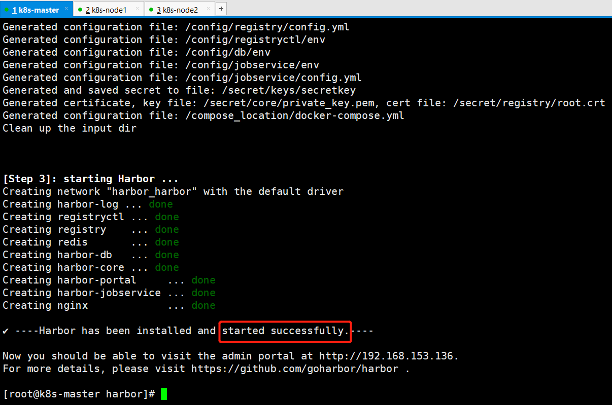
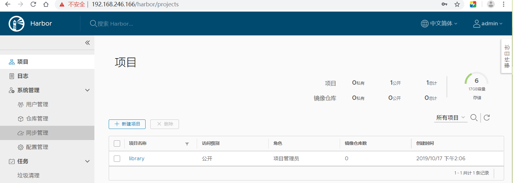
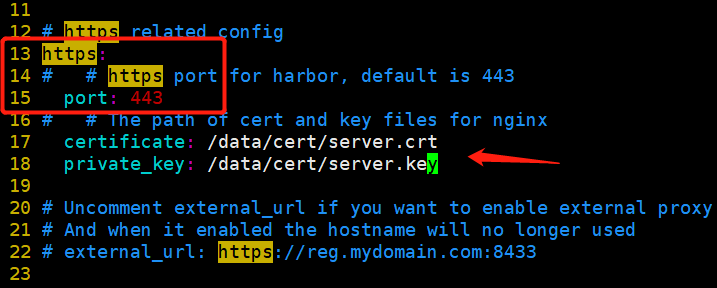
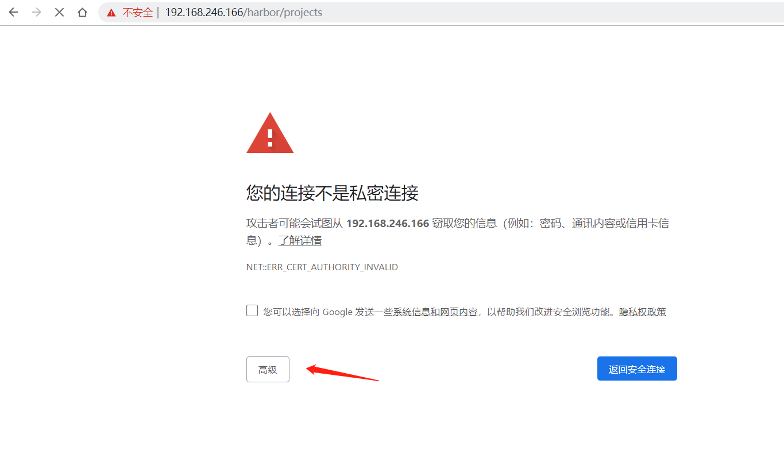
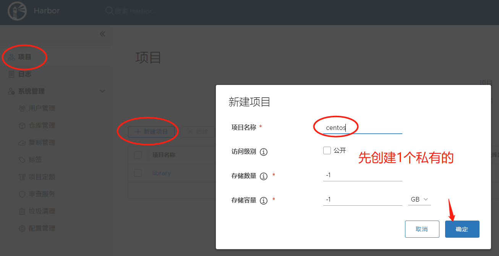
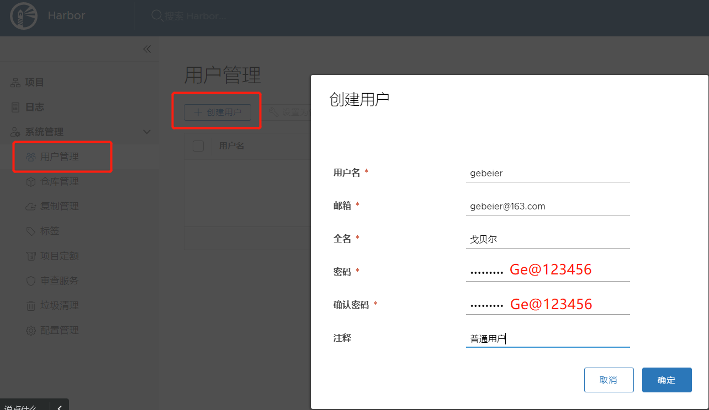
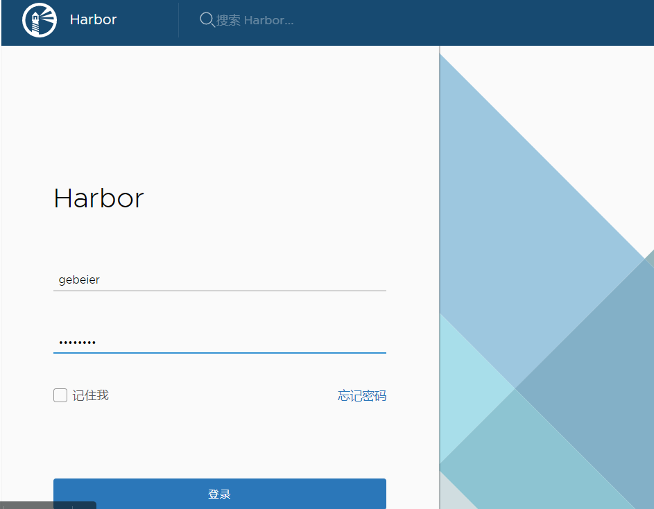
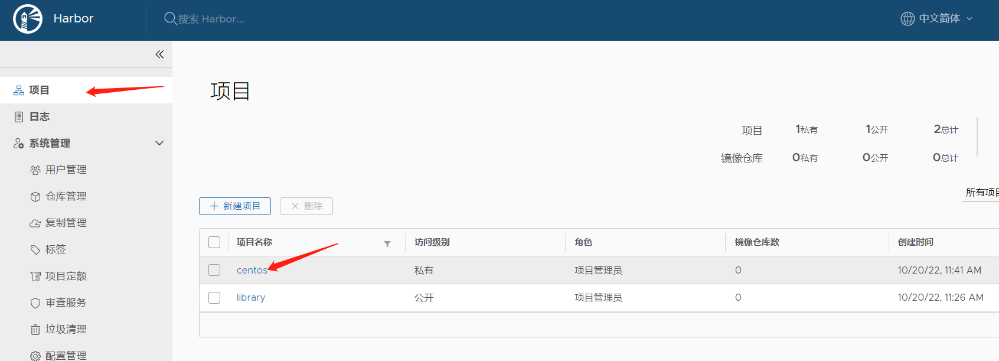
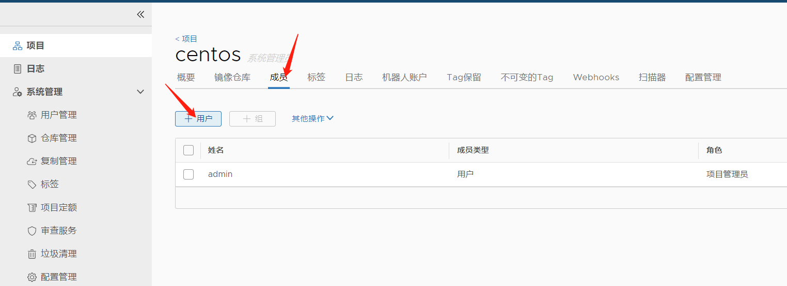
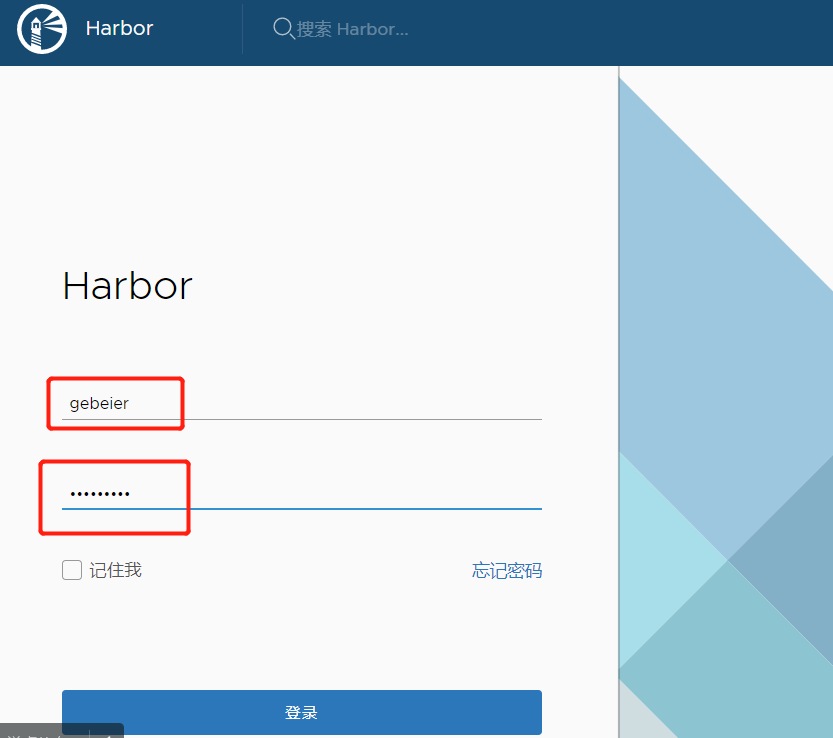

## Harbor镜像仓库部署

```shell
下面一步需要翻墙（用的1.8.0版本的harbor）
[root@kub-k8s-master ~]# wget https://storage.googleapis.com/harbor-releases/release-1.8.0/harbor-offline-installer-v1.8.0.tgz

[root@kub-k8s-master ~]# curl -L https://github.com/docker/compose/releases/download/1.22.0/docker-compose-`uname -s`-`uname -m` -o /usr/local/bin/docker-compose

我们选择了上传这两个软件包，所以要更改名称，移动路径
[root@k8s-master ~]# mv docker-compose-Linux-x86_64 /usr/local/bin/docker-compose
[root@kub-k8s-master ~]# chmod +x /usr/local/bin/docker-compose

[root@kub-k8s-master ~]# tar xf harbor-offline-installer-v1.8.0.tgz

[root@kub-k8s-master ~]# cd harbor

http访问方式的配置：
[root@kub-k8s-master harbor]# vim harbor.yml #主机名要可以解析(需要部署dns服务器，用/etc/hosts文件没有用)，如果不可以解析，可以使用IP地址,需要修改的内容如下
hostname: 192.168.246.166

[root@kub-k8s-master harbor]# ./install.sh  #需要等待下载镜像
如果安装失败，重启docker服务，重新安装即可；
```

您需要将Docker升级到版本17.06.0或更高版本。以下是升级Docker的步骤：

1. **卸载旧版本的Docker**（如果已安装）：

   ```
   sh
   复制代码
   sudo yum remove docker docker-client docker-client-latest docker-common docker-latest docker-latest-logrotate docker-logrotate docker-engine
   ```

2. **设置Docker仓库**：

   ```
   sh复制代码sudo yum install -y yum-utils
   sudo yum-config-manager --add-repo https://download.docker.com/linux/centos/docker-ce.repo
   ```

3. **安装最新版本的Docker**：

   ```
   sh
   复制代码
   sudo yum install docker-ce docker-ce-cli containerd.io
   ```

4. **启动Docker并设置为开机启动**：

   ```
   sh复制代码sudo systemctl start docker
   sudo systemctl enable docker
   ```

5. **验证Docker版本**：

   ```
   sh
   复制代码
   docker --version
   ```

   确保输出的版本是17.06.0或更高。

6. **重新运行Harbor安装脚本**：

   ```
   sh复制代码cd /path/to/harbor
   ./install.sh
   ```

如果仍有问题，请确保您的系统已连接到互联网以便从Docker仓库下载最新的软件包，并且您的系统时间和日期设置正确以避免SSL/TLS证书问题。如果升级过程中遇到任何错误，请提供错误信息以便进一步排查。


根据提示信息，您需要安装或升级`docker-compose`到1.18.0或更高版本。以下是安装`docker-compose`的步骤：

1. **下载并安装最新版本的`docker-compose`**：

   ```
   sh
   复制代码
   sudo curl -L "https://github.com/docker/compose/releases/download/1.29.2/docker-compose-$(uname -s)-$(uname -m)" -o /usr/local/bin/docker-compose
   ```

2. **赋予执行权限**：

   ```
   sh
   复制代码
   sudo chmod +x /usr/local/bin/docker-compose
   ```

3. **验证`docker-compose`版本**：

   ```
   sh
   复制代码
   docker-compose --version
   ```

   确保输出的版本是1.18.0或更高。

4. **重新运行Harbor安装脚本**：

   ```
   sh复制代码cd /path/to/harbor
   ./install.sh
   ```

如果遇到任何问题，请提供具体的错误信息，我可以帮助您进一步排查。





```plain
浏览器访问测试：
http://192.168.246.166
```





## 配置https访问

```shell
[root@kub-k8s-master ~]# mkdir -p /data/cert/
[root@kub-k8s-master ~]# cd /data/cert
[root@kub-k8s-master cert]# openssl genrsa -out /data/cert/server.key 2048
Generating RSA private key, 2048 bit long modulus
............................................+++
............+++
e is 65537 (0x10001)
[root@kub-k8s-master cert]# openssl req -x509 -new -nodes -key /data/cert/server.key -subj "/CN=192.168.246.166" -days 3650 -out /data/cert/server.crt
[root@kub-k8s-master ~]# ll -a /data/cert
[root@kub-k8s-master ~]# cd /root/harbor
[root@kub-k8s-master harbor]# vim harbor.yml   #编辑如下
```





```shell
重启
[root@kub-k8s-master harbor]# ./prepare 
prepare base dir is set to /root/harbor
Clearing the configuration file: /config/log/logrotate.conf
Clearing the configuration file: /config/nginx/nginx.conf
Clearing the configuration file: /config/core/env
Clearing the configuration file: /config/core/app.conf
Clearing the configuration file: /config/registry/config.yml
Clearing the configuration file: /config/registry/root.crt
Clearing the configuration file: /config/registryctl/env
Clearing the configuration file: /config/registryctl/config.yml
Clearing the configuration file: /config/db/env
Clearing the configuration file: /config/jobservice/env
Clearing the configuration file: /config/jobservice/config.yml
Generated configuration file: /config/log/logrotate.conf
Generated configuration file: /config/nginx/nginx.conf
Generated configuration file: /config/core/env
Generated configuration file: /config/core/app.conf
Generated configuration file: /config/registry/config.yml
Generated configuration file: /config/registryctl/env
Generated configuration file: /config/db/env
Generated configuration file: /config/jobservice/env
Generated configuration file: /config/jobservice/config.yml
loaded secret from file: /secret/keys/secretkey
Generated configuration file: /compose_location/docker-compose.yml
Clean up the input dir

如果出错，重启Docker服务，再次执行./prepare 
[root@kub-k8s-master harbor]# docker-compose down
Stopping nginx             ... done
Stopping harbor-portal     ... done
Stopping harbor-jobservice ... done
Stopping harbor-core       ... done
Stopping harbor-db         ... done
Stopping redis             ... done
Stopping registryctl       ... done
Stopping registry          ... done
Stopping harbor-log        ... done
Removing nginx             ... done
Removing harbor-portal     ... done
Removing harbor-jobservice ... done
Removing harbor-core       ... done
Removing harbor-db         ... done
Removing redis             ... done
Removing registryctl       ... done
Removing registry          ... done
Removing harbor-log        ... done
Removing network harbor_harbor
[root@kub-k8s-master harbor]# docker-compose up -d  #放后台
```


## 访问




**客户端配置(每个访问harbor的机器上都要配置)**


```shell
在client上面操作：
[root@kub-k8s-node1 ~]# vim /etc/docker/daemon.json   #编辑文件
{
"insecure-registries": ["192.168.246.166"]   #该ip为部署仓库机器的ip
}
[root@kub-k8s-node1 ~]# systemctl restart docker
```


## 创建项目





**创建账号**




换gebeier用户登录查看




## 项目授权







再次使用gebeier用户登录




## 测试

```shell
1.登录
[root@kub-k8s-node1 ~]# docker login 192.168.246.166
Username: gebeier
Password: 
Login Succeeded
2.下载一个测试的镜像
[root@kub-k8s-node1 ~]# docker pull daocloud.io/library/centos:7
3.查看
[root@kub-k8s-node1 ~]# docker images
REPOSITORY                     TAG       IMAGE ID            CREATED        SIZE
daocloud.io/library/centos    7   98ebf73aba75        3 months ago    109MB
4.打个tag
[root@kub-k8s-node1 ~]# docker tag daocloud.io/library/centos:7 192.168.91.140/centos/centos:7.4
5.上传到仓库
[root@kub-k8s-node1 ~]# docker push 192.168.91.140/centos/centos:7.4
```


在web界面中查看镜像是否被上传到仓库中


拉取测试


来到node2

```shell
[root@k8s-node2 ~]# cat /etc/docker/daemon.json 
{
	"insecure-registries": ["192.168.246.166"]
}
[root@k8s-node2 ~]# systemctl restart docker
[root@k8s-node2 ~]# docker login 192.168.246.166 --username='gebeier' --password='***'
```


```shell
[root@k8s-node2 ~]# 192.168.91.140/centos/centos:7.4
```