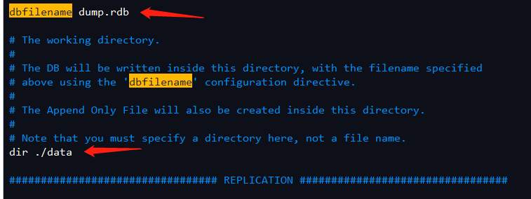
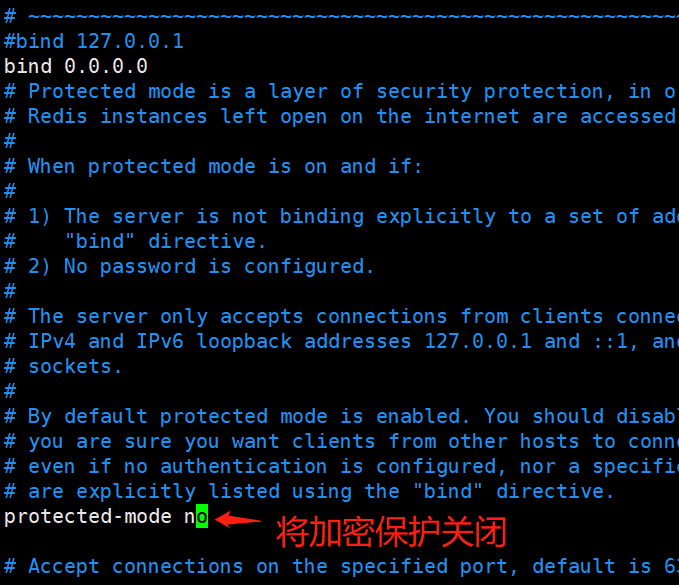
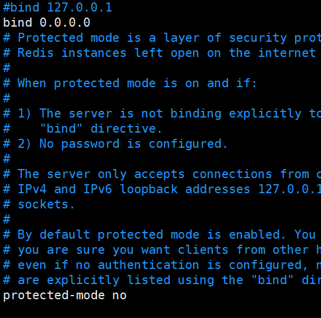
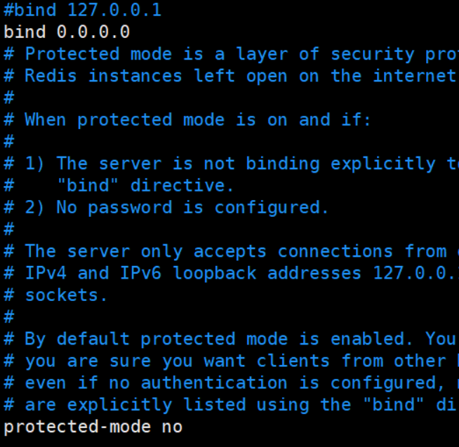
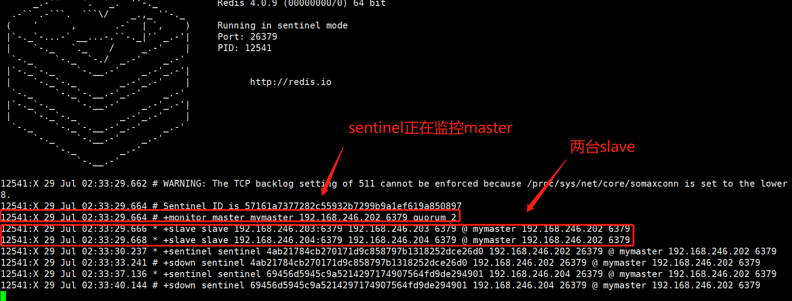
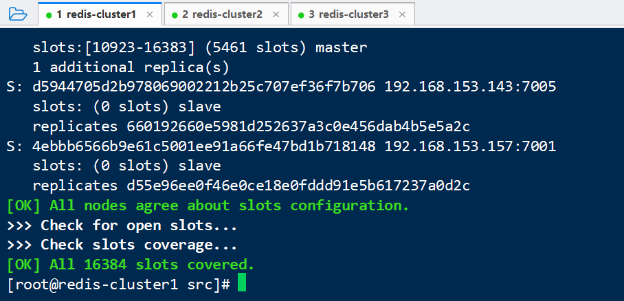

# 安装Redis

```shell
1.安装单机版redis
[root@redis-master ~]# mkdir -p /data/application     ---创建工作目录
[root@redis-master ~]# wget https://download.redis.io/releases/redis-6.2.7.tar.gz   ---下载redis
[root@redis-master ~]# tar xzf redis-6.2.7.tar.gz -C /data/application/    ---解压
[root@redis-master ~]# cd /data/application/
[root@redis-master application]# mv redis-6.2.7/ redis
[root@redis-master application]# cd redis/
[root@redis-master redis]# yum install -y gcc make  #安装编译工具
[root@redis-master redis]# make
注：如果报错请将刚才解压的安装包删除掉，再次重新解压并进行make安装即可。
[root@redis-master redis]# cp redis.conf redis.conf.bak
```

```shell
2.修改配置文件
[root@redis-master redis]# vim redis.conf     ---修改如下
bind 0.0.0.0　　#只监听内网IP
daemonize yes　　　　　#开启后台模式将no改为yes
port 6379                      #端口号
dir /data/application/redis/data　　#本地数据库存放持久化数据的目录该目录-----需要存在
创建存放数据的目录


[root@redis-master redis]# mkdir /data/application/redis/data
配置redis为systemctl启动
[root@redis-master redis]# cd /lib/systemd/system
[root@redis-master system]# vim redis.service
[Unit]
Description=Redis
After=network.target

[Service]
ExecStart=/data/application/redis/src/redis-server /data/application/redis/redis.conf  --daemonize no
ExecStop=/data/application/redis/src/redis-cli -h 127.0.0.1 -p 6379 shutdown

[Install]
WantedBy=multi-user.target
================================================================================
参数详解:
• [Unit] 表示这是基础信息 
• Description 是描述
• After 是在那个服务后面启动，一般是网络服务启动后启动

• [Service] 表示这里是服务信息 
• ExecStart 是启动服务的命令
• ExecStop 是停止服务的指令

• [Install] 表示这是是安装相关信息 
• WantedBy 是以哪种方式启动：multi-user.target表明当系统以多用户方式（默认的运行级别）启动时，这个服务需要被自动运行。
```

```shell
3.启动服务
[root@redis-master system]# systemctl daemon-reload  #重新加载
[root@redis-master system]# systemctl start redis.service
```


```shell
4.登陆redis
登陆redis
[root@redis-master system]# cd /data/application/redis/src/
[root@redis-master src]# ./redis-cli -h 192.168.246.202 -p 6379
192.168.246.202:6379> ping     ---测试redis是否可以用
PONG
192.168.246.202:6379> set name xiaoming    #设置key--name，并设置值
OK
192.168.246.202:6379> get name    #获取到key
"xiaoming"
192.168.246.202:6379>
单机版redis已经部署完成。将ip和端口发给开发就可以了。
```

```shell
192.168.246.202:6379> set key value [EX seconds] [PX milliseconds] [NX|XX]
EX seconds ： 将键的过期时间设置为 seconds 秒。 执行 SET key value EX seconds 的效果等同于执行 SETEX key seconds value。
PX milliseconds ： 将键的过期时间设置为 milliseconds 毫秒。 执行 SET key value PX milliseconds 的效果等同于执行 PSETEX key milliseconds value。
NX ： 只在键不存在时， 才对键进行设置操
XX ： 只在键已经存在时， 才对键进行设置操作。
```

```shell
6.使用EX选项
[root@localhost src]# ./redis-cli -h 192.168.62.231 -p 6379
192.168.62.231:6379> set name1 xiaohong EX 10
OK
192.168.62.231:6379> get name1
"xiaohong"
等待10s，再次查看
192.168.62.231:6379> get name1
(nil)
```

```shell
7.使用PX选项
192.168.62.231:6379> set name2 xiaohong PX 3233
OK
192.168.62.231:6379> get name2
"xiaohong"
等待3s，再次查看
192.168.62.231:6379> get name2
(nil)
```

```shell
8.使用NX选项
192.168.62.231:6379> set class 2204 NX
OK # 键不存在，设置成功
192.168.62.231:6379> get class
"2204"
192.168.62.231:6379> set class 2205 NX
(nil)  # 键已经存在，设置失败
192.168.62.231:6379> get class
"2204"  # 维持原值不变
```

```shell
9.使用XX选项
192.168.62.231:6379> set home taikang XX
(nil)  # 因为键不存在，设置失败
192.168.62.231:6379> set home taikang
OK # 先给键设置一个值
192.168.62.231:6379> set home zhengzhou XX
OK # 设置新值成功
192.168.62.231:6379> get home
"zhengzhou"
```

```shell
10.删除
192.168.62.231:6379> del class
(integer) 1
192.168.62.231:6379> get class
(nil)
```

# Redis DataBase 持久化

```shell
配置参数
[root@redis-master src]# cd ..
[root@redis-master redis]# vim redis.conf
#dbfilename：持久化数据存储在本地的文件
dbfilename dump.rdb
#dir：持久化数据存储在本地的路径
dir /data/application/redis/data
##snapshot触发的时机，save <seconds> <changes> 
##如下为900秒后，至少有一个变更操作，才会snapshot  
##对于此值的设置，需要谨慎，评估系统的变更操作密集程度  
##可以通过save “”来关闭snapshot功能  
#save时间，以下分别表示更改了1个key时间隔900s进行持久化存储；更改了10个key300s进行存储；更改10000个key60s进行存储。
save 900 1
save 300 10
save 60 10000 
##yes代表当使用bgsave命令持久化出错时候停止写RDB快照文件,no表明忽略错误继续写文件，“错误”可能因为磁盘已满/磁盘故障/OS级别异常等
stop-writes-on-bgsave-error yes
##是否启用rdb文件压缩，默认为“yes”，压缩往往意味着“额外的cpu消耗”，同时也意味着较短的网络传输时间  
rdbcompression yes 
注意:每次快照持久化都是将内存数据完整写入到磁盘一次，如果数据量大的话，而且写操作比较多，必然会引起大量的磁盘io操作，可能会严重影响性能。
```

```shell
开启持久化功能后，重启redis后，数据会自动通过持久化文件恢复
拓展RDB快照备份恢复：redis数据库备份与恢复（dump.rdb快照方式），两台机器
```

```shell
1.做备份机器的redis.conf配置文件内容：
bind 0.0.0.0
daemonize yes
port 6379
dir /data/application/redis/data
dbfilename dump.rdb
dir /data/application/redis/data
save 900 1
save 300 10
save 60 10000
stop-writes-on-bgsave-error yes
rdbcompression yes
```

```shell
2.备份数据
[root@redis-slave-1 redis]# src/redis-cli 
127.0.0.1:6379> set name3 wuhan
OK
127.0.0.1:6379> set name4 tianyun
OK
127.0.0.1:6379> BGSAVE   执行备份，或者敲SAVE
[root@redis-slave-1 redis]# ls data/
dump.rdb

传数据之前要将对方机器的redis服务关闭
[root@redis-slave-1 redis]# scp data/dump.rdb 192.168.62.135:/data/application/redis/data/
```

```shell
3.恢复数据的机器
systemctl restart redis.service
修改redis.conf配置文件
```




```shell
将dump.rdb数据文件存放到配置文件制定的目录下，直接启动即可
[root@redis-master redis]# src/redis-server redis.conf &
[root@redis-master redis]# src/redis-cli
[root@redis-master redis]#
127.0.0.1:6379> get name3
"wuhan"
127.0.0.1:6379> get name4
"tianyun"
```

# Redis主从配置

```shell
部署三台机器redis主从同步
redis-master----192.168.246.202
redis-slave-1-----192.168.246.203
redis-slave-2-----192.168.246.204


1.首先三台服务器将redis部署完成。
2.编辑master的redis配置文件:
[root@redis-master ~]# cd /data/application/redis/
[root@redis-master redis]# vim redis.conf
```



```shell
关闭protected-mode模式，此时外部网络可以直接访问
开启protected-mode保护模式，需配置bind ip或者设置访问密码
```

```shell
3.启动节点redis服务
[root@redis-master src]# cd /data/application/redis/src
[root@redis-master src]# ./redis-server ../redis.conf &   会加载此文件中的配置信息
```

```shell
4.修改slave-1的配置文件
[root@redis-slave-1 ~]# cd /data/application/redis/
[root@redis-slave-1 redis]# vim redis.conf      ---修改如下：
```




```shell
5.启动slave-1的redis服务
[root@redis-slave-1 ~]# cd /data/application/redis/src/
[root@redis-slave-1 src]# ./redis-server ../redis.conf &
```

```shell
6.修改slave-2的配置文件
[root@redis-slave-2 ~]# cd /data/application/redis/
[root@redis-slave-2 redis]# vim redis.conf       ---修改如下
```




```shell
7.启动从节点2的redis服务
[root@ansible-web2 ~]# cd /data/application/redis/src/
[root@ansible-web2 src]# ./redis-server ../redis.conf &
```

```shell
或者，配置到了系统管理工具里面直接可以以下操作
8.重启三台redis
[root@redis-master redis]# systemctl restart redis.service
[root@redis-slave-1 ~]# systemctl restart redis.service
[root@redis-slave-2 ~]# systemctl restart redis.service
```


```shell
9.测试主从
1.在master上面执行
[root@redis-master redis]# cd src/
[root@redis-master src]# ./redis-cli 
127.0.0.1:6379> ping
PONG
127.0.0.1:6379> set name jack
OK
127.0.0.1:6379> get name
"jack"
127.0.0.1:6379>
```

```shell
10.分别在slave-1和slave-2上面执行:
[root@redis-slave-1 redis]# cd src/
[root@redis-slave-1 src]# ./redis-cli 
127.0.0.1:6379> ping
PONG
127.0.0.1:6379> get name
"jack"
127.0.0.1:6379>
[root@redis-slave-2 src]# ./redis-cli 
127.0.0.1:6379> ping
PONG
127.0.0.1:6379> get name
"jack"
127.0.0.1:6379>
```

```shell
11.查看复制的状态
查看master状态
master执行：
127.0.0.1:6379> info replication
# Replication
role:master
connected_slaves:2
slave0:ip=192.168.246.203,port=6379,state=online,offset=490,lag=0
slave1:ip=192.168.246.204,port=6379,state=online,offset=490,lag=1


查看salve状态
127.0.0.1:6379> info replication
# Replication
role:slave
master_host:192.168.246.202
master_port:6379
master_link_status:up
```

```shell
注意：从服务器一般默认禁止写入操作：slave-read-only yes
```

# Redis-sentinel—哨兵模式

```shell
1.每台机器上修改redis主配置文件redis.conf文件设置：bind 0.0.0.0   ---在上面
```

```shell
2.每台机器上修改sentinel.conf配置文件：修改如下配置
[root@redis-master src]# cd ..
[root@redis-master redis]# vim sentinel.conf
sentinel monitor mymaster 10.0.0.137 6379 2 #当集群中有2个sentinel认为master死了时，才能真正认为该master已经不可用了。 (slave上面写的是master的ip，master写自己ip)
sentinel down-after-milliseconds mymaster 3000   #单位毫秒
sentinel failover-timeout mymaster 10000   #若sentinel在该配置值内未能完成failover(故障转移)操作（即故障时master/slave自动切换），则认为本次failover失败。
protected-mode no  #关闭加密模式--新添加到sentinel配置文件中
```

```shell
3.每台机器启动哨兵服务：
[root@redis-master redis]# ./src/redis-sentinel sentinel.conf 
注意:在生产环境下将哨兵模式启动放到后台执行:     ./src/redis-sentinel sentinel.conf &
```

```shell
4.master操作
```



```shell
将master的哨兵模式退出（Crtl+c），再将redis服务stop了，在两台slave上面查看其中一台是否切换为master:(没有优先级，为随机切换)
```

```shell
[root@redis-master redis]# systemctl stop redis.service
或者用kill命令杀死
```

```shell
5.在slave机器上面查看
```


# Redis Cluster去中心化集群

Redis Cluster是Redis官方提供的分布式解决方案。当遇到内存、并发、流量等瓶颈时，就可以采用Cluster架构达到负载均衡目的。官方文档:https://redis.io/topics/cluster-tutorial

## 1、为什么要用redis-cluster集群？


```shell
1.首先Redis单实例主要有单点，容量有限，流量压力上限的问题。
Redis单点故障，可以通过主从复制replication，和自动故障转移sentinel哨兵机制。但Redis单Master实例提供写服务，仍然有容量和压力问题，因此需要数据分区，构建多个Master实例同时提供读写服务（不仅限于从replica节点提供读服务）。

2.并发问题
redis官方声称可以达到 10万/s,每秒执行10万条命令
假如业务需要每秒100万的命令执行呢？

解决方案如下
1.正确的应该是考虑分布式，加机器，把数据分到不同的位置，分摊集中式的压力，一堆机器做一件事.还需要一定的机制保证数据分区，并且数据在各个主Master节点间不能混乱，当然最好还能支持在线数据热迁移的特性。
```


## 2、什么是Redis-Cluster


为何要搭建Redis集群。Redis是在内存中保存数据的，而我们的电脑一般内存都不大，这也就意味着Redis不适合存储大数据，Redis更适合处理高并发，一台设备的存储能力是很有限的，但是多台设备协同合作，就可以让内存增大很多倍，这就需要用到集群。


```shell
Redis集群搭建的方式有多种，例如使用客户端分片、Twemproxy、Codis等，但从redis 3.0之后版本支持redis-cluster集群，它是Redis官方提出的解决方案：
Redis-Cluster采用无中心结构，每个节点保存数据和整个集群状态,每个节点都和其他所有节点连接。其Redis-cluster架构图如下：
```


### 2.1 redis cluster特点

```shell
1.所有的redis节点彼此互联(PING-PONG机制),内部使用二进制协议优化传输速度和带宽。
2.客户端与redis节点直连,不需要中间proxy层.客户端不需要连接集群所有节点,连接集群中任何一个可用节点即可。
3.节点的fail是通过集群中超过半数的节点检测失效时才生效。
```

### 2.2 redis-cluster数据分布

Redis-cluster集群中有16384（0-16383）个哈希槽，每个redis实例负责一部分slot，集群中的所有信息通过节点数据交换而更新。一个hash slot中会有很多key和value。

### 2.3 数据分布存储原理


Redis 集群使用数据分片（sharding）来实现：Redis 集群中内置了 16384 个哈希槽，当需要在 Redis 集群中放置一个 key-value（name1: 张三） 时，redis 先对 key 使用 crc16 算法算出一个结果678698，然后把结果对 16384 求余数(集群使用公式 CRC16(key) % 16384)，这样每个key 都会对应一个编号在 0-16383 之间的哈希槽，那么redis就会把这个key 分配到对应范围的节点上了。同样，当连接三个节点任何一个节点想获取这个key时，也会这样的算法，然后内部跳转到存放这个key节点上获取数据。


例如三个节点：哈希槽分布的值如下：

```shell
cluster1:  0-5460
cluster2:  5461-10922
cluster3:  10923-16383
```


这种将哈希槽分布到不同节点的做法使得用户可以很容易地向集群中添加或者删除节点。 比如说：


- 如果用户将新节点 D 添加到集群中， 那么集群只需要将节点 A 、B 、 C 中的某些槽移动到节点 D 就可以了。
- 如果用户要从集群中移除节点 A ， 那么集群只需要将节点 A 中的所有哈希槽移动到节点 B 和节点 C ， 然后再移除空白（不包含任何哈希槽）的节点 A 就可以了。


因为将一个哈希槽从一个节点移动到另一个节点不会造成节点阻塞， 所以无论是添加新节点还是移除已存在节点， 又或者改变某个节点包含的哈希槽数量， 都不会造成集群下线。


## 3、Redis Cluster主从模式


```shell
redis cluster 为了保证数据的高可用性，加入了主从模式，一个主节点对应一个或多个从节点，主节点提供数据存取，从节点则是从主节点拉取数据备份，当这个主节点挂掉后，就会有这个从节点选取一个来充当主节点，从而保证集群不会挂掉.

1.主从切换机制
选举过程是集群中所有master参与,如果半数以上master节点与故障节点通信超过(cluster-node-timeout),认为该节点故障，自动触发故障转移操作.  #故障节点对应的从节点自动升级为主节点

2.什么时候整个集群就不能用了？
如果集群任意一个主节点挂掉,且当前主节点没有从节点，则集群将无法继续，因为我们不再有办法为这个节点承担范围内的哈希槽提供服务。但是，如果这个主节点和所对应的从节点同时失败，则Redis Cluster无法继续运行。
```


# 集群部署


```shell
环境准备:
1.准备三机器，关闭防火墙和selinux
2.制作解析并相互做解析
注:规划架构两种方案，一种是单机多实例，这里我们采用多机器部署
三台机器，每台机器上面两个redis实例，一个master一个slave，第一列做主库，第二列做备库
#记得选出控制节点

redis-cluster1 192.168.116.172   7000、7001
redis-cluster2 192.168.116.173   7002、7003
redis-cluster3 192.168.116.174   7004、7005
```


## 三台机器相同操作

```shell
1.安装redis
[root@redis-cluster1 ~]# mkdir /data
[root@redis-cluster1 ~]# yum -y install gcc automake autoconf libtool make
[root@redis-cluster1 ~]# wget https://download.redis.io/releases/redis-6.2.0.tar.gz
[root@redis-cluster1 ~]# tar xzvf redis-6.2.0.tar.gz -C /data/
[root@redis-cluster1 ~]# cd /data/
[root@redis-cluster1 data]# mv redis-6.2.0/ redis
[root@redis-cluster1 data]# cd redis/
[root@redis-cluster1 redis]# make    #编译
[root@redis-cluster1 redis]# mkdir /data/redis/data #创建存放数据的目录
```


```shell
2.创建节点目录:按照规划在每台redis节点的安装目录中创建对应的目录（以端口号命名）
[root@redis-cluster1 redis]# pwd
/data/redis
[root@redis-cluster1 redis]# mkdir cluster #创建集群目录
[root@redis-cluster1 redis]# cd cluster/
[root@redis-cluster1 cluster]# mkdir 7000 7001 #创建节点目录

[root@redis-cluster2 redis]# mkdir cluster
[root@redis-cluster2 redis]# cd cluster/
[root@redis-cluster2 cluster]# mkdir 7002 7003

[root@redis-cluster3 redis]# mkdir cluster
[root@redis-cluster3 redis]# cd cluster/
[root@redis-cluster3 cluster]# mkdir 7004 7005
```


```shell
3.拷贝配置文件到节点目录中，#三台机器相同操作
[root@redis-cluster1 cluster]# cp /data/redis/redis.conf 7000/
[root@redis-cluster1 cluster]# cp /data/redis/redis.conf 7001/

[root@redis-cluster2 cluster]# cp /data/redis/redis.conf 7002/
[root@redis-cluster2 cluster]# cp /data/redis/redis.conf 7003/

[root@redis-cluster3 cluster]# cp /data/redis/redis.conf 7004/
[root@redis-cluster3 cluster]# cp /data/redis/redis.conf 7005/
```


```shell
4.修改集群每个redis配置文件。(主要是端口、ip、pid文件，三台机器相同操作)，修改如下：
[root@redis-cluster1 cluster]# cd 7000/
[root@redis-cluster1 7000]# vim redis.conf #修改如下
bind 192.168.116.172  #每个实例的配置文件修改为对应节点的ip地址
port 7000   #监听端口，运行多个实例时，需要指定规划的每个实例不同的端口号
daemonize yes #redis后台运行
pidfile /var/run/redis_7000.pid #pid文件，运行多个实例时，需要指定不同的pid文件
logfile /var/log/redis_7000.log #日志文件位置，运行多实例时，需要将文件修改的不同。
dir /data/redis/data #存放数据的目录
appendonly yes #开启AOF持久化，redis会把所接收到的每一次写操作请求都追加到appendonly.aof文件中，当redis重新启动时，会从该文件恢复出之前的状态。
appendfilename "appendonly.aof"  #AOF文件名称
appendfsync everysec #表示对写操作进行累积，每秒同步一次
以下为打开注释并修改
cluster-enabled yes #启用集群
cluster-config-file nodes-7000.conf #集群配置文件，由redis自动更新，不需要手动配置，运行多实例时请注修改为对应端口
cluster-node-timeout 5000 #单位毫秒。集群节点超时时间，即集群中主从节点断开连接时间阈值，超过该值则认为主节点不可以，从节点将有可能转为master
cluster-replica-validity-factor 10 #在进行故障转移的时候全部slave都会请求申请为master，但是有些slave可能与master断开连接一段时间了导致数据过于陈旧，不应该被提升为master。该参数就是用来判断slave节点与master断线的时间是否过长。（计算方法为：cluster-node-timeout * cluster-replica-validity-factor，此处为：5000 * 10 毫秒）
cluster-migration-barrier 1 #一个主机将保持连接的最小数量的从机，以便另一个从机迁移到不再被任何从机覆盖的主机
cluster-require-full-coverage yes #集群中的所有slot（16384个）全部覆盖，才能提供服务

#注：
所有节点配置文件全部修改切记需要修改的ip、端口、pid文件...避免冲突。确保所有机器都修改。
```


```shell
5.启动三台机器上面的每个节点(三台机器相同操作)
[root@redis-cluster1 ~]# cd /data/redis/src/
[root@redis-cluster1 src]# nohup ./redis-server ../cluster/7000/redis.conf &
[root@redis-cluster1 src]# nohup ./redis-server ../cluster/7001/redis.conf &

[root@redis-cluster2 7003]# cd /data/redis/src/
[root@redis-cluster2 src]# nohup ./redis-server ../cluster/7002/redis.conf &
[root@redis-cluster2 src]# nohup ./redis-server ../cluster/7003/redis.conf &

[root@redis-cluster3 7005]# cd /data/redis/src/
[root@redis-cluster3 src]# nohup ./redis-server ../cluster/7004/redis.conf &
[root@redis-cluster3 src]# nohup ./redis-server ../cluster/7005/redis.conf &
```


查看端口


```shell
6.创建redis-cluster集群：在其中一个节点操作就可以
redis节点搭建起来后，需要完成redis cluster集群搭建，搭建集群过程中，需要保证6个redis实例都是运行状态。
Redis是根据IP和Port的顺序，确定master和slave的，所以要排好序，再执行。

参数:
--cluster-replicas 1:表示为集群中的每个主节点创建一个从节点.书写流程:主节点ip+port 对应一个从节点ip+port（注意:若节点在不同的机器上，注意主节点的书写位置，要避免主节点在同一台机器上，影响性能。正常是前面三个节点为主节点，后面的为从节点）

[root@redis-cluster1 src]# cd /data/redis/src/
[root@redis-cluster1 src]# ./redis-cli --cluster create --cluster-replicas 1 192.168.116.172:7000 192.168.116.172:7001 192.168.116.173:7002 192.168.116.173:7003 192.168.116.174:7004 192.168.116.174:7005
>>> Performing hash slots allocation on 6 nodes...
Master[0] -> Slots 0 - 5460
Master[1] -> Slots 5461 - 10922
Master[2] -> Slots 10923 - 16383
Adding replica 192.168.116.173:7003 to 192.168.116.172:7000
Adding replica 192.168.116.174:7005 to 192.168.116.173:7002
Adding replica 192.168.116.172:7001 to 192.168.116.174:7004
M: de5b4b2f6a559362ed56d4de1e3994fd529917b5 192.168.116.172:7000
   slots:[0-5460] (5461 slots) master
S: 2e8c1caa63ac4a1b9a6eea4f0fd5eab4c6b73c21 192.168.116.172:7001
   replicates 60e3755761c9cbdacb183f59e3d6205da5335e86
M: e0370608cd33ddf5bb6de48b5627799e181de3b6 192.168.116.173:7002
   slots:[5461-10922] (5462 slots) master
S: 4035841f20f07674671e6bff5d4c6db99c00626b 192.168.116.173:7003
   replicates de5b4b2f6a559362ed56d4de1e3994fd529917b5
M: 60e3755761c9cbdacb183f59e3d6205da5335e86 192.168.116.174:7004
   slots:[10923-16383] (5461 slots) master
S: e200afc33b10bd6975160bfeda7277d02371981a 192.168.116.174:7005
   replicates e0370608cd33ddf5bb6de48b5627799e181de3b6
Can I set the above configuration? (type 'yes' to accept): yes  #写yes同意
>>> Nodes configuration updated
>>> Assign a different config epoch to each node
>>> Sending CLUSTER MEET messages to join the cluster
Waiting for the cluster to join
.
>>> Performing Cluster Check (using node 192.168.116.172:7000)
M: de5b4b2f6a559362ed56d4de1e3994fd529917b5 192.168.116.172:7000
   slots:[0-5460] (5461 slots) master
   1 additional replica(s)
M: e0370608cd33ddf5bb6de48b5627799e181de3b6 192.168.116.173:7002
   slots:[5461-10922] (5462 slots) master
   1 additional replica(s)
S: 2e8c1caa63ac4a1b9a6eea4f0fd5eab4c6b73c21 192.168.116.172:7001
   slots: (0 slots) slave
   replicates 60e3755761c9cbdacb183f59e3d6205da5335e86
M: 60e3755761c9cbdacb183f59e3d6205da5335e86 192.168.116.174:7004
   slots:[10923-16383] (5461 slots) master
   1 additional replica(s)
S: 4035841f20f07674671e6bff5d4c6db99c00626b 192.168.116.173:7003
   slots: (0 slots) slave
   replicates de5b4b2f6a559362ed56d4de1e3994fd529917b5
S: e200afc33b10bd6975160bfeda7277d02371981a 192.168.116.174:7005
   slots: (0 slots) slave
   replicates e0370608cd33ddf5bb6de48b5627799e181de3b6
[OK] All nodes agree about slots configuration.
>>> Check for open slots...
>>> Check slots coverage...
[OK] All 16384 slots covered.
```





```shell
7.查看集群状态可连接集群中的任一节点，此处连接了集群中的节点192.168.116.172:7000
# 登录集群客户端，-c标识以集群方式登录
[root@redis-cluster1 src]# ./redis-cli -h 192.168.116.172 -c -p 7000
192.168.116.172:7000> ping
PONG
192.168.116.173:7002> cluster info  #查看集群信息
cluster_state:ok  #集群状态
cluster_slots_assigned:16384 #分配的槽
cluster_slots_ok:16384
cluster_slots_pfail:0
cluster_slots_fail:0
cluster_known_nodes:6 #集群实例数
......

192.168.116.172:7000> cluster nodes  #查看集群实例
```


# 集群操作

## 1、客户端登陆


```shell
测试链接redis，存取数据(链接集群中任意一台机器就可以。)
存：
[root@redis-cluster1 src]# ./redis-cli -h 192.168.116.172 -c -p 7000
192.168.116.172:7000> ping
PONG
192.168.116.172:7000> set name asuka
-> Redirected to slot [5798] located at 192.168.116.173:7002
OK
192.168.116.173:7002>

读
[root@redis-cluster3 src]# ./redis-cli -h 192.168.116.173 -c -p 7002
192.168.116.173:7002> ping
PONG
192.168.116.173:7002> get name
"asukaeva"
192.168.116.173:7002> exists name  #查看某一个key是否存在
(integer) 1
```


## 2、集群添加节点

```shell
准备工作:
1.新准备一台机器，修改主机名，关闭防火墙和selinux。
2.安装相同版本redis，单机多实例。配置主从端口配置文件。
新准备cluster4，第一列为master第二列为slave。
192.168.116.175 redis-cluster4  7006 7007
[root@redis-cluster4 ~]# mkdir /data
[root@redis-cluster4 ~]# yum -y install gcc automake autoconf libtool make
[root@redis-cluster4 ~]# wget https://download.redis.io/releases/redis-6.2.0.tar.gz
[root@redis-cluster4 ~]# tar xzvf redis-6.2.0.tar.gz -C /data/
[root@redis-cluster4 ~]# cd /data/
[root@redis-cluster4 data]# mv redis-6.2.0/ redis
[root@redis-cluster4 data]# cd redis/
[root@redis-cluster4 redis]# make    #编译
[root@redis-cluster4 redis]# mkdir data  #创建数据目录
[root@redis-cluster4 redis]# mkdir cluster
[root@redis-cluster4 redis]# mkdir cluster/{7006,7007}  #创建集群节点
[root@redis-cluster4 redis]# cp redis.conf cluster/7006/
[root@redis-cluster4 redis]# cp redis.conf cluster/7007/
开始修改配置文件略...和之前一样，注意修改不一样的地方:端口、ip、pid文件...
启动
[root@redis-cluster4 src]# nohup ./redis-server ../cluster/7006/redis.conf  &
[root@redis-cluster4 src]# nohup ./redis-server ../cluster/7007/redis.conf  &

1.都准备好之后，开始添加节点：将cluster4添加到集群中
[root@redis-cluster4 src]# ./redis-cli --cluster add-node 192.168.116.175:7006 192.168.116.172:7000
>>> Adding node 192.168.116.175:7006 to cluster 192.168.116.172:7000
......
>>> Check for open slots...
>>> Check slots coverage...
[OK] All 16384 slots covered.
>>> Send CLUSTER MEET to node 192.168.116.175:7006 to make it join the cluster.
[OK] New node added correctly.

查看集群节点信息(随便登陆一个客户端即可)
[root@redis-cluster1 src]# ./redis-cli -h 192.168.116.172 -c -p 7000
192.168.116.172:7000> CLUSTER nodes
```


```shell
详细解释：
runid: 该行描述的节点的id。
ip:prot: 该行描述的节点的ip和port
flags: 逗号分隔的标记位，可能的值有：
1.master: 该行描述的节点是master
2.slave: 该行描述的节点是slave
3.fail?:该行描述的节点可能不可用
4.fail:该行描述的节点不可用（故障）
master_runid: 该行描述的节点的master的id,如果本身是master则显示-
ping-sent: 最近一次发送ping的Unix时间戳，0表示未发送过
pong-recv：最近一次收到pong的Unix时间戳，0表示未收到过
config-epoch: 主从切换的次数
link-state: 连接状态，connnected 和 disconnected
hash slot: 该行描述的master中存储的key的hash的范围
```


```shell
2.给新节点hash槽分配
需要给新节点进行hash槽分配，这样该主节才可以存储数据，（如果有数据记得提前先将数据同步然后在从其他节点迁移槽到新节点。）
[root@redis-cluster1 src]# ./redis-cli --cluster reshard 192.168.116.175:7006
>>> Performing Cluster Check (using node 192.168.116.175:7006)
......
[OK] All nodes agree about slots configuration.
>>> Check for open slots...
>>> Check slots coverage...
[OK] All 16384 slots covered.
How many slots do you want to move (from 1 to 16384)? 4000 #输入要分配的槽数量 
What is the receiving node ID?  828c48dc72d52ff5be972512d3d87b70236af87c #输入接收槽的节点id,通过cluster nodes 查看新增的192.168.116.175:7006 的id

Please enter all the source node IDs.
  Type 'all' to use all the nodes as source nodes for the hash slots.
  Type 'done' once you entered all the source nodes IDs.
输入： all
然后输入输入yes确认

此时再通过cluster nodes查看节点，可以看到新节点分配的槽为0-1332 5461-6794 10923-12255
[root@redis-cluster1 src]# ./redis-cli -h 192.168.116.172 -c -p 7000
192.168.116.172:7000> CLUSTER nodes
```


```shell
3.给新添加的主节点添加对应的从节点：
[root@redis-cluster4 src]# ./redis-cli --cluster add-node 192.168.116.175:7007 192.168.116.175:7006 --cluster-slave --cluster-master-id 308320db4284c9b203aff1d3d9a145616856f681 #master的id
>>> Adding node 192.168.116.175:7007 to cluster 192.168.116.175:7006
>>> Performing Cluster Check (using node 192.168.116.175:7006)
......
[OK] All nodes agree about slots configuration.
>>> Check for open slots...
>>> Check slots coverage...
[OK] All 16384 slots covered.
>>> Send CLUSTER MEET to node 192.168.116.175:7007 to make it join the cluster.
Waiting for the cluster to join

>>> Configure node as replica of 192.168.116.175:7006.
[OK] New node added correctly.

查看集群信息
192.168.116.172:7000> CLUSTER nodes
```


```shell
4.平衡各个主节点的槽：
[root@redis-cluster1 src]# ./redis-cli --cluster rebalance --cluster-threshold 1 192.168.116.172:7000
#--cluster-threshold 1 只要不均衡的slot数量超过1,就触发rebanlance
>>> Performing Cluster Check (using node 192.168.116.172:7000)
[OK] All nodes agree about slots configuration.
>>> Check for open slots...
>>> Check slots coverage...
[OK] All 16384 slots covered.
>>> Rebalancing across 4 nodes. Total weight = 4.00
Moving 32 slots from 192.168.116.174:7004 to 192.168.116.175:7006
################################
Moving 32 slots from 192.168.116.173:7002 to 192.168.116.175:7006
################################
Moving 32 slots from 192.168.116.172:7000 to 192.168.116.175:7006
################################

登陆测试：
[root@redis-cluster1 src]# ./redis-cli -h 192.168.116.175 -c -p 7007
192.168.116.175:7007> ping
PONG
192.168.116.175:7007> get name 
-> Redirected to slot [5798] located at 192.168.116.175:7006
"asukaeva"
```


## 3、删除节点

```shell
#注意:这个地方需要提一下的就是
如果要下线节点6，节点7，请务必先下线从节点，并且节点6的slot的迁移到其他节点了，如果先线下节点6的话 会发产生故障切换，节点7成主节点了
在移除某个redis节点之前，首先不能在登入该节点当中，否则不能正常移除该节点.

1.退出所有链接的客户端，然后在任意一台机器执行
[root@redis-cluster1 src]# ./redis-cli --cluster del-node 192.168.116.175:7007 dbad32bd47cc177de61109b96447d1f1ef6db2fc #该节点的id
>>> Removing node dbad32bd47cc177de61109b96447d1f1ef6db2fc from cluster 192.168.116.175:7007
>>> Sending CLUSTER FORGET messages to the cluster...
>>> Sending CLUSTER RESET SOFT to the deleted node.

[root@redis-cluster1 src]# ./redis-cli -h 192.168.116.172 -c -p 7000
192.168.116.172:7000> CLUSTER NODES
```


```shell
2.删除主节点：带有槽的节点
查看每个节点槽的数量
[root@redis-cluster1 src]# ./redis-cli --cluster info 192.168.116.172:7000
192.168.116.172:7000 (de5b4b2f...) -> 0 keys | 4096 slots | 1 slaves.
192.168.116.173:7002 (e0370608...) -> 0 keys | 4096 slots | 1 slaves.
192.168.116.174:7004 (60e37557...) -> 0 keys | 4096 slots | 1 slaves.
192.168.116.175:7006 (308320db...) -> 2 keys | 4096 slots | 0 slaves.
[OK] 2 keys in 4 masters.

要删除的当前主节点哈希槽状态：0-1364 5461-6826 10923-12287
共有哈希槽=1365 + 1366 + 1365 = 4096个


1.将6节点上面的槽迁移到其他节点：
ip+port：要移除的节点
cluster-from:移除节点的id
cluster-to:接受槽主节点的id，需要将4096平均移动到不同的主节点，需要写不同接受槽的主节点id
cluster-slots:移除槽的数量
[root@redis-cluster1 src]# ./redis-cli --cluster reshard 192.168.116.175:7006 --cluster-from 308320db4284c9b203aff1d3d9a145616856f681 --cluster-to e0370608cd33ddf5bb6de48b5627799e181de3b6 --cluster-slots 1365 --cluster-yes

[root@redis-cluster1 src]# ./redis-cli --cluster reshard 192.168.116.175:7006 --cluster-from 308320db4284c9b203aff1d3d9a145616856f681 --cluster-to de5b4b2f6a559362ed56d4de1e3994fd529917b5 --cluster-slots 1366 --cluster-yes

[root@redis-cluster1 src]# ./redis-cli --cluster reshard 192.168.116.175:7006 --cluster-from 308320db4284c9b203aff1d3d9a145616856f681 --cluster-to 60e3755761c9cbdacb183f59e3d6205da5335e86 --cluster-slots 1365 --cluster-yes

查看节点信息
192.168.116.173:7002> CLUSTER nodes
```


可以看到已经没有槽了。


```properties
如果报错：
[root@redis-cluster1 src]# ./redis-cli --cluster del-node 192.168.116.175:7006 308320db4284c9b203aff1d3d9a145616856f681
>>> Removing node 308320db4284c9b203aff1d3d9a145616856f681 from cluster 192.168.116.175:7006
[ERR] Node 192.168.116.175:7006 is not empty! Reshard data away and try again.

需要重新查看一下槽有没有全部移动完成。如果没有需要重新指定数量移动。这是因为还有槽不能直接移除master。
```


```shell
3.删除master节点
[root@redis-cluster1 src]# ./redis-cli --cluster del-node 192.168.116.175:7006 308320db4284c9b203aff1d3d9a145616856f681
>>> Removing node 308320db4284c9b203aff1d3d9a145616856f681 from cluster 192.168.116.175:7006
>>> Sending CLUSTER FORGET messages to the cluster...
>>> Sending CLUSTER RESET SOFT to the deleted node.

查看集群信息：
192.168.116.173:7002> CLUSTER nodes
```


可以看到变成了3主3从


# 主从切换


```shell
测试：
1.将节点cluster1的主节点7000端口的redis关掉
[root@redis-cluster1 src]# ps -ef |grep redis 
root      15991      1  0 01:04 ?        00:02:24 ./redis-server 192.168.116.172:7000 [cluster]
root      16016      1  0 01:04 ?        00:02:00 ./redis-server 192.168.116.172:7001 [cluster]
root      16930   1595  0 08:04 pts/0    00:00:00 grep --color=auto redis
[root@redis-cluster1 src]# kill -9 15991

查看集群信息：
192.168.116.173:7002> CLUSTER nodes
```


可以看到7000端口这个redis已经是fail失败的了。


```shell
2.将该节点的7000端口redis启动在查看
[root@redis-cluster1 log]# cd /data/redis/src/
[root@redis-cluster1 src]# ./redis-server ../cluster/7000/redis.conf

查看节点信息：
192.168.116.173:7002> CLUSTER nodes
```


可以看到已经主从切换了

```
一、如何解决Redis，mysql双写一致性？
1.最经典的缓存+数据库读写的模式:
读的时候，先读缓存，缓存没有的话，就读数据库，然后取出数据后放入缓存，同时返回响应。
更新的时候，先更新数据库，然后再删除缓存。
2.给缓存设置过期时间，这种方案下，可以对存入缓存的数据设置过期时间，所有的写操作以数据库为准，也就是说如果数据库写成功，缓存更新失败，那么只要到达过期时间，则后面的读请求自然会从数据库中读取新值然后回填缓存。

二、缓存雪崩
数据未加载到缓存中，或者缓存同一时间大面积的失效，从而导致所有请求都去查数据库，导致数据库CPU和内存负载过高，甚至宕机。
产生雪崩的简单过程：
1、redis集群大面积故障
2、缓存失效，但依然大量请求访问缓存服务redis
3、redis大量失效后，大量请求转向到mysql数据库，mysql的调用量暴增，很快就扛不住了，甚至直接宕机
4、由于大量的应用服务依赖mysql和redis的服务，这个时候很快会演变成各服务器集群的雪崩，最后网站彻底崩溃。
#解决：

1.缓存的高可用性
缓存层设计成高可用，防止缓存大面积故障。即使个别节点、个别机器、甚至是机房宕掉，依然可以提供服务，例如 Redis Sentinel 和 Redis Cluster 都实现了高可用。

2.缓存降级
可以利用ehcache等本地缓存(暂时支持)，主要还是对源服务访问进行限流、资源隔离（熔断）、降级等。
当访问量剧增、服务出现问题仍然需要保证服务还是可用的。系统可以根据一些关键数据进行自动降级，也可以配置开关实现人工降级，这里会涉及到运维的配合。
降级的最终目的是保证核心服务可用，即使是有损的。
在进行降级之前要对系统进行梳理，比如：哪些业务是核心(必须保证)，哪些业务可以容许暂时不提供服务(利用静态页面替换)等，以及配合服务器核心指标，来后设置整体。

3.Redis备份和快速预热
1)Redis数据备份和恢复
2)快速缓存预热

4.提前演练
最后，建议还是在项目上线前，演练缓存层宕掉后，应用以及后端的负载情况以及可能出现的问题，对高可用提前预演，提前发现问题。

三、缓存穿透
缓存穿透是指查询一个一不存在的数据。例如：从缓存redis没有命中，需要从mysql数据库查询，查不到数据则不写入缓存，这将导致这个不存在的数据每次请求都要到数据库去查询，造成缓存穿透。
解决：
如果查询数据库也为空，直接设置一个默认值存放到缓存，这样第二次到缓冲中获取就有值了，而不会继续访问数据库。设置一个过期时间或者当有值的时候将缓存中的值替换掉即可。

四、缓存并发
这里的并发指的是多个redis的client同时set key引起的并发问题。其实redis自身就是单线程操作，多个client并发操作，按照先到先执行的原则，先到的先执行，其余的阻塞。

五、缓存预热
缓存预热就是系统上线后，将相关的缓存数据直接加载到缓存系统。
这样就可以避免在用户请求的时候，先查询数据库，然后再将数据缓存的问题！用户直接查询事先被预热的缓存数据！
解决：
1、直接写个缓存刷新页面，上线时手工操作下；
2、数据量不大，可以在项目启动的时候自动进行加载；
目的就是在系统上线前，将数据加载到缓存中。

其他面试：
1.Redis官方为什么不提供Windows版本？
因为目前Linux版本已经相当稳定，而且用户量很大，无需开发windows版本，反而会带来兼容性等问题。
2.一个字符串类型的值能存储最大容量是多少？
512M
3.Redis集群方案什么情况下会导致整个集群不可用？
有A，B，C三个节点的集群,在没有复制模型的情况下,如果节点B失败了，那么整个集群就会以为缺少5501-11000这个范围的槽而不可用。
4.说说Redis哈希槽的概念？
Redis集群没有使用一致性hash,而是引入了哈希槽的概念，Redis集群有16384个哈希槽，每个key通过CRC16校验后对16384取模来决定放置哪个槽，集群的每个节点负责一部分hash槽。
5.Redis集群之间是如何复制的？
异步复制
6.Redis集群最大节点个数是多少？
16384个。
7.Redis集群如何选择数据库？
Redis集群目前无法做数据库选择，默认在0数据库。
8.怎么测试Redis的连通性？
ping
9.如何与Redis互动？
安装服务器后，您可以运行redis安装提供的Redis客户端，也可以打开命令提示符并使用以下命令：
redis-cli
10.使用Redis有什么好处？
Redis非常快。
它支持服务器端锁定。
它有一个丰富的客户端库。
这是一个很好的反击。
它支持原子操作。
11.使用Redis有哪些缺点/限制？
```

