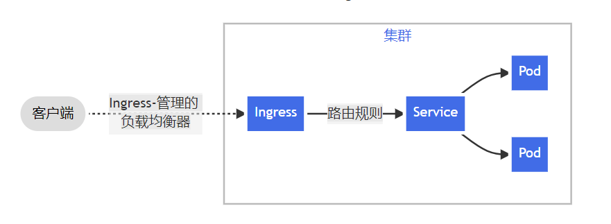
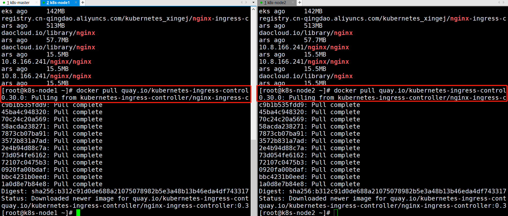
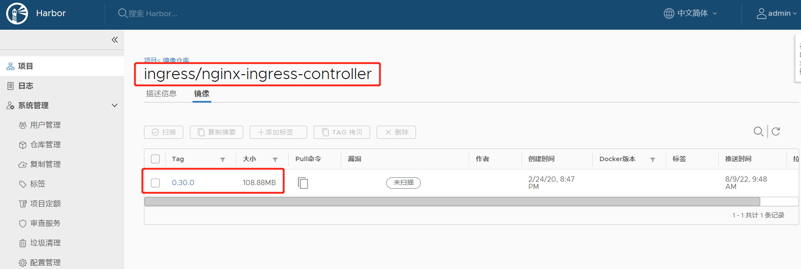
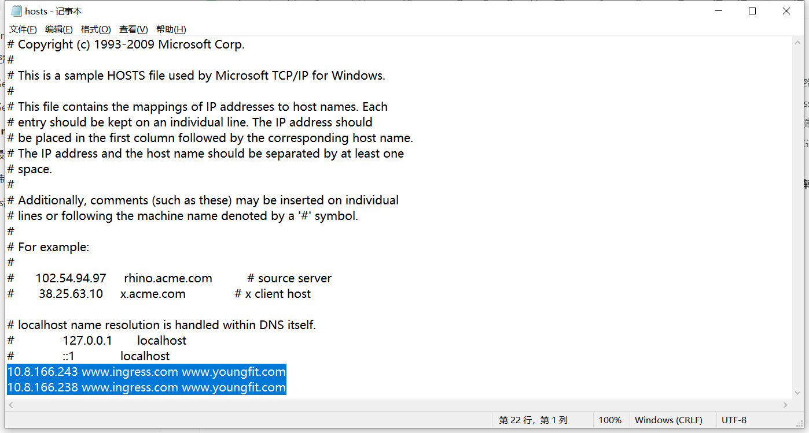
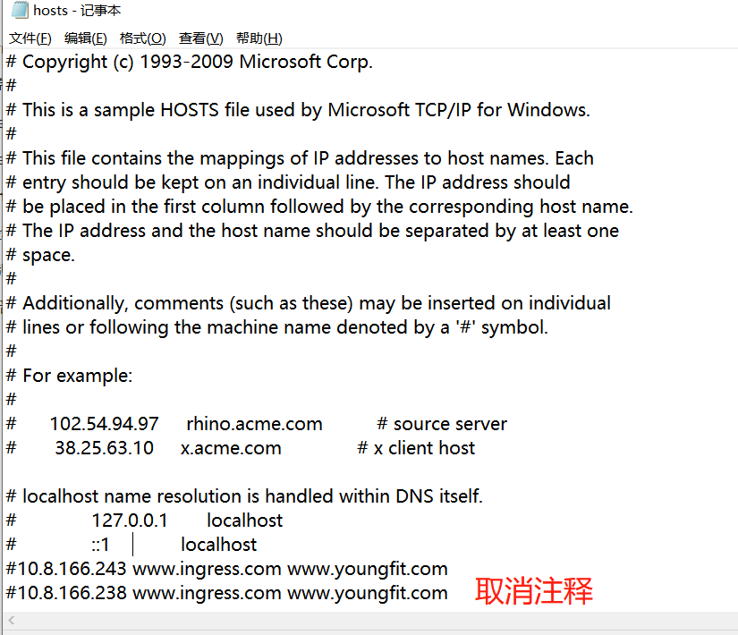

# k8s-Ingress应用

# Ingress服务接入控制器

参考官方文档：https://kubernetes.io/zh-cn/docs/concepts/services-networking/ingress/

Kubernetes 暴露服务的方式目前只有三种：LoadBlancer Service、NodePort Service、Ingress


要理解ingress，需要区分两个概念，ingress和ingress-controller：


ingress对象：

指的是k8s中的一个api对象/资源对象，一般用yaml配置。作用是定义请求如何转发到service的规则，可以理解为配置模板。


ingress-controller：

具体实现反向代理及负载均衡的程序，对ingress定义的规则进行解析，根据配置的规则来实现请求转发。


简单来说，ingress-controller才是负责具体转发的组件，通过各种方式将它暴露在集群入口，外部对集群的请求流量会先到ingress-controller，而ingress对象是用来告诉ingress-controller该如何转发请求，比如哪些域名哪些path要转发到哪些服务等等。


service 的表现形式为IP:PORT，即工作在第四层传输层（TCP/IP层），对于不同的URL地址经常对应用不同的后端服务或者虚拟服务器，这些应用层的转发机制仅通过kubernetes的service机制是无法实现的，这种情况我们可以使用ingress策略定义和一个具体的ingress Controller. Ingress提供七层负载均衡能力，可以通过 Ingress 配置提供外部可访问的 URL、负载均衡、SSL、基于名称的虚拟主机等。作为集群流量接入层，Ingress 的高可靠性显得尤为重要。


这个负载均衡是基于nginx七层反向代理来实现的，ingress工作原理如下图：




外部客户端通过访问负载均衡器，然后调度到service上，然后在调度到IngressController，IngressController通过Ingress规则（域名或虚拟主机）访问到后端pod，而在Ingress规则当中对应的主机是由service分组来设定的.


Kubernetes 并没有自带 Ingress Controller，实际上ingress-controller只是一个统称，具体实现有多种，需要自己单独安装，目前，由k8s维护的ingress-controller只有google云的GCE与ingress-nginx两个，常用的是 Ingress-nginx Controller。


Ingress 一般由三个组件组成： 

\1. Nginx 反向代理负载均衡器 

\2. Ingress Controller 可以理解为控制器，它通过不断的跟 Kubernetes API 交互，实时获取后端 Service、Pod 等的变化，比如新增、删除等，然后结合 Ingress 定义的规则生成配置，然后动态更新上边的 Nginx 负载均衡器，并刷新使配置生效，来达到服务自动发现的作用。 

\3. Ingress 则是定义规则，通过它定义某个域名的请求过来之后转发到集群中指定的 Service。它可以通过 Yaml 文件定义，可以给一个或多个 Service 定义一个或多个 Ingress 规则。


## 如何创建 Ingress 资源

- Ingress 中的spec字段是Ingress资源的核心组成部分，主要包含以下3个字段：

- - rules：用于定义当前Ingress资源的转发规则列表；由rules定义规则，或没有匹配到规则时，所有的流量会转发到由backend定义的默认后端。
  - backend：默认的后端，用于服务那些没有匹配到任何规则的请求；定义Ingress资源时，必须要定义backend或rules两者之一，该字段用于让负载均衡器指定一个全局默认的后端。
  - tls：TLS配置，目前仅支持通过默认端口443提供服务，如果要配置指定的列表成员指向不同的主机，则需要通过SNI TLS扩展机制来支持该功能。

## 部署 Ingress 控制器（Nginx）

- 下载 ingress controller
- wget https://github.com/kubernetes/ingress-nginx/archive/nginx-0.30.0.tar.gz

```shell
ingress-nginx文件位于deploy/static目录下，各文件的作用：

configmap.yaml:
提供configmap可以在线更新nginx的配置

default-backend.yaml:
提供一个缺省的后台错误页面 404

namespace.yaml:
创建一个独立的命名空间 ingress-nginx

rbac.yaml：
创建对应的role rolebinding 用于rbac

tcp-services-configmap.yaml:
修改L4负载均衡配置的configmap

udp-services-configmap.yaml:
修改L4负载均衡配置的configmap

with-rbac.yaml:
有应用rbac的nginx-ingress-controller组件
```

## Ingress-Nginx GitHub地址

```shell
https://github.com/kubernetes/ingress-nginx
挂上代理，访问github。

nginx-0.30.0.tar.gz
百度网盘链接地址：
链接：https://pan.baidu.com/s/1tQ-QrbsOXwwKaCf8w7lSjA 
提取码：yute 
[root@k8s-master ~]# cd /mnt/
[root@k8s-master mnt]# wget https://github.com/kubernetes/ingress-nginx/archive/nginx-0.30.0.tar.gz
[root@k8s-master mnt]# tar xzvf nginx-0.30.0.tar.gz
[root@k8s-master mnt]# cd ingress-nginx-nginx-0.30.0/deploy/static/
[root@k8s-master static]# ls
configmap.yaml  mandatory.yaml  namespace.yaml  provider  rbac.yaml  with-rbac.yaml
[root@k8s-master static]# cp mandatory.yaml /root/
[root@k8s-master static]# cd

# 创建命名空间ingress-nginx
[root@k8s-master static]# cat namespace.yaml 
apiVersion: v1
kind: Namespace
metadata:
  name: ingress-nginx
  labels:
    app.kubernetes.io/name: ingress-nginx
    app.kubernetes.io/part-of: ingress-nginx
    
# 创建几个configmap。可以更新pod中的配置
[root@k8s-master static]# cat configmap.yaml 
kind: ConfigMap
apiVersion: v1
metadata:
  name: nginx-configuration
  namespace: ingress-nginx
  labels:
    app.kubernetes.io/name: ingress-nginx
    app.kubernetes.io/part-of: ingress-nginx

---
kind: ConfigMap
apiVersion: v1
metadata:
  name: tcp-services
  namespace: ingress-nginx
  labels:
    app.kubernetes.io/name: ingress-nginx
    app.kubernetes.io/part-of: ingress-nginx

---
kind: ConfigMap
apiVersion: v1
metadata:
  name: udp-services
  namespace: ingress-nginx
  labels:
    app.kubernetes.io/name: ingress-nginx
    app.kubernetes.io/part-of: ingress-nginx
[root@k8s-master ~]# vim mandatory.yaml #修改配置文件
找到已下apiserver的版本：
apiVersion: apps/v1
kind: DaemonSet  #将原来的Deployment修改为DaemonSet
metadata:
  name: nginx-ingress-controller
  namespace: ingress-nginx
  labels:
    app.kubernetes.io/name: ingress-nginx
    app.kubernetes.io/part-of: ingress-nginx
spec:
  #replicas: 1 #将这里注释
  selector:
    matchLabels:
      app.kubernetes.io/name: ingress-nginx
      app.kubernetes.io/part-of: ingress-nginx
  template:
    metadata:
      labels:
        app.kubernetes.io/name: ingress-nginx
        app.kubernetes.io/part-of: ingress-nginx
      annotations:
        prometheus.io/port: "10254"
        prometheus.io/scrape: "true"
    spec:
      # wait up to five minutes for the drain of connections
      terminationGracePeriodSeconds: 300
      serviceAccountName: nginx-ingress-serviceaccount
      hostNetwork: true  #添加此配置，共享宿主机网络
#      nodeSelector:
#        custom/ingress-controller-ready: "true"  #添加此配置
      containers:
        - name: nginx-ingress-controller
          image: quay.io/kubernetes-ingress-controller/nginx-ingress-controller:0.30.0 #提前将镜像下载下来
          args:
            - /nginx-ingress-controller
            - --configmap=$(POD_NAMESPACE)/nginx-configuration
            - --tcp-services-configmap=$(POD_NAMESPACE)/tcp-services
            - --udp-services-configmap=$(POD_NAMESPACE)/udp-services
            - --publish-service=$(POD_NAMESPACE)/ingress-nginx
            - --annotations-prefix=nginx.ingress.kubernetes.io
          securityContext:
            allowPrivilegeEscalation: true
            capabilities:
              drop:
                - ALL
              add:
                - NET_BIND_SERVICE
            # www-data -> 101
            runAsUser: 101
          env:
            - name: POD_NAME
              valueFrom:
                fieldRef:
                  fieldPath: metadata.name
            - name: POD_NAMESPACE
              valueFrom:
                fieldRef:
                  fieldPath: metadata.namespace
          ports:
            - name: http
              containerPort: 80
              protocol: TCP
            - name: https
              containerPort: 443
              protocol: TCP
          livenessProbe:
            failureThreshold: 3
            httpGet:
              path: /healthz
              port: 10254
              scheme: HTTP
            initialDelaySeconds: 10
            periodSeconds: 10
            successThreshold: 1
            timeoutSeconds: 10
          readinessProbe:
            failureThreshold: 3
            httpGet:
              path: /healthz
              port: 10254
              scheme: HTTP
            periodSeconds: 10
            successThreshold: 1
            timeoutSeconds: 10
          lifecycle:
            preStop:
              exec:
                command:
                  - /wait-shutdown
[root@k8s-master static]# pwd
/root/ingress/ingress-nginx-nginx-0.30.0/deploy/static

[root@k8s-master static]# kubectl apply -f namespace.yaml 

[root@k8s-master static]# kubectl apply -f configmap.yaml 

[root@k8s-master static]# kubectl apply -f rbac.yaml

[root@k8s-master static]# kubectl apply -f with-rbac.yaml
或者
[root@k8s-master static]# kubectl apply -f /root/mandatory.yaml
参数解释：
terminationGracePeriodSeconds: 300

1、Pod 被删除，状态置为 Terminating。
2、kube-proxy 更新转发规则，将 Pod 从 service 的 endpoint 列表中摘除掉，新的流量不再转发到该 Pod。
3、如果 Pod 配置了 preStop Hook ，将会执行。
4、kubelet 对 Pod 中各个 container 发送 SIGTERM 信号以通知容器进程开始优雅停止。
5、等待容器进程完全停止，如果在 terminationGracePeriodSeconds 内 (默认 30s) 还未完全停止，就发送 SIGKILL 信号强制杀死进程。
6、所有容器进程终止，清理 Pod 资源。

优雅退出
要实现优雅终止，务必在业务代码里面处理下 SIGTERM 信号

进程优雅退出的方法

1、preStop-webhook
    lifecycle:
      preStop:
        exec:
          command:
          - sleep
          - 5s

2、调整优雅终止时间，terminationGracePeriodSeconds 默认是30s。自己视情况而定（terminationGracePeriodSeconds 一定大于sleep的时间）
特别说明： preStop Hook并不会影响SIGTERM的处理，因此有可能preStopHook还没有执行完就收到SIGKILL导致容器强制退出。因此如果preStop Hook设置了n秒，需要设置terminationGracePeriodSeconds为terminationGracePeriodSeconds+n秒。
```

**需要修改的地方：**

kind: DaemonSet

```shell
官方原始文件使用的是deployment，replicate 为 1，这样将会在某一台节点上启动对应的nginx-ingress-controller pod。外部流量访问至该节点，由该节点负载分担至内部的service。测试环境考虑防止单点故障，改为DaemonSet然后删掉replicate ，配合亲和性部署在指定节点上启动nginx-ingress-controller pod，确保有多个节点启动nginx-ingress-controller pod，后续将这些节点加入到外部硬件负载均衡组实现高可用性。
```

hostNetwork: true

```shell
添加该字段，暴露nginx-ingress-controller pod的服务端口（80）。
```

nodeSelector

```shell
增加亲和性部署，有custom/ingress-controller-ready 标签的节点才会部署该DaemonSet

为需要部署nginx-ingress-controller的节点设置lable

# 由于我这里定义的是DaemonSet，所以这里注释掉了。每个Node节点都会部署nginx-ingress-controller pod的服务
```

给两个node节点设置lable，我这里用的DeamonSet，不设置也可以。

```shell
[root@k8s-master ~]# kubectl label nodes k8s-node1 custom/ingress-controller-ready=true

[root@k8s-master ~]# kubectl label nodes k8s-node2 custom/ingress-controller-ready=true

同时在两个node节点下载镜像
[root@k8s-node1 ~]# docker pull quay.io/kubernetes-ingress-controller/nginx-ingress-controller:0.30.0
[root@k8s-node2 ~]# docker pull quay.io/kubernetes-ingress-controller/nginx-ingress-controller:0.30.0
```



### 镜像推送Harbor仓库

便于以后使用

```shell
[root@k8s-node1 ~]# cat /etc/docker/daemon.json 
{
"insecure-registries": ["10.8.166.241"]  #harbor仓库的地址
}
[root@k8s-node1 ~]# systemctl restart docker #我这里设置过了，不用重启了。
[root@k8s-node1 ~]# docker tag quay.io/kubernetes-ingress-controller/nginx-ingress-controller:0.30.0 10.8.166.241/ingress/nginx-ingress-controller:0.30.0
[root@k8s-node1 ~]# docker push 10.8.166.241/ingress/nginx-ingress-controller:0.30.0
```




创建ingress-controller

```shell
[root@k8s-master ~]# kubectl apply -f mandatory.yaml
这里需要注意：rbac和rbaccluster的apiserver的版本需要修改为：
rbac.authorization.k8s.io/v1

查看ingress-controller资源
[root@k8s-master ~]# kubectl get pod -n ingress-nginx
```


### 测试ingress

创建两个应用和service

```shell
[root@k8s-master ingress]# pwd
/root/ingress
[root@k8s-master ingress]# vim my-apache.yaml
apiVersion: apps/v1
kind: Deployment
metadata:
 name: my-apache
spec:
 selector:
   matchLabels:
     run: my-apache
 replicas: 2
 template:
  metadata:
   labels:
    run: my-apache
  spec:
   containers:
   - name: my-apache
     image: daocloud.io/library/httpd:2.4
     ports:
     - containerPort: 80
---
apiVersion: v1
kind: Service
metadata:
 name: my-apache
 labels:
  run: my-apache
spec:
 #type: NodePort
 ports:
 - port: 80
   targetPort: 80
   #nodePort: 30002
 selector:
  run: my-apache
[root@k8s-master ~]# cat my-nginx.yaml 
apiVersion: apps/v1
kind: Deployment
metadata:
 name: my-nginx
spec:
 selector:
   matchLabels:
     run: my-nginx
 replicas: 2
 template:
  metadata:
   labels:
    run: my-nginx
  spec:
   containers:
   - name: my-nginx
     image: daocloud.io/library/nginx:1.7.9
     ports:
     - containerPort: 80
---
apiVersion: v1
kind: Service
metadata:
 name: my-nginx
 labels:
  run: my-nginx
spec:
 #type: NodePort
 ports:
 - port: 80
   targetPort: 80
   #nodePort: 30001
 selector:
  run: my-nginx
创建pod和service
[root@k8s-master ~]# kubectl apply -f my-apache.yaml
[root@k8s-master ~]# kubectl apply -f my-nginx.yaml
```


### 配置ingress转发文件

#### 宿主机网络模式 hostNetwork: true

```shell
[root@k8s-master ~]# cat ingress-test.yaml 
apiVersion: networking.k8s.io/v1
kind: Ingress
metadata:
 name: test-ingress
 namespace: default
 annotations:
    nginx.ingress.kubernetes.io/rewrite-target: /
spec:
 rules:  #定义转发规则
 - host: www.ingress.com  #指定域名方式
   http:
    paths:
    - path: /  #指定访问的路径
      pathType: Prefix  #定义路径的类型
      backend:   #定义转发后端的服务
       service:  #定义转发的service
         name: my-apache
         port:
          number: 80 #由于Ingress控制器开启了hostNetwork: true。这里必须设置80
 - host: www.youngfit.com
   http:
    paths:
    - path: /
      pathType: Prefix
      backend:
       service:
         name: my-nginx
         port:
          number: 80
[root@k8s-master mingyu-ingress]# kubectl apply -f ingress-test.yaml
```


nginx-ingress-controller运行在node1,node2两个节点上。

如果网络中有dns服务器，在dns中把这两个域名映射到nginx-ingress-controller运行的任意一个节点上，如果没有dns服务器只能修改host文件了。

任意一个节点上操作：(客户端解析)

我这里有两个节点部署了控制器，ip分别为172.16.229.5，172.16.229.6 ，如果有多个，可以随便选。

访问测试

在windows电脑设置本地解析






#### nodePort方式

```plain
[root@k8s-master nodeport]# ls
ingress-test.yaml  mandatory.yaml  my-apache.yml  my-nginx.yml
[root@k8s-master nodeport]# ls
ingress-test.yaml  mandatory.yaml  my-apache.yml  my-nginx.yml
[root@k8s-master nodeport]# cat mandatory.yaml 
apiVersion: v1
kind: Namespace
metadata:
  name: ingress-nginx
  labels:
    app.kubernetes.io/name: ingress-nginx
    app.kubernetes.io/part-of: ingress-nginx

---

kind: ConfigMap
apiVersion: v1
metadata:
  name: nginx-configuration
  namespace: ingress-nginx
  labels:
    app.kubernetes.io/name: ingress-nginx
    app.kubernetes.io/part-of: ingress-nginx

---
kind: ConfigMap
apiVersion: v1
metadata:
  name: tcp-services
  namespace: ingress-nginx
  labels:
    app.kubernetes.io/name: ingress-nginx
    app.kubernetes.io/part-of: ingress-nginx

---
kind: ConfigMap
apiVersion: v1
metadata:
  name: udp-services
  namespace: ingress-nginx
  labels:
    app.kubernetes.io/name: ingress-nginx
    app.kubernetes.io/part-of: ingress-nginx

---
apiVersion: v1
kind: ServiceAccount
metadata:
  name: nginx-ingress-serviceaccount
  namespace: ingress-nginx
  labels:
    app.kubernetes.io/name: ingress-nginx
    app.kubernetes.io/part-of: ingress-nginx

---
apiVersion: rbac.authorization.k8s.io/v1beta1
kind: ClusterRole
metadata:
  name: nginx-ingress-clusterrole
  labels:
    app.kubernetes.io/name: ingress-nginx
    app.kubernetes.io/part-of: ingress-nginx
rules:
  - apiGroups:
      - ""
    resources:
      - configmaps
      - endpoints
      - nodes
      - pods
      - secrets
    verbs:
      - list
      - watch
  - apiGroups:
      - ""
    resources:
      - nodes
    verbs:
      - get
  - apiGroups:
      - ""
    resources:
      - services
    verbs:
      - get
      - list
      - watch
  - apiGroups:
      - ""
    resources:
      - events
    verbs:
      - create
      - patch
  - apiGroups:
      - "extensions"
      - "networking.k8s.io"
    resources:
      - ingresses
    verbs:
      - get
      - list
      - watch
  - apiGroups:
      - "extensions"
      - "networking.k8s.io"
    resources:
      - ingresses/status
    verbs:
      - update

---
apiVersion: rbac.authorization.k8s.io/v1beta1
kind: Role
metadata:
  name: nginx-ingress-role
  namespace: ingress-nginx
  labels:
    app.kubernetes.io/name: ingress-nginx
    app.kubernetes.io/part-of: ingress-nginx
rules:
  - apiGroups:
      - ""
    resources:
      - configmaps
      - pods
      - secrets
      - namespaces
    verbs:
      - get
  - apiGroups:
      - ""
    resources:
      - configmaps
    resourceNames:
      # Defaults to "<election-id>-<ingress-class>"
      # Here: "<ingress-controller-leader>-<nginx>"
      # This has to be adapted if you change either parameter
      # when launching the nginx-ingress-controller.
      - "ingress-controller-leader-nginx"
    verbs:
      - get
      - update
  - apiGroups:
      - ""
    resources:
      - configmaps
    verbs:
      - create
  - apiGroups:
      - ""
    resources:
      - endpoints
    verbs:
      - get

---
apiVersion: rbac.authorization.k8s.io/v1beta1
kind: RoleBinding
metadata:
  name: nginx-ingress-role-nisa-binding
  namespace: ingress-nginx
  labels:
    app.kubernetes.io/name: ingress-nginx
    app.kubernetes.io/part-of: ingress-nginx
roleRef:
  apiGroup: rbac.authorization.k8s.io
  kind: Role
  name: nginx-ingress-role
subjects:
  - kind: ServiceAccount
    name: nginx-ingress-serviceaccount
    namespace: ingress-nginx

---
apiVersion: rbac.authorization.k8s.io/v1beta1
kind: ClusterRoleBinding
metadata:
  name: nginx-ingress-clusterrole-nisa-binding
  labels:
    app.kubernetes.io/name: ingress-nginx
    app.kubernetes.io/part-of: ingress-nginx
roleRef:
  apiGroup: rbac.authorization.k8s.io
  kind: ClusterRole
  name: nginx-ingress-clusterrole
subjects:
  - kind: ServiceAccount
    name: nginx-ingress-serviceaccount
    namespace: ingress-nginx

---

apiVersion: apps/v1
#kind: DaemonSet
kind: Deployment
metadata:
  name: nginx-ingress-controller
  namespace: ingress-nginx
  labels:
    app.kubernetes.io/name: ingress-nginx
    app.kubernetes.io/part-of: ingress-nginx
spec:
  replicas: 1
  selector:
    matchLabels:
      app.kubernetes.io/name: ingress-nginx
      app.kubernetes.io/part-of: ingress-nginx
  template:
    metadata:
      labels:
        app.kubernetes.io/name: ingress-nginx
        app.kubernetes.io/part-of: ingress-nginx
      annotations:
        prometheus.io/port: "10254"
        prometheus.io/scrape: "true"
    spec:
      # wait up to five minutes for the drain of connections
      terminationGracePeriodSeconds: 300
#      hostNetwork: true   # 关闭此网络模式
      serviceAccountName: nginx-ingress-serviceaccount
#      nodeSelector:
#        custom/ingress-controller-ready: "true"
#        kubernetes.io/os: linux
      containers:
        - name: nginx-ingress-controller
          image: quay.io/kubernetes-ingress-controller/nginx-ingress-controller:0.30.0
#          image: registry.cn-qingdao.aliyuncs.com/kubernetes_xingej/nginx-ingress-controller:0.20.0
          args:
            - /nginx-ingress-controller
            - --configmap=$(POD_NAMESPACE)/nginx-configuration
            - --tcp-services-configmap=$(POD_NAMESPACE)/tcp-services
            - --udp-services-configmap=$(POD_NAMESPACE)/udp-services
            - --publish-service=$(POD_NAMESPACE)/ingress-nginx
            - --annotations-prefix=nginx.ingress.kubernetes.io
          securityContext:
            allowPrivilegeEscalation: true
            capabilities:
              drop:
                - ALL
              add:
                - NET_BIND_SERVICE
            # www-data -> 101
            runAsUser: 101
          env:
            - name: POD_NAME
              valueFrom:
                fieldRef:
                  fieldPath: metadata.name
            - name: POD_NAMESPACE
              valueFrom:
                fieldRef:
                  fieldPath: metadata.namespace
          ports:
            - name: http
              containerPort: 80
              protocol: TCP
            - name: https
              containerPort: 443
              protocol: TCP
          livenessProbe:
            failureThreshold: 3
            httpGet:
              path: /healthz
              port: 10254
              scheme: HTTP
            initialDelaySeconds: 10
            periodSeconds: 10
            successThreshold: 1
            timeoutSeconds: 10
          readinessProbe:
            failureThreshold: 3
            httpGet:
              path: /healthz
              port: 10254
              scheme: HTTP
            periodSeconds: 10
            successThreshold: 1
            timeoutSeconds: 10
          lifecycle:
            preStop:
              exec:
                command:
                  - /wait-shutdown

---

apiVersion: v1
kind: LimitRange
metadata:
  name: ingress-nginx
  namespace: ingress-nginx
  labels:
    app.kubernetes.io/name: ingress-nginx
    app.kubernetes.io/part-of: ingress-nginx
spec:
  limits:
  - min:
      memory: 90Mi
      cpu: 100m
    type: Container
```


```plain
[root@k8s-master nodeport]# cat my-apache.yml 
apiVersion: apps/v1
kind: Deployment
metadata:
 name: my-apache
spec:
 selector:
   matchLabels:
     run: my-apache
 replicas: 2
 template:
  metadata:
   labels:
    run: my-apache
  spec:
   containers:
   - name: my-apache
     image: daocloud.io/library/httpd:2.4
     ports:
     - containerPort: 80
---
apiVersion: v1
kind: Service
metadata:
 name: my-apache
 labels:
  run: my-apache
spec:
 type: NodePort
 ports:
 - port: 80
   targetPort: 80
#   nodePort: 30002
 selector:
  run: my-apache
[root@k8s-master ingress]# cat my-nginx.yaml 
apiVersion: apps/v1
kind: Deployment
metadata:
 name: my-nginx
spec:
 selector:
   matchLabels:
     run: my-nginx
 replicas: 2
 template:
  metadata:
   labels:
    run: my-nginx
  spec:
   containers:
   - name: my-nginx
     image: 10.8.166.241/nginx/nginx:v1.9
     ports:
     - containerPort: 80
---
apiVersion: v1
kind: Service
metadata:
 name: my-nginx
 labels:
  run: my-nginx
spec:
 type: NodePort
 ports:
 - port: 80
   targetPort: 80
   #nodePort: 30001
 selector:
  run: my-nginx
[root@k8s-master nodeport]# cat ingress-test.yaml
apiVersion: networking.k8s.io/v1
kind: Ingress
metadata:
 name: test-ingress
 namespace: default
 annotations:
    nginx.ingress.kubernetes.io/rewrite-target: /
spec:
 rules:  #定义转发规则
 - host: www.ingress.com
   http:
    paths:
    - path: /  #指定访问的路径
      pathType: Prefix  #定义路径的类型
      backend:   #定义转发后端的服务
       service:  #定义转发的service
         name: my-apache
         port:
          number: 80  #这个跟clusetrIP端口保持一致；这里有点模糊。
 - host: www.youngfit.com
   http:
    paths:
    - path: /
      pathType: Prefix
      backend:
       service:
         name: my-nginx
         port:
          number: 80
[root@k8s-master nodeport]# kubectl apply -f mandatory.yaml
[root@k8s-master nodeport]# kubectl apply -f my-apache.yml  
[root@k8s-master nodeport]# kubectl apply -f my-nginx.yml
[root@k8s-master nodeport]# kubectl apply -f ingress-test.yaml
```


