# Mysql多源主从复制

## 实验环境

| 操作系统   | 主机地址        | 主机名        |
| ---------- | --------------- | ------------- |
| CentOS 7.4 | 192.168.153.220 | mysql-master1 |
| CentOS 7.4 | 192.168.153.215 | mysql-master2 |
| CentOS 7.4 | 192.168.153.148 | mysql-slave1  |
| CentOS 7.4 | 192.168.153.219 | mysql-slave2  |

MySQL在5.7.2上面添加了多源复制（Multi-Source）功能，意味着一个从库可以连多个主库，从而同时进行同步，但是如果是同一个表的话，会存在主键和唯一索引冲突的风险，需要提前做好规划

个人认为MySQL能实现多源复制的关键有两点

\1.      MySQL5.7中的从库进行同步的SQL_THREAD，IO_THREAD可以并发执行，这使得使多数据源的binlog同时同步变为可能。我们只需要对每一个Master执行Change Master 语句，只需要在每个语句最后使用For Channel来进行区分。

master1:

change master to master2 channel 'master';


master2:

change master to master1 channel 'master1';


slave1:

change master to master1 channel 'master1';

change master to master2 channel 'master';

\2.      MySQL5.7中添加了channel（通道）来判别不同的数据源，这样slave可以非常简单的进行多数据源的配置与区分。

3.	由于复制的原理没有改变，在没有开启GTID的时候Master的版本可以是MySQL5.5、5.6、5.7。并且从库需要[master-info-repository](http://dev.mysql.com/doc/refman/5.6/en/replication-options-slave.html#option_mysqld_relay-log-info-repository)、[relay-log-info-repository](http://dev.mysql.com/doc/refman/5.6/en/replication-options-slave.html#option_mysqld_relay-log-info-repository)设置为table，否则会报错：

```shell
ERROR 3077 (HY000): To have multiple channels, repository cannot be of type FILE; Please check the repository configuration and convert them to TABLE.
```

## 实战操作

前提：本次使用的binlog日志方式。手动指定binlog日志名称以及位置的方式；

## 配置host解析

```shell
# cat /etc/hosts
192.168.153.220 mysql-master1
192.168.153.215 mysql-master2
192.168.153.148 mysql-slave1
192.168.153.219 mysql-slave2
```

## 安装Mysql 5.7

4台机器均安装，这里采用yum安装

Mysql官网地址：https://www.mysql.com/

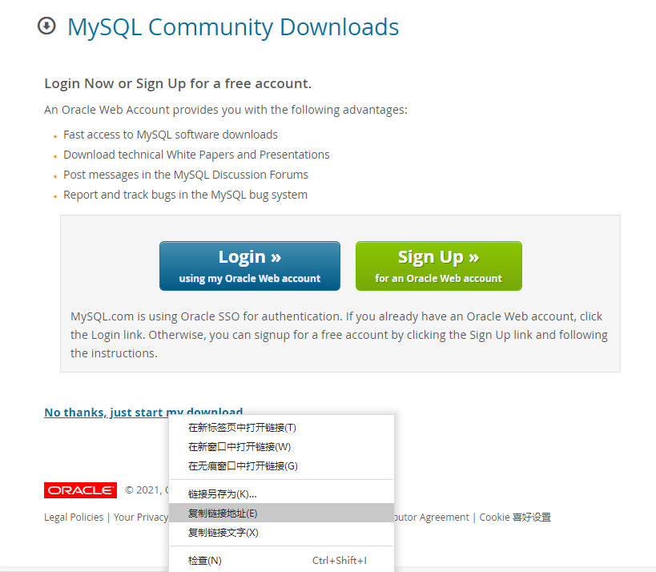

```shell
# wget https://dev.mysql.com/get/mysql80-community-release-el7-4.noarch.rpm
# rpm -ivh mysql80-community-release-el7-4.noarch.rpm
# vi /etc/yum.repos.d/mysql-community.repo   //配置yum源，下载mysql5.7
```

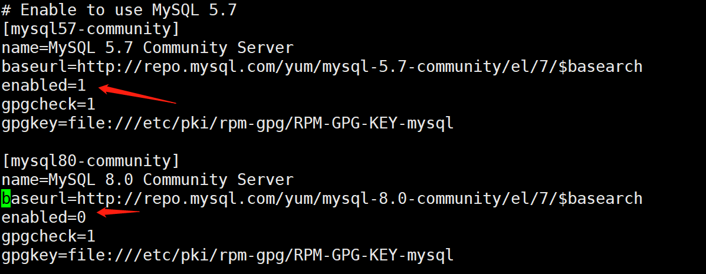

```shell
# yum -y install mysql-community-server
[root@mysq-master1 ~]# mysql --version   #一定要确定4台机器下载的Mysql版本一致
mysql  Ver 14.14 Distrib 5.7.36, for Linux (x86_64) using  EditLine wrapper
```

修改4台mysql的配置文件

打开/etc/my.cnf，在[mysqld]标签下添加内容：

```shell
server-id=1
log-bin=mylog
master-info-repository=TABLE
relay-log-info-repository=TABLE
```

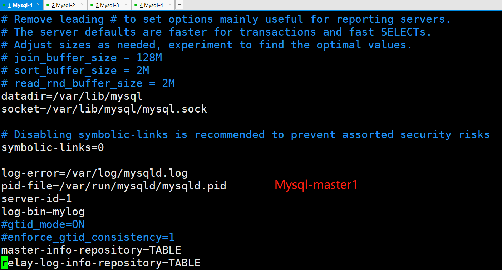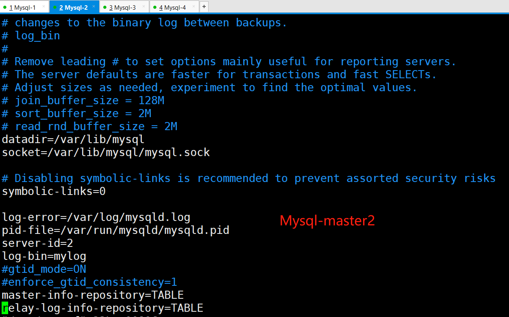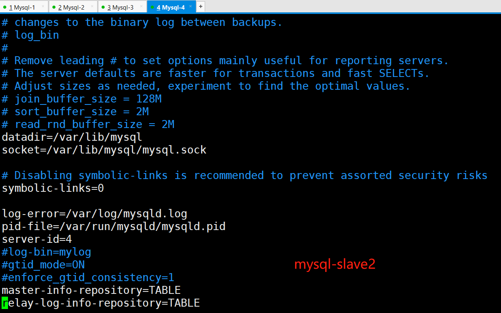

## 启动配置Mysql

mysql-master1节点操作

```shell
[root@mysq-master1 ~]# systemctl start mysqld
[root@mysq-master1 ~]# grep password /var/log/mysqld.log
```


```shell
[root@mysq-master1 ~]# mysqladmin -uroot -p'WdJ_H?xVk8-k' password 'Youngfit@123456'
[root@mysq-master1 ~]# mysql -uroot -p'Youngfit@123456'
mysql> grant replication slave,replication client on *.* to 'rep'@'192.168.153.%' identified by 'Rep@123456';  --创建同步使用的用户，注意网段

mysql> flush privileges;
```

mysql-master2操作如同mysql-master1一样步骤

## 双主配置

查看mysql-master2的binlog日志名称和位置：


在mysql-master1上指定操作：

```shell
mysql> change master to						--设置mysql-mastre2为自己的主节点
master_host='mysql-master2',
master_user='rep',
master_password='Rep@123456',
master_log_file='mylog.000002',
master_log_pos=856916 for channel 'mysql-master2';
Query OK, 0 rows affected, 2 warnings (0.00 sec)

mysql> start slave;
mysql> show slave status\G
```

查看mysql-master1的binlog日志名称和位置：


在mysql-master2上指定操作：

```shell
mysql> change master to						--设置mysql-mastre1为自己的主节点
master_host='mysql-master1',
master_user='rep',
master_password='Rep@123456',
master_log_file='mylog.000003',   --我这里不一样，根据你自己的名称和位置去写
master_log_pos=659 for channel 'mysql-master1';

mysql> start slave;
mysql> show slave status\G
```

2台分别查看同步的io线程和sql线程是否为YES

```shell
mysql> show slave status\G
```


```shell
mysql> show slave status\G
```


经常操作：

```shell
# 查看单个channel的状态
mysql> show slave status for channel 'mysql-master2'\G
# 停止单个channel同步
mysql>  stop slave for channel 'mysql-master2';
# 开启单个channel同步
mysql>  start slave for channel 'mysql-master2';
# 重置单个channel
mysql>  reset slave for channel 'mysql-master2';
# 查看所有channel
mysql> show slave status\G
# 开启所有channel
mysql> start slave;
```

 [监控](https://dev.mysql.com/doc/refman/5.7/en/replication-multi-source-monitoring.html)：系统库performance_schema增加了一些replication的监控表

```shell
mysql> use performance_schema
mysql> show tables like 'replicat%';
+-------------------------------------------+
| Tables_in_performance_schema (replicat%)  |
+-------------------------------------------+
| replication_applier_configuration         |###查看各个channel是否配置了复制延迟
| replication_applier_status                |###查看各个channel是否复制正常（service_state）以及事务重连的次数
| replication_applier_status_by_coordinator |###查看各个channel是否复制正常，以及复制错误的code、message和时间
| replication_applier_status_by_worker      |###查看各个channel是否复制正常，以及并行复制work号，复制错误的code、SQL和时间
| replication_connection_configuration      |###查看各个channel的连接配置信息：host、port、user、auto_position等
| replication_connection_status             |###查看各个channel的连接信息
| replication_group_member_stats            |###
| replication_group_members                 |###
+-------------------------------------------+
```

## 双从配置

mysql-slave1

```shell
[root@mysql-slave1 ~]# systemctl start mysqld
[root@mysql-slave1 ~]# grep password /var/log/mysqld.log 
[root@mysql-slave1 ~]# mysqladmin -uroot -p'oUm?lgeoA8yY' password 'Youngfit@123456'
[root@mysql-slave1 ~]# mysql -uroot -p'Youngfit@123456'
mysql> change master to						--设置mysql-mastre1为自己的主节点
master_host='mysql-master1',
master_user='rep',
master_password='Rep@123456',
master_log_file='mylog.000003',   --我这里不一样，根据你自己的名称和位置去写
master_log_pos=659 for channel 'mysql-master1';
Query OK, 0 rows affected, 2 warnings (0.00 sec)
    
mysql> change master to						--设置mysql-mastre2为自己的主节点
master_host='mysql-master2',
master_user='rep',
master_password='Rep@123456',
master_log_file='mylog.000002',   --我这里不一样，根据你自己的名称和位置去写
master_log_pos=856916 for channel 'mysql-master2';
Query OK, 0 rows affected, 2 warnings (0.00 sec)

mysql> start slave for channel 'mysql-master1';
Query OK, 0 rows affected (0.00 sec)

mysql> start slave for channel 'mysql-master2';
Query OK, 0 rows affected (0.00 sec)

mysql> show slave status\G
```

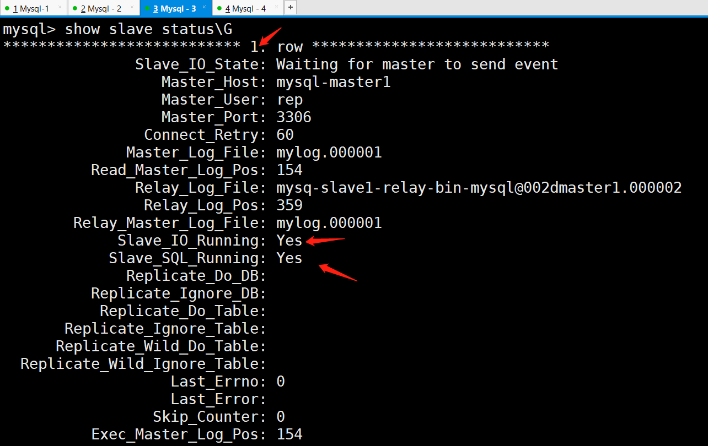

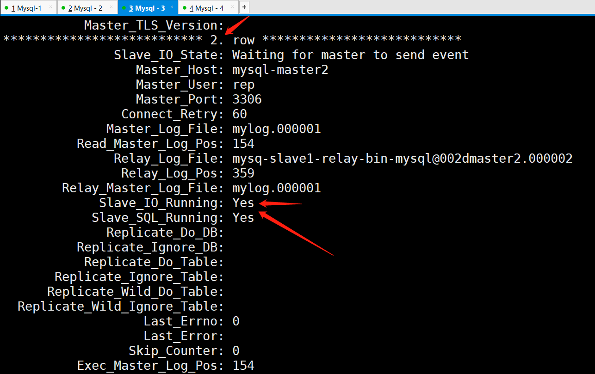

mysql-slave2同样操作

```shell
[root@mysql-slave2 ~]# systemctl start mysqld
[root@mysql-slave2 ~]# grep password /var/log/mysqld.log 
[root@mysql-slave2 ~]# mysqladmin -uroot -p'oUm?lgeoA8yY' password 'Youngfit@123456'
[root@mysql-slave2 ~]# mysql-uroot -p'Youngfit@123456'
mysql> change master to						--设置mysql-mastre1为自己的主节点
master_host='mysql-master1',
master_user='rep',
master_password='Rep@123456',
master_log_file='mylog.000003',   --我这里不一样，根据你自己的名称和位置去写
master_log_pos=659 for channel 'mysql-master1';
Query OK, 0 rows affected, 2 warnings (0.00 sec)
    
mysql> change master to						--设置mysql-mastre2为自己的主节点
master_host='mysql-master2',
master_user='rep',
master_password='Rep@123456',
master_log_file='mylog.000002',   --我这里不一样，根据你自己的名称和位置去写
master_log_pos=856916 for channel 'mysql-master2';
Query OK, 0 rows affected, 2 warnings (0.00 sec)

mysql> start slave for channel 'mysql-master1';
Query OK, 0 rows affected (0.00 sec)

mysql> start slave for channel 'mysql-master2';
Query OK, 0 rows affected (0.00 sec)

mysql> show slave status\G
```

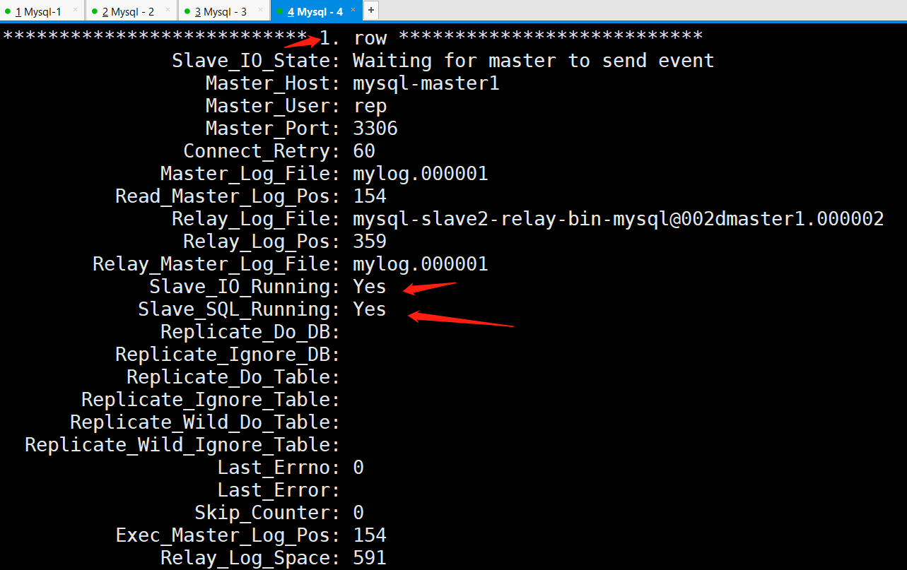

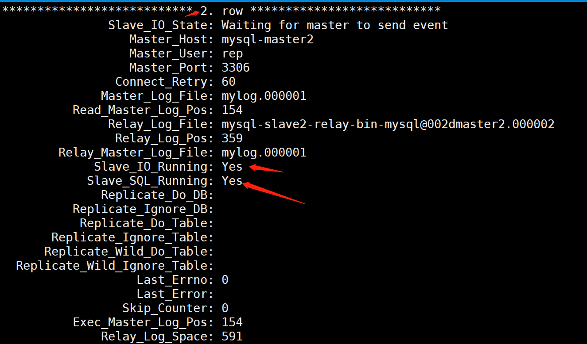

## 验证集群

在mysql-master1上创建1个库，查看其他节点是否同步

```shell
mysql> create database testbase1;
Query OK, 1 row affected (0.00 sec)
```


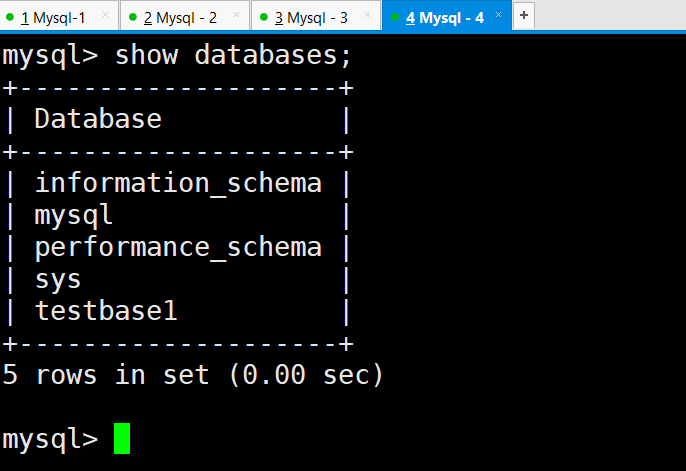

以上看出没有问题，再来试试mysql-master2插入数据，在mysql-master2节点操作

```shell
mysql> create table testbase1.table1(id int,age int);
```

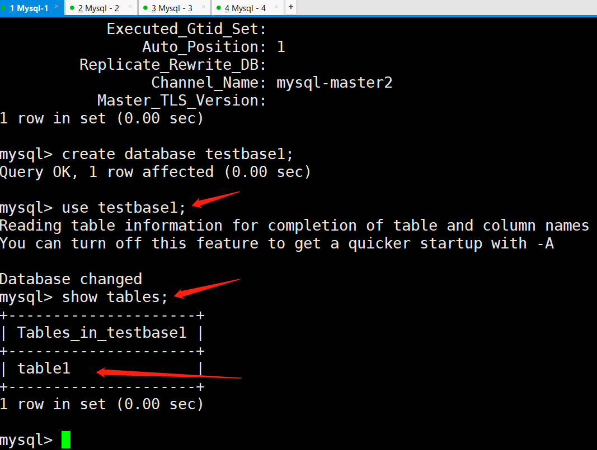


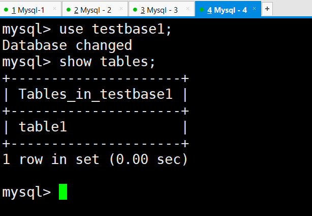

## 高可用性验证

停止mysql-master2节点

```shell
[root@mysq-master2 ~]# systemctl stop mysqld
```

能看到所有从节点，连接mysql-master2的io线程异常

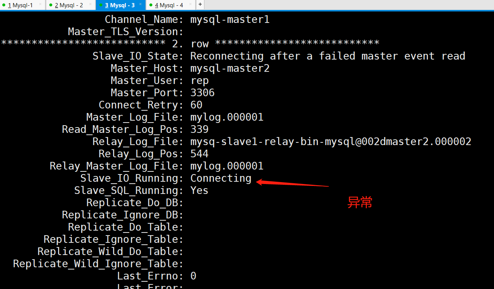

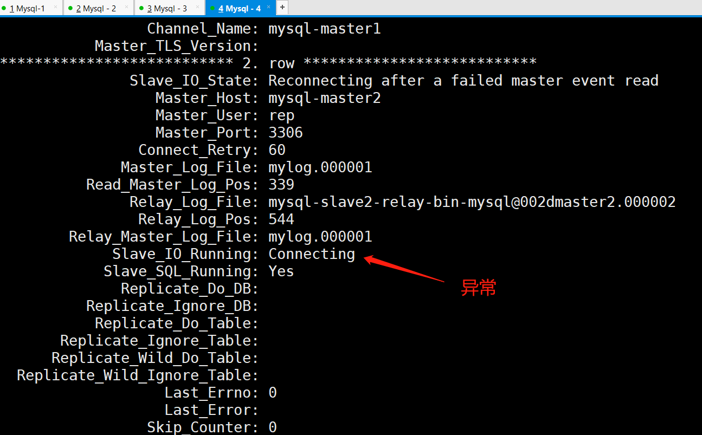

但是连接mysql-master1的仍为正常


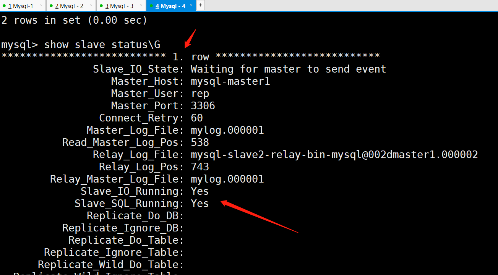

那么下面测试一下在mysql-master1上继续创建数据，看2个从节点是否还正常同步

```shell
mysql> create table  testbase1.table2(name char(3),home varchar(20));
Query OK, 0 rows affected (0.01 sec)
```

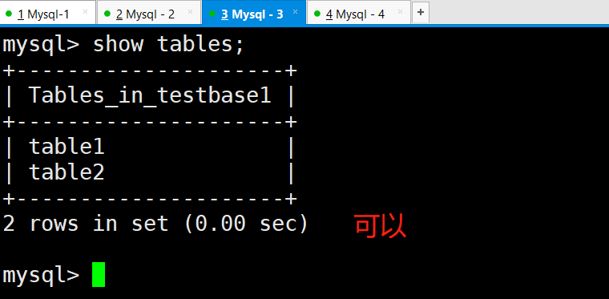

## 修复问题

修复流程：

1.停止mysql-master2节点的数据库，清空数据，

2.mysql-master1将数据全部导出，发送给mysql-master2

3.mysql-master2导入数据，重新change master to

这种修复操作，一般在Mysql没有访问的时候，像我们公司，是晚上11点以后，基本不会有请求。如果不放心，可以直接先让防火墙屏蔽掉数据库端口3306，这样所有请求都无法进入，但是要对mysql-master1,mysql-slave1,mysql-slave2放行。

在mysql-master2操作

```shell
[root@mysq-master2 ~]# systemctl stop mysqld  #停止数据库
[root@mysq-master2 ~]# rm -rf /var/lib/mysql/*  #删除所有原来的数据，当然要确保其他节点正常，最好是再对所有数据进行一次备份，以防万一
[root@mysq-master2 ~]# rm -rf /var/log/mysqld.log
[root@mysq-master2 ~]# systemctl start mysqld
[root@mysq-master2 ~]# grep password /var/log/mysqld.log 
2021-12-12T12:17:13.471634Z 1 [Note] A temporary password is generated for root@localhost: #pHeA4KFauP?
[root@mysq-master2 ~]# mysqladmin -uroot -p'#pHeA4KFauP?' password 'Youngfit@123456'
```

在mysql-master1备份数据，并发送给mysql-master2

```shell
[root@mysq-master1 ~]# mysqldump -uroot -p'Youngfit@123456' -A --set-gtid-purged=OFF > alldata.sql
[root@mysq-master1 ~]# scp alldata.sql mysql-master2:/root/
```

在mysql-master2导入数据，保证跟集群数据一致

```shell
[root@mysq-master2 ~]# mysql -uroot -p'Youngfit@123456' < alldata.sql
[root@mysq-master2 ~]# mysql -uroot -p'Youngfit@123456'
mysql> grant replication slave,replication client on *.* to 'rep'@'192.168.153.%' identified by 'Rep@123456';  --创建同步使用的用户，注意网段
Query OK, 0 rows affected, 1 warning (0.00 sec)

mysql> flush privileges;
Query OK, 0 rows affected (0.00 sec)
```

下面进行恢复：

查看mysql-master1的binlog日志名称和位置：

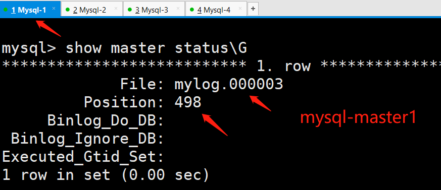

在Mysql-master2操作：

```shell
mysql> change master to                                                
master_host='mysql-master1',
master_user='rep',
master_password='Rep@123456',
master_log_file='mylog.000003',   #注意对应名称和日志位置
master_log_pos=498 for channel 'mysql-master1';

mysql> start slave for channel 'mysql-master1';
Query OK, 0 rows affected (0.00 sec)

mysql> show slave status for channel 'mysql-master1'\G
```


mysql-master1未恢复正常：


所以，mysql-master1需要重新指定：

先查看mysql-master2的binlog日志名称和位置：


在mysql-master1上重新指定操作：

```shell
mysql> stop slave for channel 'mysql-master2';
Query OK, 0 rows affected (0.00 sec)

mysql> reset slave for channel 'mysql-master2';
Query OK, 0 rows affected (0.00 sec)

mysql> change master to                                                
master_host='mysql-master2',
master_user='rep',
master_password='Rep@123456',
master_log_file='mylog.000002',
master_log_pos=880 for channel 'mysql-master2';

mysql> start slave for channel 'mysql-master2';
Query OK, 0 rows affected (0.00 sec)

mysql> show slave status for channel 'mysql-master2';
```

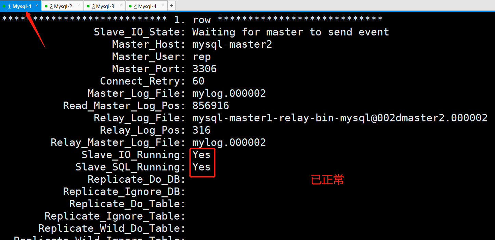

但是mysql-slave1还未恢复正常：

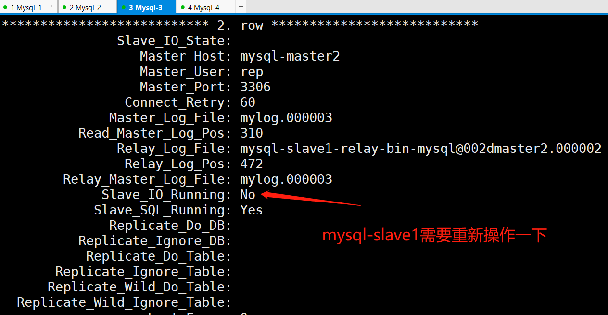

在mysql-slave1上操作：

```shell
mysql> stop slave for channel 'mysql-master2';
Query OK, 0 rows affected (0.01 sec)

mysql> reset slave for channel 'mysql-master2';
Query OK, 0 rows affected (0.00 sec)
```

看下mysql-master2的日志名称和位置：

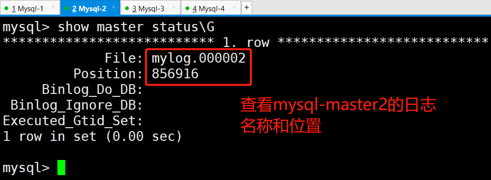

在mysql-slave1上操作：

```shell
mysql> change master to                                                
master_host='mysql-master2',
master_user='rep',
master_password='Rep@123456',
master_log_file='mylog.000002',  -- 注意对应binlog日志名称和位置
master_log_pos=856916 for channel 'mysql-master2';

mysql> start slave for channel 'mysql-master2';
Query OK, 0 rows affected (0.00 sec)
```

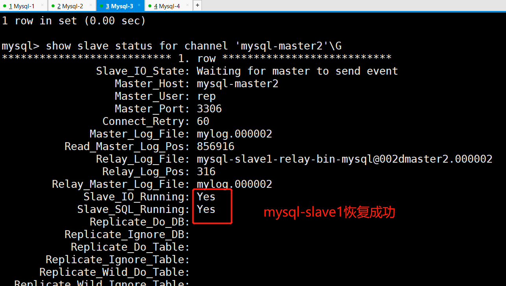

在mysql-slave2上查看，也未恢复正常

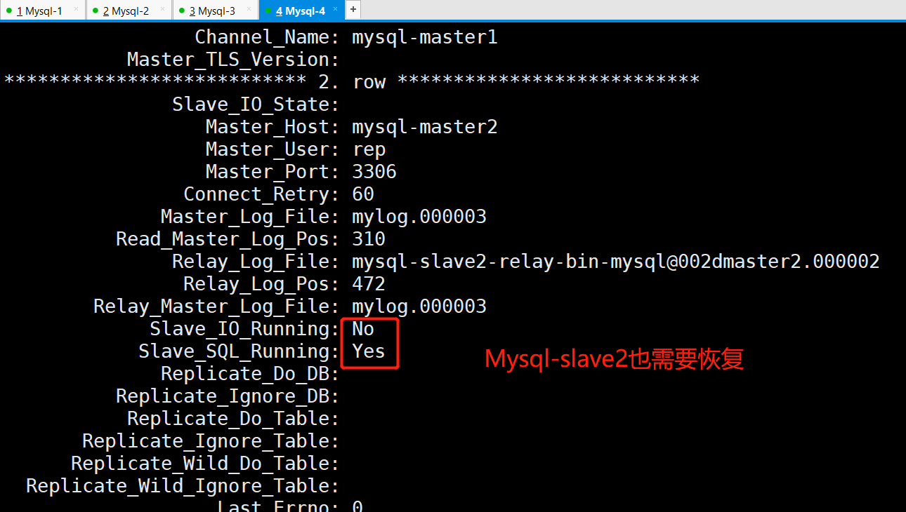

在mysql-slave2上操作：

```shell
mysql> stop slave for channel 'mysql-master2';
Query OK, 0 rows affected (0.01 sec)

mysql> reset slave for channel 'mysql-master2';
Query OK, 0 rows affected (0.00 sec)
```

查看mysql-master2的binlog日志名称和位置：

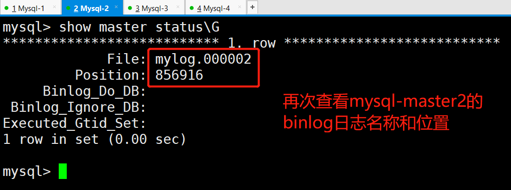

在mysql-slave2上操作：

```shell
mysql> change master to
master_host='mysql-master2',
master_user='rep',
master_password='Rep@123456',
master_log_file='mylog.000002', -- 注意对应binlog日志名称和位置
master_log_pos=856916 for channel 'mysql-master2';

mysql> start slave for channel 'mysql-master2';
Query OK, 0 rows affected (0.01 sec)

mysql> show slave status for channel 'mysql-master2'\G
```

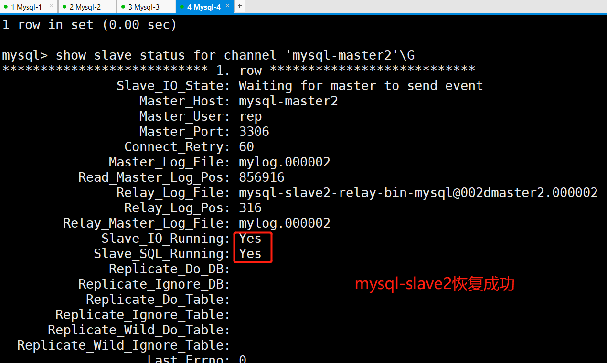

## 再次验证

在mysql-master1上新建数据，查看其他节点是否同步

```shell
mysql> create table testbase1.table2(id int,age int);
Query OK, 0 rows affected (0.01 sec)
```

其他3个节点查看验证：

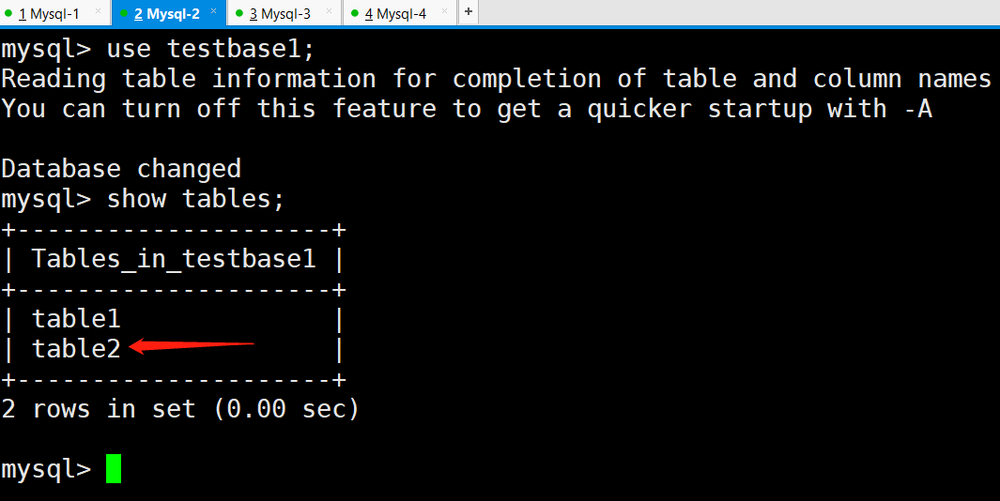

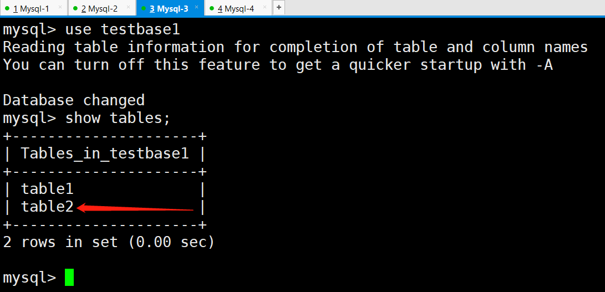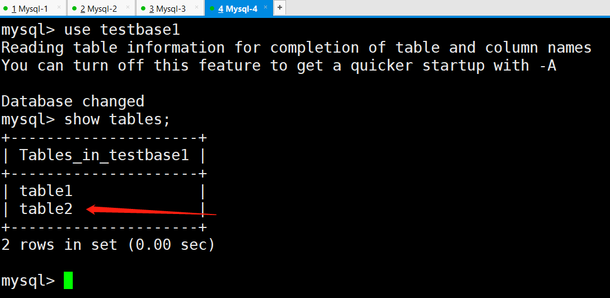

666！