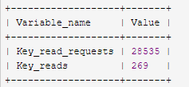

# Mysql数据库优化

#### 1、目的：

通过根据服务器目前状况，修改[MySQL](http://lib.csdn.net/base/mysql)的系统参数，达到合理利用服务器现有资源，最大合理的提高MySQL性能。


#### 2、服务器参数：

32G内存、4个CPU,每个CPU 8核


#### 3、修改MySQL配置

打开MySQL配置文件my.cnf

vi  /etc/my.cnf


#### 4.1 MySQL非缓存参数变量介绍及修改

###### 4.1.1 修改back_log参数值:由默认的50修改为500.（每个连接256kb,占用：125M）

```shell
back_log=500
```

 back_log值指出在MySQL暂时停止回答新请求之前的短时间内多少个请求可以被存在堆栈中。也就是说，如果MySql的连接数据达到max_connections时，新来的请求将会被存在堆栈中，
以等待某一连接释放资源，该堆栈的数量即back_log，
如果等待连接的数量超过back_log，将不被授予连接资源。将会报：unauthenticated user | xxx.xxx.xxx.xxx | NULL | Connect | NULL | login | NULL 的待连接进程时. back_log值不能超过TCP/IP连接的侦听队列的大小。若超过则无效，查看当前系统的TCP/IP连接的侦听队列的大小命令：cat /proc/sys/net/ipv4/tcp_max_syn_backlog目前系统为1024。对于Linux系统推荐设置为小于512的整数。 修改系统内核参数，）http://www.51testing.com/html/64/n-810764.html 查看mysql 当前系统默认back_log值，命令： show variables like 'back_log'; 查看当前数量


###### 4.1.2 修改wait_timeout参数值，由默认的8小时，修改为30分钟。(本次不用)

```shell
wait_timeout=1800（单位为s）
```

我对wait-timeout这个参数的理解：

​        MySQL客户端的数据库连接闲置最大时间值。 说得比较通俗一点，就是当你的MySQL连接闲置超过一定时间后将会被强行关闭。MySQL默认的wait-timeout  值为8个小时，可以通过命令show variables like 'wait_timeout'查看结果值;。 设置这个值是非常有意义的，比如你的网站有大量的MySQL链接请求（每个MySQL连接都是要内存资源开销的 ），由于你的程序的原因有大量的连接请求空闲啥事也不干，白白占用内存资源，或者导致MySQL超过最大连接数从来无法新建连接导致“Too many connections”的错误。在设置之前你可以查看一下你的MYSQL的状态（可用show processlist)，如果经常发现MYSQL中有大量的Sleep进程，则需要 修改wait-timeout值了。 interactive_timeout：服务器关闭交互式连接前等待活动的秒数。交互式客户端定义为在mysql_real_connect()中使用CLIENT_INTERACTIVE选项的客户端。 wait_timeout:服务器关闭非交互连接之前等待活动的秒数。在线程启动时，根据全局wait_timeout值或全局 interactive_timeout值初始化会话wait_timeout值，取决于客户端类型(由mysql_real_connect()的连接选项CLIENT_INTERACTIVE定义). 这两个参数必须配合使用。否则单独设置wait_timeout无效


###### 4.1.3 修改max_connections参数值，由默认的151，修改为1000。

```shell
max_connections=1000
```

max_connections是指MySql的最大连接数，如果服务器的并发连接请求量比较大，建议调高此值，以增加并行连接数量，当然这建立在机器能支撑的情况下，因为如果连接数越多，
介于MySql会为每个连接提供连接缓冲区，就会开销越多的内存，所以要适当调整该值，不能盲目提高设值。可以过'conn%'通配符查看当前状态的连接数量，以定夺该值的大小。 MySQL服务器允许的最大连接数16384； 查看系统当前最大连接数： show variables like 'max_connections';

###### 4.1..4 修改max_user_connections值，由默认的0，修改为800

```shell
max_user_connections=100
```

max_user_connections是指每个数据库用户的最大连接 针对某一个账号的所有客户端并行连接到MYSQL服务的最大并行连接数。简单说是指同一个账号能够同时连接到mysql服务的最大连接数。设置为0表示不限制。 目前默认值为：0不受限制。 这儿顺便介绍下Max_used_connections:它是指从这次mysql服务启动到现在，同一时刻并行连接数的最大值。它不是指当前的连接情况，而是一个比较值。如果在过去某一个时刻，MYSQL服务同时有1000个请求连接过来，而之后再也没有出现这么大的并发请求时，则Max_used_connections=1000.请注意与show variables 里的max_user_connections的区别。默认为0表示无限大。 查看max_user_connections值 show variables like 'max_user_connections';


**4.1.5  修改thread_concurrency值，由目前默认的8，修改为64**

```shell
 thread_concurrency=64
```

thread_concurrency的值的正确与否, 对mysql的性能影响很大, 在多个cpu(或多核)的情况下，错误设置了thread_concurrency的值, 会导致mysql不能充分利用多cpu(或多核), 出现同一时刻只能一个cpu(或核)在工作的情况。 thread_concurrency应设为CPU核数的2倍. 比如有一个双核的CPU, 那thread_concurrency  的应该为4; 2个双核的cpu, thread_concurrency的值应为8. 比如：根据上面介绍我们目前系统的配置，可知道为4个CPU,每个CPU为8核，按照上面的计算规则，这儿应为:4*8*2=64 查看系统当前thread_concurrency默认配置命令：  show variables like 'thread_concurrency';


###### 4.1.6  添加skip-name-resolve，默认被注释掉，没有该参数。

```shell
skip-name-resolve
```

skip-name-resolve：禁止MySQL对外部连接进行DNS解析，使用这一选项可以消除MySQL进行DNS解析的时间。但需要注意，如果开启该选项，则所有远程主机连接授权都要使用IP地址方式，否则MySQL将无法正常处理连接请求！


###### 4.1.8  default-storage-engine(设置MySQL的默认存储引擎)

default-storage-engine= InnoDB(设置InnoDB类型，另外还可以设置MyISAM类型)


#### 4.2 MySQL缓存变量介绍及修改

数据库属于IO密集型的应用程序，其主职责就是数据的管理及存储工作。而我们知道，从内存中读取一个数据库的时间是微秒级别，而从一块普通硬盘上读取一个 IO是在毫秒级别，二者相差3个数量级。
所以，要优化数据库，首先第一步需要优化的就是IO，尽可能将磁盘IO转化为内存IO。本文先从MySQL数据库 IO相关参数(缓存参数)的角度来看看可以通过哪些参数进行IO优化


**4.2.1 全局缓存**

启动MySQL时就要分配并且总是存在的全局缓存。目前有：key_buffer_size(默认值：402653184,即384M)、innodb_buffer_pool_size(默认值：134217728即：128M)、
innodb_additional_mem_pool_size（默认值：8388608即：8M）、innodb_log_buffer_size(默认值：8388608即：8M)、query_cache_size(默认值：33554432即：32M)等五个。总共：560M. 这些变量值都可以通过命令如：show variables like '变量名';查看到。


**4.2.1.1：key_buffer_size,本系统目前为384M,可修改为400M**

```shell
key_buffer_size=400M
```

 key_buffer_size是用于索引块的缓冲区大小，增加它可得到更好处理的索引(对所有读和多重写)，对MyISAM(MySQL表存储的一种类型，可以百度等查看详情)表性能影响最大的一个参数。如果你使它太大，系统将开始换页并且真的变慢了。
严格说是它决定了数据库索引处理的速度，尤其是索引读的速度。对于内存在4GB左右的服务器该参数可设置为256M或384M. 怎么才能知道key_buffer_size的设置是否合理呢，一般可以检查状态值Key_read_requests和Key_reads   ，比例key_reads / key_read_requests应该尽可能的低，比如1:100，1:1000 ，1:10000。其值可以用以下命令查得：show status like 'key_read%'; 比如查看系统当前key_read和key_read_request值为： 



可知道有28535个请求，有269个请求在内存中没有找到直接从硬盘读取索引. 未命中缓存的概率为：0.94%=269/28535*100%.  一般未命中概率在0.1之下比较好。目前已远远大于0.1，证明效果不好。若命中率在0.01以下，则建议适当的修改key_buffer_size值。 


http://dbahacker.com/mysql/innodb-myisam-compare(InnoDB与MyISAM的六大区别) http://kb.cnblogs.com/page/99810/（查看存储引擎介绍） 

MyISAM、InnoDB、MyISAM Merge引擎、InnoDB、memory(heap)、archive