# ELK 企业实战

## ELK+Kafka+Filebeat企业内部日志分析系统


**ELK:日志收集平台**


ELK由ElasticSearch（依莱芙se t rua 弛）(简称ES)、Logstash（老歌丝带吃）和Kibana三个开源工具组成：


### 1、组件介绍


#### 1、Elasticsearch：


ElasticSearch是一个基于Lucene的开源分布式搜索服务。**只搜索和分析日志**


**特点：分布式，配置简洁，自动发现，索引自动分片，索引副本机制，多数据源等**。它提供了一个分布式多用户能力的全文搜索引擎。Elasticsearch是用Java开发的，并作为Apache许可条款下的开放源码发布，是第二流行的企业搜索引擎。设计用于云计算中，能够达到实时搜索，稳定，可靠，快速，安装使用方便。
在elasticsearch集群中，所有节点的数据是均等的。


#### 2、Logstash:


Logstash是一个完全开源工具，可以对你的日志进行收集、过滤、分析，并将其存储供以后使用（如，搜索），logstash带有一个web界面，搜索和展示所有日志。  **只收集和过滤日志,和改格式**


简单来说logstash就是一根具备实时数据传输能力的管道，负责将数据信息从管道的输入端传输到管道的输出端；与此同时这根管道还可以让你根据自己的需求在中间加上滤网，Logstash提供很多功能强大的滤网以满足你的各种应用场景。


② Logstash的事件（logstash将数据流中等每一条数据称之为一个事件）处理流水线有三个主要角色完成：input –> filter –> output：


**logstash整个工作流程分为三个阶段：输入、过滤、输出。每个阶段都有强大的插件提供支持**：


**Input 必须，负责产生事件（Inputs generate events）,常用的插件有**


- file 从文件系统收集数据
- syslog 从syslog日志收集数据
- redis 从redis收集日志
- beats 从beats family收集日志（如：Filebeats）


**Filter常用的插件，负责数据处理与转换（filters modify them）**


- grok是logstash中最常用的日志解释和结构化插件。：grok是一种采用组合多个预定义的正则表达式，用来匹配分割文本并映射到关键字的工具。
- mutate 支持事件的变换，例如重命名、移除、替换、修改等
- drop 完全丢弃事件
- clone 克隆事件


**output 输出,必须，负责数据输出（outputs ship them elsewhere）,常用的插件有**


- elasticsearch 把数据输出到elasticsearch
- file 把数据输出为普通的文件


#### 3、Kibana:


Kibana 是一个基于浏览器页面的Elasticsearch前端展示工具，也是一个开源和免费的工具，Kibana可以为 Logstash 和 ElasticSearch 提供的日志分析友好的 Web 界面，可以帮你汇总、分析和搜索重要数据日志。


### 2、环境介绍

| 安装软件                 | 主机名                | IP地址          | 系统版本       |
| ------------------------ | --------------------- | --------------- | -------------- |
| Elasticsearch/           | mes-1-zk              | 192.168.246.234 | centos7.4--3G  |
| zookeeper/kafka/Logstash | es-2-zk-log           | 192.168.246.231 | centos7.4--2G  |
| head/Kibana              | es-3-head-kib-zk-File | 192.168.246.235 | centos7.4---2G |


所有机器关闭防火墙，selinux


### 3、版本说明


```shell
Elasticsearch: 6.5.4  #https://artifacts.elastic.co/downloads/elasticsearch/elasticsearch-6.5.4.tar.gz
Logstash: 6.5.4  #https://artifacts.elastic.co/downloads/logstash/logstash-6.5.4.tar.gz
Kibana: 6.5.4  #https://artifacts.elastic.co/downloads/kibana/kibana-6.5.4-linux-x86_64.tar.gz
Kafka: 2.11-2.1  #https://archive.apache.org/dist/kafka/2.1.0/kafka_2.11-2.1.0.tgz
Filebeat: 6.5.4
相应的版本最好下载对应的插件
```


相关地址：


官网地址：https://www.elastic.co


官网搭建：https://www.elastic.co/guide/index.html


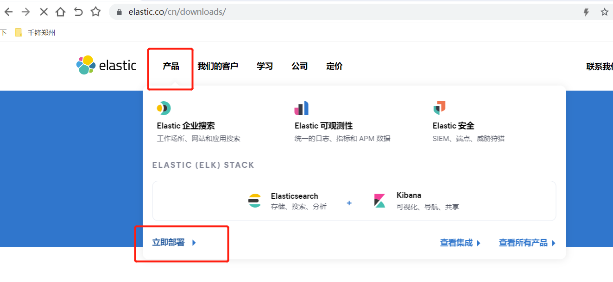


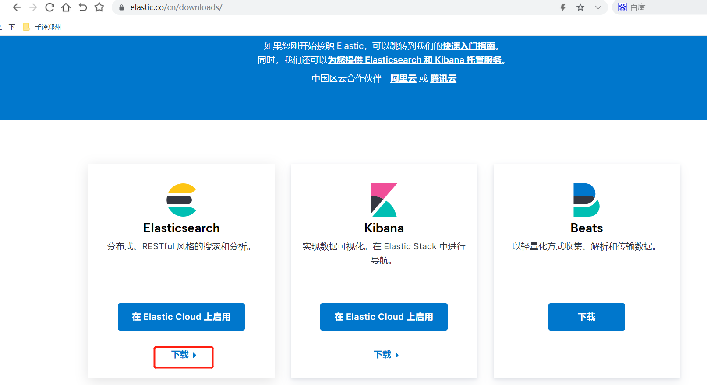


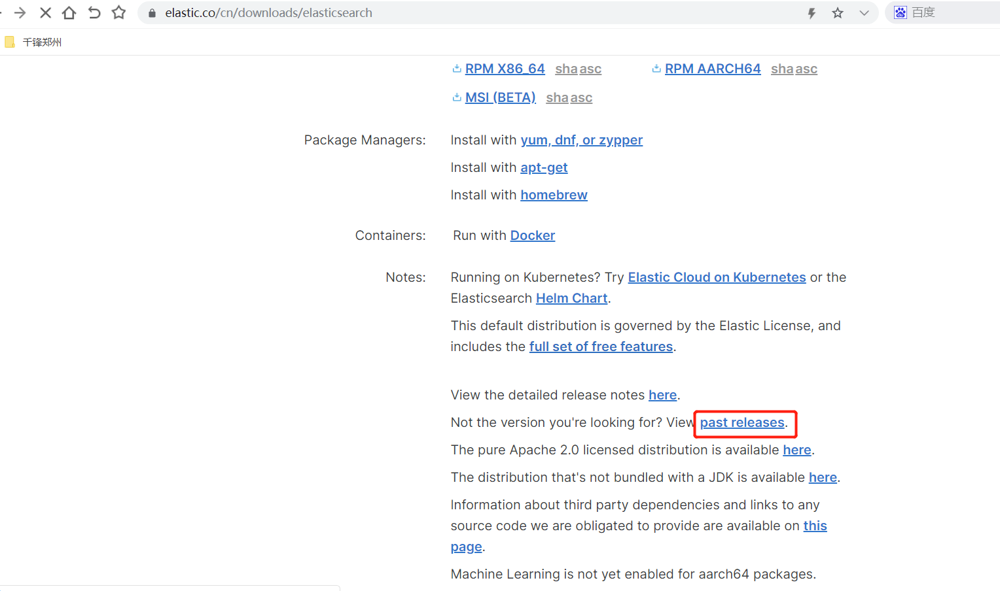


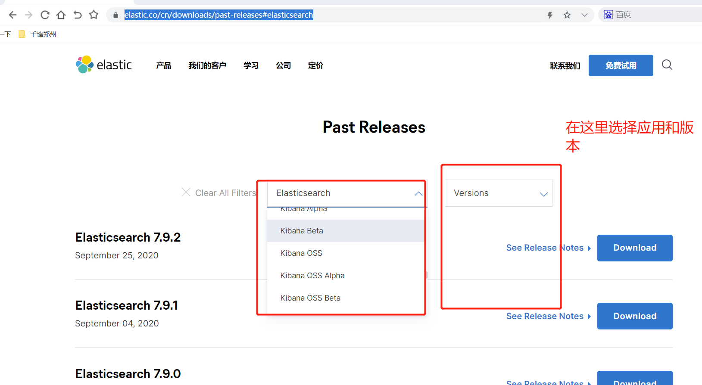


### 实施部署


#### 1、 Elasticsearch部署

https://www.elastic.co/cn/

```shell
系统类型：Centos7.4
节点IP：172.16.246.234
软件版本：jdk-8u191-linux-x64.tar.gz、elasticsearch-6.5.4.tar.gz
示例节点：172.16.246.234
```


##### 1、安装配置jdk8


ES运行依赖jdk8  -----三台机器都操作，先上传jdk1.8


```shell
[root@mes-1 ~]# tar xzf jdk-8u191-linux-x64.tar.gz -C /usr/local/
[root@mes-1 ~]# cd /usr/local/
[root@mes-1 local]# mv jdk1.8.0_191/ java
[root@mes-1 local]# echo '
JAVA_HOME=/usr/local/java
PATH=$JAVA_HOME/bin:$PATH
export JAVA_HOME PATH
' >>/etc/profile
[root@mes-1 ~]# source /etc/profile
[root@mes-1  local]# java -version
java version "1.8.0_211"
Java(TM) SE Runtime Environment (build 1.8.0_211-b12)
Java HotSpot(TM) 64-Bit Server VM (build 25.211-b12, mixed mode)
```


##### 2、安装配置ES----只在第一台操作操作下面的部分


###### （1）创建运行ES的普通用户


```shell
[root@mes-1 ~]# useradd elsearch
[root@mes-1 ~]# echo "****" | passwd --stdin "elsearch"
```


###### （2）安装配置ES


```shell
[root@mes-1 ~]# tar xzf elasticsearch-6.5.4.tar.gz -C /usr/local/
[root@mes-1 ~]# cd /usr/local/elasticsearch-6.5.4/config/
[root@mes-1 config]# ls
elasticsearch.yml  log4j2.properties  roles.yml  users_roles
jvm.options        role_mapping.yml   users
[root@mes-1 config]# cp elasticsearch.yml elasticsearch.yml.bak
[root@mes-1 config]# vim elasticsearch.yml    ----找个地方添加如下内容
cluster.name: elk
node.name: elk01
node.master: true
node.data: true
path.data: /data/elasticsearch/data
path.logs: /data/elasticsearch/logs
bootstrap.memory_lock: false
bootstrap.system_call_filter: false
network.host: 0.0.0.0
http.port: 9200
#discovery.zen.ping.unicast.hosts: ["192.168.246.234", "192.168.246.231","192.168.246.235"]
#discovery.zen.minimum_master_nodes: 2
#discovery.zen.ping_timeout: 150s
#discovery.zen.fd.ping_retries: 10
#client.transport.ping_timeout: 60s
http.cors.enabled: true
http.cors.allow-origin: "*"
```


配置项含义：


```shell
cluster.name        集群名称，各节点配成相同的集群名称。
node.name       节点名称，各节点配置不同。
node.master     指示某个节点是否符合成为主节点的条件。
node.data       指示节点是否为数据节点。数据节点包含并管理索引的一部分。
path.data       数据存储目录。
path.logs       日志存储目录。
bootstrap.memory_lock       内存锁定，是否禁用交换。
bootstrap.system_call_filter    系统调用过滤器。
network.host    绑定节点IP。
http.port       端口。
discovery.zen.ping.unicast.hosts    提供其他 Elasticsearch 服务节点的单点广播发现功能。
discovery.zen.minimum_master_nodes  集群中可工作的具有Master节点资格的最小数量，官方的推荐值是(N/2)+1，其中N是具有master资格的节点的数量。
discovery.zen.ping_timeout      节点在发现过程中的等待时间。
discovery.zen.fd.ping_retries        节点发现重试次数。
http.cors.enabled               是否允许跨源 REST 请求，用于允许head插件访问ES。
http.cors.allow-origin              允许的源地址。
```


###### （3）设置JVM堆大小


```shell
[root@mes-1 config]# vim jvm.options     ----将
-Xms1g    ----修改成 -Xms2g
-Xmx1g    ----修改成 -Xms2g

或者:
推荐设置为4G，请注意下面的说明：
sed -i 's/-Xms1g/-Xms4g/' /usr/local/elasticsearch-6.5.4/config/jvm.options
sed -i 's/-Xmx1g/-Xmx4g/' /usr/local/elasticsearch-6.5.4/config/jvm.options
```


注意：
确保堆内存最小值（Xms）与最大值（Xmx）的大小相同，防止程序在运行时改变堆内存大小。
堆内存大小不要超过系统内存的50%


###### （4）创建ES数据及日志存储目录


```shell
[root@mes-1 ~]# mkdir -p /data/elasticsearch/data       (/data/elasticsearch)
[root@mes-1 ~]# mkdir -p /data/elasticsearch/logs       (/log/elasticsearch)
```


###### （5）修改安装目录及存储目录权限


```shell
[root@mes-1 ~]# chown -R elsearch:elsearch /data/elasticsearch
[root@mes-1 ~]# chown -R elsearch:elsearch /usr/local/elasticsearch-6.5.4
```


##### 3、系统优化


###### （1）增加最大文件打开数


永久生效方法：


```shell
echo "* - nofile 65536" >> /etc/security/limits.conf
```


###### （2）增加最大进程数


```plain
[root@mes-1 ~]# vim /etc/security/limits.conf    ---在文件最后面添加如下内容
* soft nofile 65535
* hard nofile 131072
* soft nproc 2048
* hard nproc 4096
更多的参数调整可以直接用这个

解释：
soft  xxx  : 代表警告的设定，可以超过这个设定值，但是超过后会有警告。
hard  xxx  : 代表严格的设定，不允许超过这个设定的值。
nofile : 是每个进程可以打开的文件数的限制
nproc  : 是操作系统级别对每个用户创建的进程数的限制
```


###### （3）增加最大内存映射数(调整使用交换分区的策略)


```shell
[root@mes-1 ~]# vim /etc/sysctl.conf   ---添加如下
vm.max_map_count=262144
vm.swappiness=0 （0为达到100%启动交换分区 30%为达到70%启动交换分区）
[root@mes-1 ~]# sysctl -p
解释：在内存不足的情况下，使用交换空间。


[root@mes-1 ~]# sysctl -w vm.max_map_count=262144
增大用户使用内存的空间(临时)
```


启动如果报下列错误


```shell
memory locking requested for elasticsearch process but memory is not locked
elasticsearch.yml文件
bootstrap.memory_lock : false
/etc/sysctl.conf文件
vm.swappiness=0

错误:
max file descriptors [4096] for elasticsearch process is too low, increase to at least [65536]

意思是elasticsearch用户拥有的客串建文件描述的权限太低，知道需要65536个

解决：

切换到root用户下面，

vim   /etc/security/limits.conf

在最后添加
* hard nofile 65536
* hard nofile 65536
重新启动elasticsearch，还是无效？
必须重新登录启动elasticsearch的账户才可以，例如我的账户名是elasticsearch，退出重新登录。
另外*也可以换为启动elasticsearch的账户也可以，* 代表所有，其实比较不合适

启动还会遇到另外一个问题，就是
max virtual memory areas vm.max_map_count [65530] is too low, increase to at least [262144]
意思是：elasticsearch用户拥有的内存权限太小了，至少需要262114。这个比较简单，也不需要重启，直接执行
# sysctl -w vm.max_map_count=262144
就可以了
```


##### 4、启动ES


```shell
[root@mes-1 ~]# su - elsearch
Last login: Sat Aug  3 19:48:59 CST 2019 on pts/0
[root@mes-1 ~]$ cd /usr/local/elasticsearch-6.5.4/
[root@mes-1 elasticsearch-6.5.4]$ nohup ./bin/elasticsearch &  #放后台启动
[1] 11462
nohup: ignoring input and appending output to ‘nohup.out’
[root@mes-1 elasticsearch-6.5.4]$ tail -f nohup.out   #看一下是否启动
或者:
su - elsearch -c "cd /usr/local/elasticsearch-6.5.4 && nohup bin/elasticsearch &"
```


测试：浏览器访问http://192.168.246.234:9200
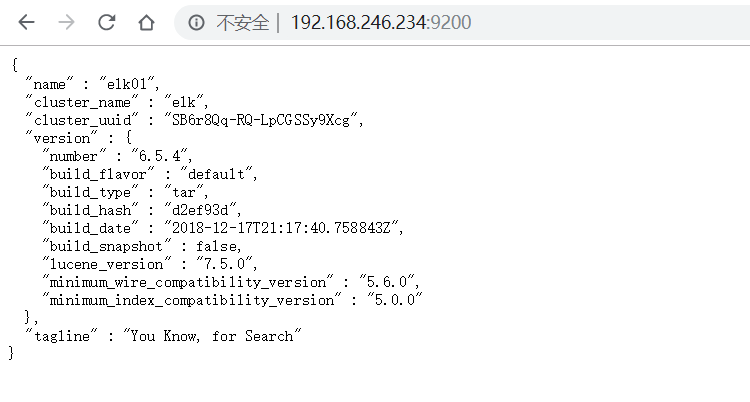


##### 5、 Head插件安装


**前提**： head插件是Nodejs实现的，所以需要先安装Nodejs。


###### 5.1 安装nodejs


nodejs官方下载地址：https://nodejs.org/


下载linux64位：


```shell
[root@es-3-head-kib ~]# wget https://nodejs.org/dist/v14.17.6/node-v14.17.6-linux-x64.tar.xz
[root@es-3-head-kib ~]# tar xf node-v14.17.6-linux-x64.tar.xz -C /usr/local/
[root@es-3-head-kib nodejs]# vim /etc/profile
# 添加 如下配置
NODE_HOME=/usr/local/node-v14.17.6-linux-x64
JAVA_HOME=/usr/local/java
PATH=$NODE_HOME/bin:$JAVA_HOME/bin:$PATH
export JAVA_HOME PATH
#由于我这里，ES也装在了此台机器上，所以环境变量这样配置；不能删除jdk的配置
[root@es-3-head-kib ~]# source /etc/profile
[root@es-3-head-kib ~]# node --version
v14.17.6
[root@es-3-head-kib ~]# npm -v
6.14.15
```


npm 是随同NodeJS一起安装的包管理工具,能解决NodeJS代码部署上的很多问题。


###### 5.2 安装git


需要使用git方式下载head插件，下面安装git：


```shell
[root@es-3-head-kib local]# yum install -y git
[root@es-3-head-kib local]# git --version
git version 1.8.3.1
```


###### 5.3 下载及安装head插件


```shell
[root@es-3-head-kib ~]# cd /usr/local/
[root@es-3-head-kib local]# git clone git://github.com/mobz/elasticsearch-head.git
或者使用：https://gitee.com/KelvinChan/elasticsearch-head.git
[root@es-3-head-kib local]# cd elasticsearch-head/
[root@es-3-head-kib elasticsearch-head]# 坑  #注意：这里直接安装，可能会失败，如果你的网络没问题，才能下载成功
#也可以将npm源设置为国内淘宝的，确保能下载成功
[root@es-3-head-kib elasticsearch-head]# npm install -g cnpm --registry=https://registry.npm.taobao.org
[root@es-3-head-kib elasticsearch-head]# npm install #报错，不用管它
```


修改地址：如果你的head插件和ES没在一台机器上，需要进行如下2处修改，在一台机器，不修改即可


```plain
[root@es-3-head-kib elasticsearch-head]# vim Gruntfile.js
```


```plain
[root@es-3-head-kib elasticsearch-head]# vim _site/app.js #配置连接es的ip和port
```


###### 5.4 配置elasticsearch，允许head插件访问


```plain
[root@es-3-head-kib ~]# vim /usr/local/elasticsearch-6.5.4/config/elasticsearch.yml
在配置最后面，加2行
```


然后，重启elasticsearch


###### 5.5 测试


进入到head目录，执行npm run start


```shell
[root@es-3-head-kib ~]# cd /usr/local/elasticsearch-head/
[root@es elasticsearch-head]# nohup npm  run start &
```


启动成功后，在浏览器访问：http://192.168.153.190:9100/ ，内部输入 http://192.168.153.190:9200/ 点击连接测试，输出黄色背景字体说明配置OK。


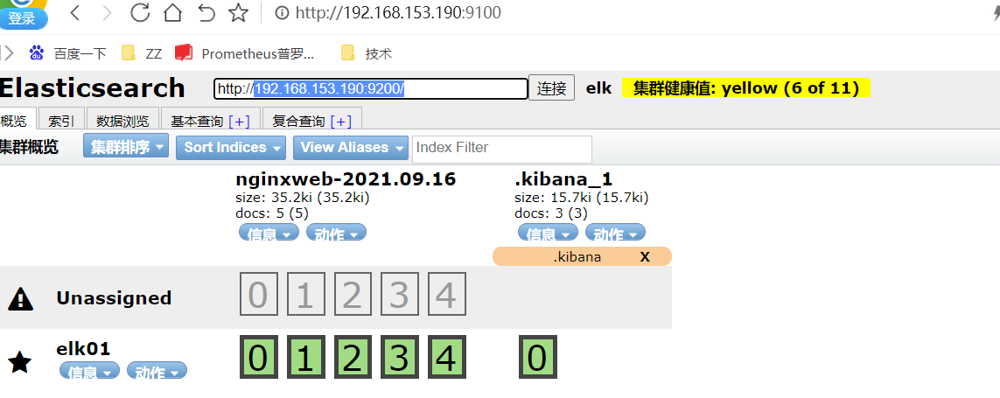


#### 2、 Kibana部署


```shell
系统类型：Centos7.5
节点IP： 192.168.246.235
软件版本：nginx-1.14.2、kibana-6.5.4-linux-x86_64.tar.gz
```


##### 1. 安装配置Kibana


###### （1）安装


```shell
[root@es-3-head-kib ~]# tar zvxf kibana-6.5.4-linux-x86_64.tar.gz -C /usr/local/
```


###### （2）配置


```shell
[root@es-3-head-kib ~]# cd /usr/local/kibana-6.5.4-linux-x86_64/config/
[root@es-3-head-kib config]# vim kibana.yml
server.port: 5601
server.host: "192.168.246.235"     #kibana本机的地址
elasticsearch.url: "http://192.168.246.234:9200"	#ES主节点地址+端口
kibana.index: ".kibana"
```


配置项含义：


```shell
server.port kibana 服务端口，默认5601
server.host kibana 主机IP地址，默认localhost
elasticsearch.url  用来做查询的ES节点的URL，默认http://localhost:9200
kibana.index       kibana在Elasticsearch中使用索引来存储保存的searches, visualizations和dashboards，默认.kibana
```


其他配置项可参考：
https://www.elastic.co/guide/en/kibana/6.5/settings.html


###### （3）启动


```shell
[root@es-3-head-kib config]# cd ..
[root@es-3-head-kib kibana-6.5.4-linux-x86_64]# nohup ./bin/kibana & 
[1] 12054
[root@es-3-head-kib kibana-6.5.4-linux-x86_64]# nohup: ignoring input and appending output to ‘nohup.out’
```


##### 2. 安装配置Nginx反向代理


###### （1）配置YUM源：


```shell
[root@es-3-head-kib ~]# rpm -ivh http://nginx.org/packages/centos/7/noarch/RPMS/nginx-release-centos-7-0.el7.ngx.noarch.rpm
```


###### （2）安装：


```shell
[root@es-3-head-kib ~]# yum install -y nginx
```


###### （3）配置反向代理


```shell
[root@es-3-head-kib ~]# cd /etc/nginx/conf.d/
[root@es-3-head-kib conf.d]# cp default.conf nginx.conf
[root@es-3-head-kib conf.d]# mv default.conf default.conf.bak
[root@es-3-head-kib conf.d]# vim nginx.conf
```


```plain
server {
        listen       80;
        server_name  192.168.246.235;

        #charset koi8-r;

       # access_log  /var/log/nginx/host.access.log  main;
       # access_log off;

         location / {  
             proxy_pass http://192.168.246.235:5601;
             proxy_set_header Host $host:5601;  
             proxy_set_header X-Real-IP $remote_addr;  
             proxy_set_header X-Forwarded-For $proxy_add_x_forwarded_for;  
             proxy_set_header Via "nginx";
                     }
         location /status { 
             stub_status on; #开启网站监控状态 
             access_log /var/log/nginx/kibana_status.log; #监控日志 
             auth_basic "NginxStatus"; }

         location /head/{
             proxy_pass http://192.168.246.235:9100;
             proxy_set_header Host $host:9100;
             proxy_set_header X-Real-IP $remote_addr;
             proxy_set_header X-Forwarded-For $proxy_add_x_forwarded_for;
             proxy_set_header Via "nginx";
                         }  
}
```


**（4）配置Nginx**


```shell
1.将原来的log_format注释掉，添加json格式的配置信息，如下：
[root@es-3-head-kib conf.d]# vim /etc/nginx/nginx.conf
log_format  json '{"@timestamp":"$time_iso8601",'
                           '"@version":"1",'
                           '"client":"$remote_addr",'
                           '"url":"$uri",'
                           '"status":"$status",'
                           '"domain":"$host",'
                           '"host":"$server_addr",'
                           '"size":$body_bytes_sent,'
                           '"responsetime":$request_time,'
                           '"referer": "$http_referer",'
                           '"ua": "$http_user_agent"'
               '}';
2.引用定义的json格式的日志：
access_log  /var/log/nginx/access_json.log  json;
```


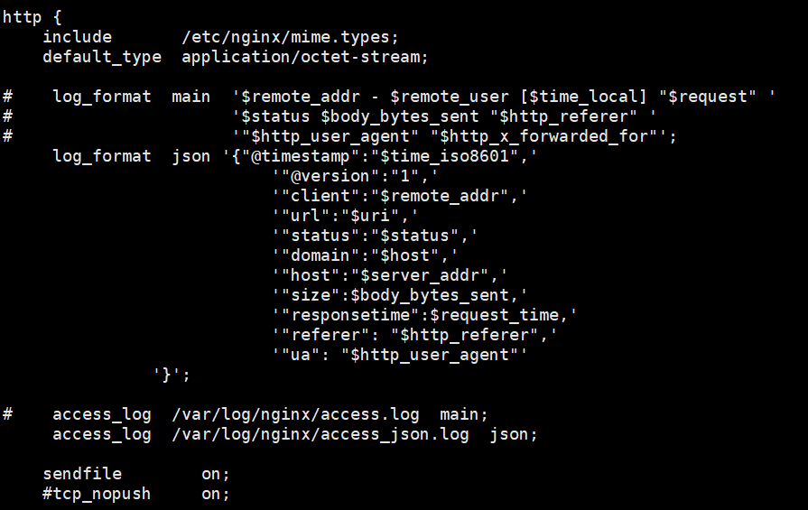


###### （5）启动Nginx


```shell
root@es-3-head-kib ~]# systemctl start nginx
```


浏览器访问http://192.168.246.235 刚开始没有任何数据，会提示你创建新的索引。


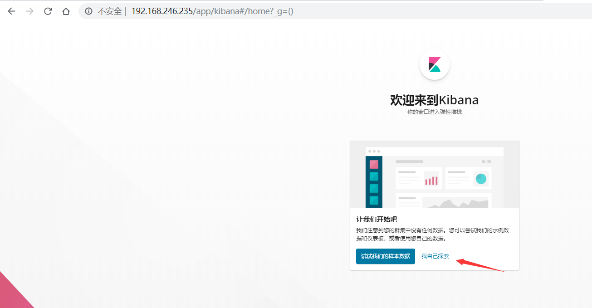


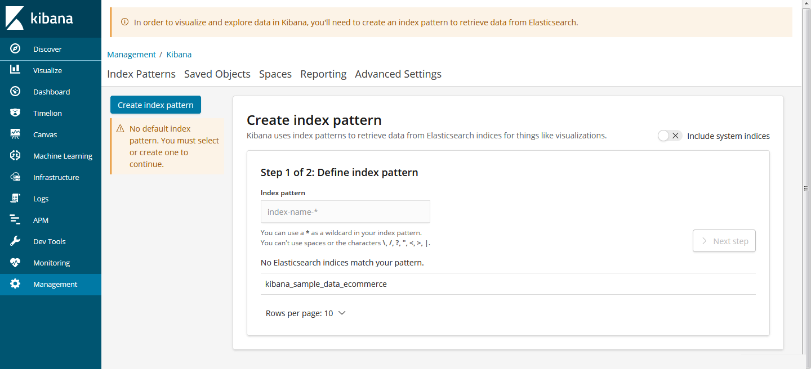


#### 3、 Logstash部署----192.168.246.231


```shell
系统类型：Centos7.5
节点IP：192.168.246.231
软件版本：jdk-8u121-linux-x64.tar.gz、logstash-6.5.4.tar.gz
```


##### 1.安装配置Logstash


Logstash运行同样依赖jdk，本次为节省资源，故将Logstash安装在了kafka244.231节点。


```shell
[root@es-2-zk-log ~]# tar -xvzf jdk-8u211-linux-x64.tar.gz  -C /usr/local/
[root@es-2-zk-log ~]# cd /usr/local/
[root@es-2-zk-log ~]# mv jdk1.8.0_211/ java
[root@es-2-zk-log ~]# vim /etc/profile
[root@es-2-zk-log elk_packages]# tail -3 /etc/profile
JAVA_HOME=/usr/local/java
PATH=$JAVA_HOME/bin:$PATH
export JAVA_HOME PATH

[root@es-2-zk-log local]# source /etc/profile
[root@es-2-zk-log local]# java -version
java version "1.8.0_211"
Java(TM) SE Runtime Environment (build 1.8.0_211-b12)
Java HotSpot(TM) 64-Bit Server VM (build 25.211-b12, mixed mode)
```


###### （1）安装


```shell
[root@es-2-zk-log ~]# tar xvzf logstash-6.5.4.tar.gz -C /usr/local/
```


###### （2）配置


创建目录，我们将所有input、filter、output配置文件全部放到该目录中。

：

```shell
1.安装nginx:
[root@es-2-zk-log ~]# rpm -ivh http://nginx.org/packages/centos/7/noarch/RPMS/nginx-release-centos-7-0.el7.ngx.noarch.rpm
[root@es-2-zk-log ~]# yum install -y nginx
将原来的日志格式注释掉定义成json格式：
[root@es-2-zk-log conf.d]# vim /etc/nginx/nginx.conf
log_format  json '{"@timestamp":"$time_iso8601",'
                           '"@version":"1",'
                           '"client":"$remote_addr",'
                           '"url":"$uri",'
                           '"status":"$status",'
                           '"domain":"$host",'
                           '"host":"$server_addr",'
                           '"size":$body_bytes_sent,'
                           '"responsetime":$request_time,'
                           '"referer": "$http_referer",'
                           '"ua": "$http_user_agent"'
               '}';
2.引用定义的json格式的日志：
access_log  /var/log/nginx/access_json.log  json;
```


```shell
[root@es-2-zk-log ~]# systemctl restart nginx 
[root@es-2-zk-log ~]# systemctl enable nginx
浏览器多访问几次
[root@es-2-zk-log ~]# mkdir -p /usr/local/logstash-6.5.4/etc/conf.d
[root@es-2-zk-log ~]# cd /usr/local/logstash-6.5.4/etc/conf.d/       
[root@es-2-zk-log conf.d]# vim input.conf       #---在下面添加
input {                        #让logstash可以读取特定的事件源。
    file {                                       #从文件读取
    path => ["/var/log/nginx/access_json.log"]        #要输入的文件路径
#   code => "json"               #定义编码，用什么格式输入和输出，由于日志就是json格式，这里不用再写

        type => "shopweb"                       #定义一个类型，通用选项. 用于激活过滤器

    }
}


[root@es-2-zk-log conf.d]# vim output.conf
output {           #输出插件，将事件发送到特定目标
    elasticsearch {            #输出到es
    hosts => ["192.168.246.234:9200"]       #指定es服务的ip加端口
    index => ["%{type}-%{+YYYY.MM.dd}"]     #引用input中的type名称，定义输出的格式
    }
}

启动： 权限
[root@es-2-zk-log conf.d]# cd /usr/local/logstash-6.5.4/
[root@es-2-zk-log logstash-6.5.4]# nohup bin/logstash -f etc/conf.d/  --config.reload.automatic &
```


查看日志出现:


```shell
[root@es-2-zk-log logstash-6.5.4]# tail -f nohup.out
[2019-08-04T01:39:24,671][INFO ][logstash.outputs.elasticsearch] Attempting to install template {:manage_template=>{"template"=>"logstash-*", "version"=>60001, "settings"=>{"index.refresh_interval"=>"5s"}, "mappings"=>{"_default_"=>{"dynamic_templates"=>[{"message_field"=>{"path_match"=>"message", "match_mapping_type"=>"string", "mapping"=>{"type"=>"text", "norms"=>false}}}, {"string_fields"=>{"match"=>"*", "match_mapping_type"=>"string", "mapping"=>{"type"=>"text", "norms"=>false, "fields"=>{"keyword"=>{"type"=>"keyword", "ignore_above"=>256}}}}}], "properties"=>{"@timestamp"=>{"type"=>"date"}, "@version"=>{"type"=>"keyword"}, "geoip"=>{"dynamic"=>true, "properties"=>{"ip"=>{"type"=>"ip"}, "location"=>{"type"=>"geo_point"}, "latitude"=>{"type"=>"half_float"}, "longitude"=>{"type"=>"half_float"}}}}}}}}
```


在浏览器中访问本机的nginx网站


然后去head插件页面查看是否有shopweb索引出现


发现之后，去配置kibanna添加索引


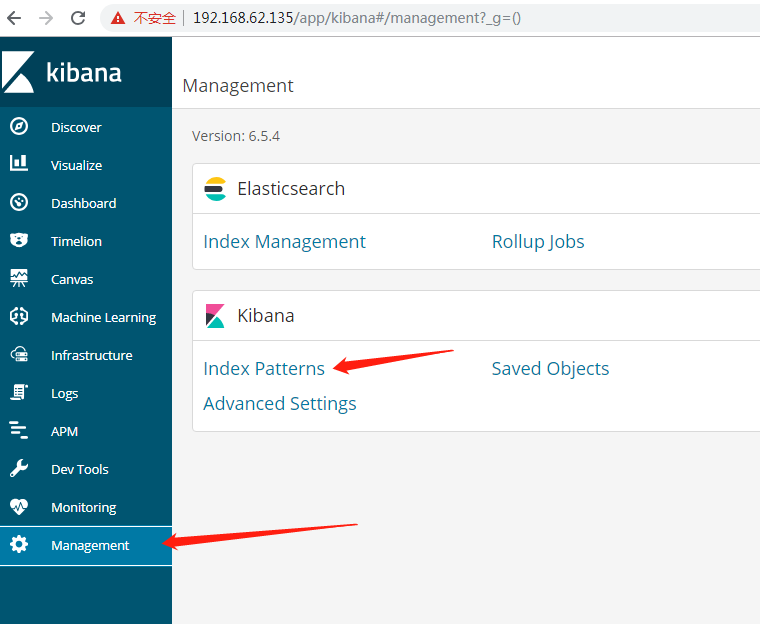


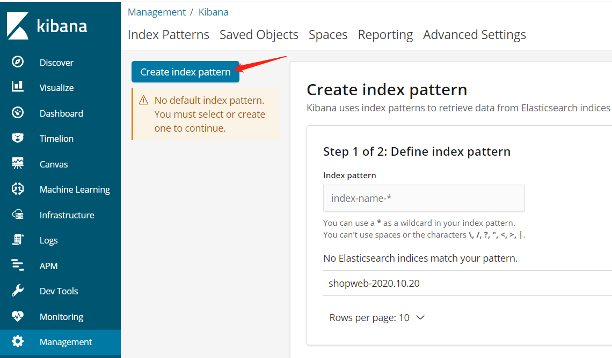


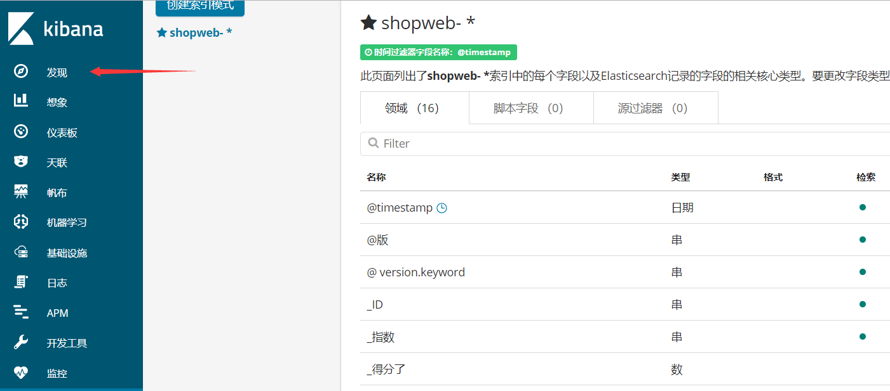


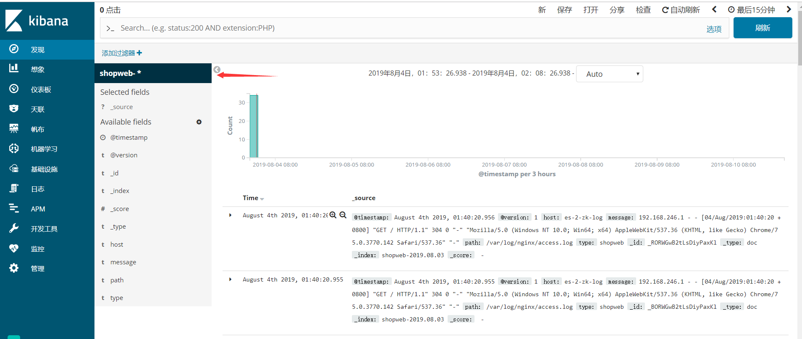


可以根据某个特定的值，来查看记录，比如


多刷新几次本机的nginx页面，可以看到相应的日志记录


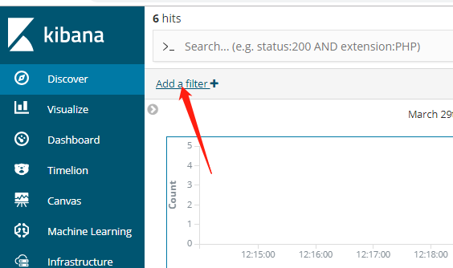


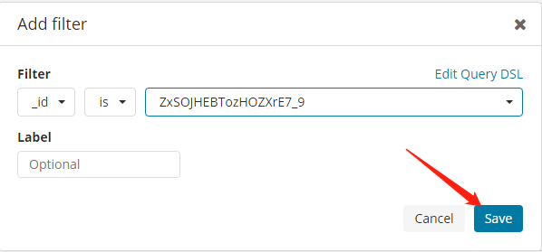


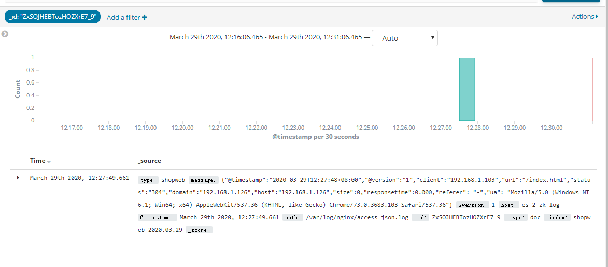


作业,收集Tomcat日志，配置文件已提供：


```shell
[root@es-2-zk-log logstash-6.5.4]# cat etc/conf.d/tomcat.conf 
input {
    file {
      path => "/apps/tomcat/logs/localhost_access_log*.txt"
      type => "tomcat"
#      start_position => "beginning"
#      stat_interval => "2"
    }
}

output {
    elasticsearch {
      hosts => ["192.168.1.121:9200"]
      index => ["%{type}-%{+YYYY.MM.dd}"]
    }
}
```


做出来应该是以下效果：


**注意:如果进程关闭,页面将会访问失败，需要重启head,kibana,logstash**


注意:如果出不来通过界面提示打开时间管理器，设置时间为本星期


过程: 通过nginx的访问日志获取日志--->传输到logstach ----传输到--elasticsearch--传输到---kibana （通过nginix反代）


注意：如果出现问题


```shell
从上面截图可以看出存在5个unassigned的分片，新建索引blog5的时候，分片数为5，副本数为1，新建之后集群状态成为yellow，其根本原因是因为集群存在没有启用的副本分片，我们先来看一下官网给出的副本分片的介绍：
副本分片的主要目的就是为了故障转移，正如在 集群内的原理 中讨论的：如果持有主分片的节点挂掉了，一个副本分片就会晋升为主分片的角色。

那么可以看出来副本分片和主分片是不能放到一个节点上面的，可是在只有一个节点的集群里，副本分片没有办法分配到其他的节点上，所以出现所有副本分片都unassigned得情况。因为只有一个节点，如果存在主分片节点挂掉了，那么整个集群理应就挂掉了，不存在副本分片升为主分片的情况。

解决办法就是，在单节点的elasticsearch集群，删除存在副本分片的索引，新建索引的副本都设为0。然后再查看集群状态
```


#### 4、 Kafka部署


#### 4、Kafka：


   数据缓冲队列(消息队列)。同时提高了可扩展性。具有峰值处理能力，使用消息队列能够使关键组件顶住突发的访问压力，而不会因为突发的超负荷的请求而完全崩溃。**是一个分布式、支持分区的（partition）、多副本的（replica），基于zookeeper协调的分布式消息系统，它的最大的特性就是可以实时的处理大量数据以满足各种需求场景：比如基于hadoop的批量处理系统、低延迟的实时系统、web/nginx日志、访问日志，消息服务等等**，用scala语言编写，Linkedin于2010年贡献给了Apache基金会并成为顶级开源项目。


**Kafka的特性:**


-  高吞吐量：kafka每秒可以处理几十万条消息。 
-  可扩展性：kafka集群支持热扩展- 持久性、 
-  可靠性：消息被持久化到本地磁盘，并且支持数据备份防止数据丢失 
-  容错性：允许集群中节点失败（若副本数量为n,则允许n-1个节点失败） 
-  高并发：支持数千个客户端同时读写
   它主要包括以下组件 

```shell
话题（Topic）：是特定类型的消息流。(每条发布到 kafka 集群的消息属于的类别，即 kafka 是面向 topic 的)
生产者（Producer）：是能够发布消息到话题的任何对象(发布消息到 kafka 集群的终端或服务).
消费者（Consumer）：可以订阅一个或多个话题，从而消费这些已发布的消息。
服务代理（Broker）：已发布的消息保存在一组服务器中，它们被称为代理（Broker）或Kafka集群。
partition（区）：每个 topic 包含一个或多个 partition。
replication：partition 的副本，保障 partition 的高可用。
leader：replica 中的一个角色， producer 和 consumer 只跟 leader 交互。
follower：replica 中的一个角色，从 leader 中复制数据。
zookeeper：kafka 通过 zookeeper 来存储集群的信息。
```

 


#### **zookeeper:**


**ZooKeeper是一个分布式协调服务，它的主要作用是为分布式系统提供一致性服务，提供的功能包括：配置维护、分布式同步等。Kafka的运行依赖ZooKeeper。**


ZooKeeper用于分布式系统的协调，Kafka使用ZooKeeper也是基于相同的原因。ZooKeeper主要用来协调Kafka的各个broker，不仅可以实现broker的负载均衡，而且当增加了broker或者某个broker故障了，ZooKeeper将会通知生产者和消费者，这样可以保证整个系统正常运转。


在Kafka中,一个topic会被分成多个区并被分到多个broker上，分区的信息以及broker的分布情况与消费者当前消费的状态信息都会保存在ZooKeeper中。


**搭建架构**


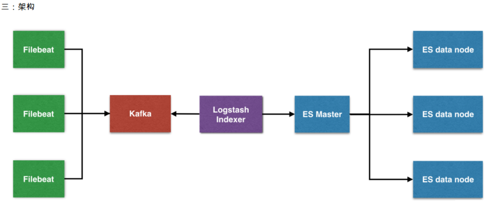


**Filebeat安装在要收集日志的应用服务器中，Filebeat收集到日志之后传输到kafka中，logstash通过kafka拿到日志，在由logstash传给后面的es，es将日志传给后面的kibana，最后通过kibana展示出来。**


```plain
系统类型：Centos7.5
节点IP：192.168.246.234,192.168.246.231、192.168.246.235
软件版本：jdk-8u121-linux-x64.tar.gz、kafka_2.11-2.1.0.tgz
示例节点：172.16.246.231
```


##### 1.安装配置jdk8


###### （1）Kafka、Zookeeper（简称：ZK）运行依赖jdk8


```shell
tar zxvf /usr/local/package/jdk-8u121-linux-x64.tar.gz -C /usr/local/
echo '
JAVA_HOME=/usr/local/jdk1.8.0_121
PATH=$JAVA_HOME/bin:$PATH
export JAVA_HOME PATH
' >>/etc/profile
source /etc/profile
```


##### 2.安装配置ZK


Kafka运行依赖ZK，Kafka官网提供的tar包中，已经包含了ZK，这里不再额下载ZK程序。


配置相互解析---三台机器


```shell
[root@es-2-zk-log ~]# vim /etc/hosts
192.168.246.234 mes-1
192.168.246.231 es-2-zk-log
192.168.246.235 es-3-head-kib
```


###### （1）安装


```shell
[root@es-2-zk-log ~]# tar xzvf kafka_2.11-2.1.0.tgz -C /usr/local/
```


###### （2）配置


```shell
[root@mes-1 ~]# sed -i 's/^[^#]/#&/' /usr/local/kafka_2.11-2.1.0/config/zookeeper.properties
[root@mes-1 ~]# vim /usr/local/kafka_2.11-2.1.0/config/zookeeper.properties  #添加如下配置
dataDir=/opt/data/zookeeper/data 
dataLogDir=/opt/data/zookeeper/logs
clientPort=2181 
tickTime=2000 
initLimit=20 
syncLimit=10 
server.1=192.168.246.231:2888:3888             #kafka集群IP:Port
server.2=192.168.246.234:2888:3888
server.3=192.168.246.235:2888:3888
#创建data、log目录
[root@mes-1 ~]# mkdir -p /opt/data/zookeeper/{data,logs}
#创建myid文件
[root@mes-1 ~]# echo 1 > /opt/data/zookeeper/data/myid     #myid号按顺序排
```


```shell
[root@es-2-zk-log ~]# sed -i 's/^[^#]/#&/' /usr/local/kafka_2.11-2.1.0/config/zookeeper.properties
[root@es-2-zk-log ~]# vim /usr/local/kafka_2.11-2.1.0/config/zookeeper.properties
dataDir=/opt/data/zookeeper/data 
dataLogDir=/opt/data/zookeeper/logs
clientPort=2181 
tickTime=2000 
initLimit=20 
syncLimit=10 
server.1=192.168.246.231:2888:3888
server.2=192.168.246.234:2888:3888
server.3=192.168.246.235:2888:3888
#创建data、log目录
[root@es-2-zk-log ~]# mkdir -p /opt/data/zookeeper/{data,logs}
#创建myid文件
[root@es-2-zk-log ~]# echo 2 > /opt/data/zookeeper/data/myid
```


```shell
[root@es-3 ~]# sed -i 's/^[^#]/#&/' /usr/local/kafka_2.11-2.1.0/config/zookeeper.properties
[root@es-3-head-kib ~]# vim /usr/local/kafka_2.11-2.1.0/config/zookeeper.properties
dataDir=/opt/data/zookeeper/data 
dataLogDir=/opt/data/zookeeper/logs
clientPort=2181 
tickTime=2000 
initLimit=20
syncLimit=10
server.1=192.168.246.231:2888:3888
server.2=192.168.246.234:2888:3888
server.3=192.168.246.235:2888:3888
#创建data、log目录
[root@es-3-head-kib ~]# mkdir -p /opt/data/zookeeper/{data,logs}
#创建myid文件
[root@es-3-head-kib ~]# echo 3 > /opt/data/zookeeper/data/myid
```


配置项含义：


```plain
dataDir ZK数据存放目录。
dataLogDir  ZK日志存放目录。
clientPort  客户端连接ZK服务的端口。
tickTime        ZK服务器之间或客户端与服务器之间维持心跳的时间间隔。
initLimit       允许follower连接并同步到Leader的初始化连接时间，当初始化连接时间超过该值，则表示连接失败。
syncLimit   Leader与Follower之间发送消息时如果follower在设置时间内不能与leader通信，那么此follower将会被丢弃。
server.1=172.16.244.31:2888:3888    2888是follower与leader交换信息的端口，3888是当leader挂了时用来执行选举时服务器相互通信的端口。
```


##### 3.配置Kafka


###### （1）配置


```shell
[root@mes-1 ~]# sed -i 's/^[^#]/#&/' /usr/local/kafka_2.11-2.1.0/config/server.properties
[root@mes-1 ~]# vim /usr/local/kafka_2.11-2.1.0/config/server.properties  #在最后添加
broker.id=1
listeners=PLAINTEXT://192.168.246.231:9092
num.network.threads=3
num.io.threads=8
socket.send.buffer.bytes=102400
socket.receive.buffer.bytes=102400
socket.request.max.bytes=104857600
log.dirs=/opt/data/kafka/logs
num.partitions=6
num.recovery.threads.per.data.dir=1
offsets.topic.replication.factor=2
transaction.state.log.replication.factor=1
transaction.state.log.min.isr=1
log.retention.hours=168
log.segment.bytes=536870912
log.retention.check.interval.ms=300000
zookeeper.connect=192.168.246.231:2181,192.168.246.234:2181,192.168.246.235:2181
zookeeper.connection.timeout.ms=6000
group.initial.rebalance.delay.ms=0
[root@mes-1 ~]# mkdir -p /opt/data/kafka/logs
```


```shell
[root@es-2-zk-log ~]# sed -i 's/^[^#]/#&/' /usr/local/kafka_2.11-2.1.0/config/server.properties
[root@es-2-zk-log ~]# vim /usr/local/kafka_2.11-2.1.0/config/server.properties
broker.id=2
listeners=PLAINTEXT://192.168.246.234:9092
num.network.threads=3
num.io.threads=8
socket.send.buffer.bytes=102400
socket.receive.buffer.bytes=102400
socket.request.max.bytes=104857600
log.dirs=/opt/data/kafka/logs
num.partitions=6
num.recovery.threads.per.data.dir=1
offsets.topic.replication.factor=2
transaction.state.log.replication.factor=1
transaction.state.log.min.isr=1
log.retention.hours=168
log.segment.bytes=536870912
log.retention.check.interval.ms=300000
zookeeper.connect=192.168.246.231:2181,192.168.246.234:2181,192.168.246.235:2181
zookeeper.connection.timeout.ms=6000
group.initial.rebalance.delay.ms=0
[root@es-2-zk-log ~]# mkdir -p /opt/data/kafka/logs
```


```shell
[root@es-3-head-kib ~]# sed -i 's/^[^#]/#&/' /usr/local/kafka_2.11-2.1.0/config/server.properties
[root@es-3-head-kib ~]# vim /usr/local/kafka_2.11-2.1.0/config/server.properties
broker.id=3
listeners=PLAINTEXT://192.168.246.235:9092
num.network.threads=3
num.io.threads=8
socket.send.buffer.bytes=102400
socket.receive.buffer.bytes=102400
socket.request.max.bytes=104857600
log.dirs=/opt/data/kafka/logs
num.partitions=6
num.recovery.threads.per.data.dir=1
offsets.topic.replication.factor=2
transaction.state.log.replication.factor=1
transaction.state.log.min.isr=1
log.retention.hours=168
log.segment.bytes=536870912
log.retention.check.interval.ms=300000
zookeeper.connect=192.168.246.231:2181,192.168.246.234:2181,192.168.246.235:2181
zookeeper.connection.timeout.ms=6000
group.initial.rebalance.delay.ms=0
[root@es-3-head-kib ~]# mkdir -p /opt/data/kafka/logs
```


配置项含义：


```plain
#每个server需要单独配置broker id，如果不配置系统会自动配置。
broker.id  

#监听地址，格式PLAINTEXT://IP:端口。
listeners  

#处理网络请求的线程数量，也就是接收消息的线程数。
num.network.threads	

#消息从内存中写入磁盘是时候使用的线程数量。
num.io.threads	

#发送套接字的缓冲区大小
socket.send.buffer.bytes 

#当消息的尺寸不足时,server阻塞的时间,如果超时,
#消息将立即发送给consumer
socket.receive.buffer.bytes	

服务器将接受的请求的最大大小(防止OOM)
socket.request.max.bytes  

日志文件目录。
log.dirs    

#topic在当前broker上的分片个数
num.partitions

#用来设置恢复和清理data下数据的线程数量
num.recovery.threads.per.data.dir 


offsets.topic.replication.factor

#超时将被删除
log.retention.hours

#日志文件中每个segment的大小，默认为1G
log.segment.bytes

#上面的参数设置了每一个segment文件的大小是1G，那么
#就需要有一个东西去定期检查segment文件有没有达到1G，
#多长时间去检查一次，就需要设置一个周期性检查文件大小
#的时间（单位是毫秒）
log.retention.check.interval.ms 

#ZK主机地址，如果zookeeper是集群则以逗号隔开
zookeeper.connect  

#连接到Zookeeper的超时时间。
zookeeper.connection.timeout.ms
```


##### 4、其他节点配置


只需把配置好的安装包直接分发到其他节点，Kafka的broker.id和listeners就可以了。


##### 5、启动、验证ZK集群


###### （1）启动


在三个节点依次执行：


```shell
[root@mes-1 ~]# cd /usr/local/kafka_2.11-2.1.0/
[root@mes-1 kafka_2.11-2.1.0]# nohup bin/zookeeper-server-start.sh config/zookeeper.properties &
```


###### （2）验证


查看端口


```shell
[root@mes-1 ~]# netstat -lntp | grep 2181
tcp6       0      0 :::2181                 :::*                    LISTEN      1226/java
```


##### 6、启动、验证Kafka


###### （1）启动


在三个节点依次执行：


```shell
[root@mes-1 ~]# cd /usr/local/kafka_2.11-2.1.0/
[root@mes-1 kafka_2.11-2.1.0]# nohup bin/kafka-server-start.sh config/server.properties &
```


###### （2）验证


在192.168.246.231上创建topic


```shell
[root@es-2-zk-log kafka_2.11-2.1.0]# ./bin/kafka-topics.sh --create --zookeeper localhost:2181 --replication-factor 1 --partitions 1 --topic testtopic
```


在246.235上面查询192.168.246.231上的topic


```shell
[root@es-3-head-kib kafka_2.11-2.1.0]#  bin/kafka-topics.sh --zookeeper 192.168.246.231:2181 --list
testtopic
```


模拟消息生产和消费
发送消息到192.168.246.231


```plain
[root@mes-1 kafka_2.11-2.1.0]# bin/kafka-console-producer.sh --broker-list 192.168.246.231:9092 --topic testtopic
>hello
```


从192.168.246.234接受消息


```shell
[root@es-2-zk-log kafka_2.11-2.1.0]# bin/kafka-console-consumer.sh --bootstrap-server  192.168.246.234:9092 --topic testtopic --from-beginning
hello
```


```shell
kafka没有问题之后，回到logstash服务器：
#安装完kafka之后的操作：
[root@es-2-zk-log ~]# cd /usr/local/logstash-6.5.4/etc/conf.d/
[root@es-2-zk-log conf.d]# cp input.conf input.conf.bak
[root@es-2-zk-log conf.d]# vim input.conf
input {
kafka {               #指定kafka服务
    type => "nginx_log"
    codec => "json"        #通用选项，用于输入数据的编解码器
    topics => "nginx"        #这里定义的topic
    decorate_events => true  #此属性会将当前topic、group、partition等信息也带到message中
    bootstrap_servers => "192.168.246.234:9092, 192.168.246.231:9092, 192.168.246.235:9092"
  }
}
output {
    elasticsearch {
    hosts => ["192.168.91.173:9200"]
    index => ["%{type}-%{+YYYY.MM.dd}"]
    }
}

启动 logstash
[root@es-2-zk-log conf.d]# cd /usr/local/logstash-6.5.4/
[root@es-2-zk-log logstash-6.5.4]# nohup bin/logstash -f etc/conf.d/  --config.reload.automatic &
```


#### 5、Filebeat


   隶属于Beats,轻量级数据收集引擎。基于原先 Logstash-fowarder 的源码改造出来。换句话说：Filebeat就是新版的 Logstash-fowarder，也会是 ELK Stack 在 Agent 的第一选择,目前Beats包含四种工具：


- 1.Packetbeat（搜集网络流量数据）
- 2.Metricbeat（搜集系统、进程和文件系统级别的 CPU 和内存使用情况等数据。）
- 3.Filebeat（搜集文件数据）
- 4.Winlogbeat（搜集 Windows 日志数据）


为什么用 Filebeat ，而不用原来的 Logstash 呢？


**原因很简单，资源消耗比较大。**


**由于 Logstash 是跑在 JVM 上面，资源消耗比较大，后来作者用 GO 写了一个功能较少但是资源消耗也小的轻量级的 Agent 叫 Logstash-forwarder。**后来作者加入 elastic.co 公司， Logstash-forwarder 的开发工作给公司内部 GO 团队来搞，最后命名为 Filebeat。


Filebeat 需要部署在每台应用服务器上。


##### （1）下载


```shell
wget https://artifacts.elastic.co/downloads/beats/filebeat/filebeat-6.5.4-linux-x86_64.tar.gz
```


##### （2）解压


```shell
[root@es-3-head-kib ~]# tar xzvf filebeat-6.5.4-linux-x86_64.tar.gz -C /usr/local/
[root@es-3-head-kib ~]# cd /usr/local/
[root@es-3-head-kib local]# mv filebeat-6.5.4-linux-x86_64 filebeat
[root@es-3-head-kib local]# cd filebeat/
```


##### （3）修改配置


修改 Filebeat 配置，支持收集本地目录日志，并输出日志到 Kafka 集群中


```shell
[root@es-3-head-kib filebeat]# mv filebeat.yml filebeat.yml.bak
[root@es-3-head-kib filebeat]# vim filebeat.yml
filebeat.prospectors:
- input_type: log        #指定输入的类型
  paths:
    -  /var/log/nginx/*.log      #日志的路径
  json.keys_under_root: true
  json.add_error_key: true
  json.message_key: log

output.kafka:
  hosts: ["192.168.246.234:9092","192.168.246.231:9092","192.168.246.235:9092"]   #kafka服务器
  topic: 'nginx'        #输出到kafka中的topic
  
注释：
下面三行配置，只针对于收集json格式的日志，如收集的不是json格式，可以擦除
json.keys_under_root: true #keys_under_root可以让字段位于根节点，默认为false
json.add_error_key: true #将解析错误的消息记录储存在error.message字段中
json.message_key: log #message_key是用来合并多行json日志使用的
```


Filebeat 6.0 之后一些配置参数变动比较大，比如 document_type 就不支持，需要用 fields 来代替等等。


##### （4）启动


```shell
[root@es-3-head-kib filebeat]# nohup ./filebeat -e -c filebeat.yml &
[root@es-3-head-kib filebeat]# tail -f nohup.out
2019-08-04T16:55:54.708+0800	INFO	kafka/log.go:53	kafka message: client/metadata found some partitions to be leaderless
2019-08-04T16:55:54.708+0800	INFO	kafka/log.go:53	client/metadata retrying after 250ms... (2 attempts remaining)
...

验证kafka是否生成topic
[root@es-3-head-kib filebeat]# cd /usr/local/kafka_2.11-2.1.0/
[root@es-3-head-kib kafka_2.11-2.1.0]# bin/kafka-topics.sh --zookeeper 192.168.246.231:2181 --list
__consumer_offsets
nginx     #已经生成topic
testtopic
```


**现在我们去编辑logstach连接kafka的输出文件**


**配置完kafka之后查看**


登录到kibana


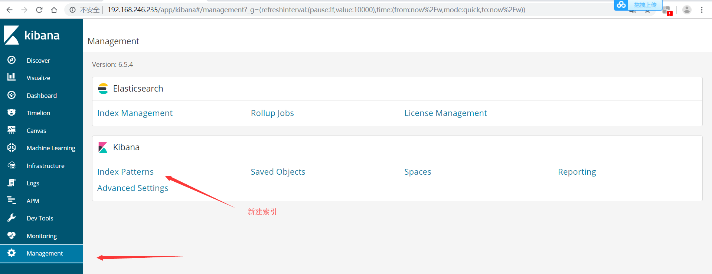


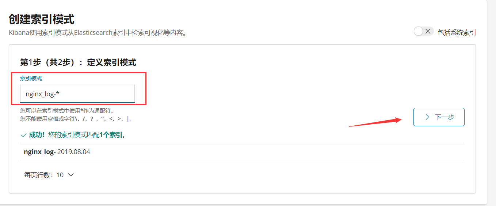


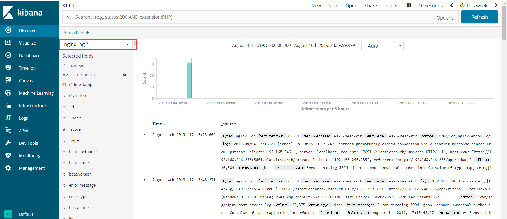


```shell
配置文件详细解释
    https://blog.csdn.net/gamer_gyt/article/details/59077189
```


```shell
用于测试
bin/logstash -e 'input { stdin{} } output {  elasticsearch { hosts => ["192.168.246.231:9200"]} }'
```


ELK终极版


