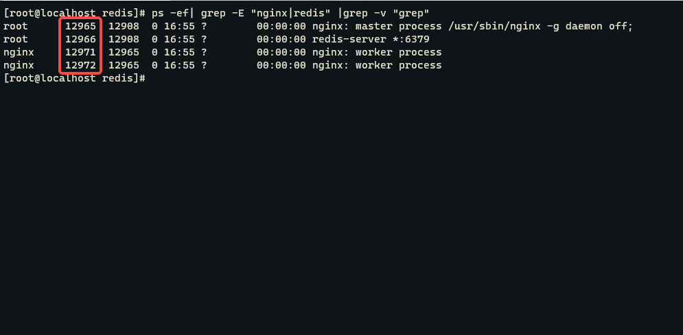
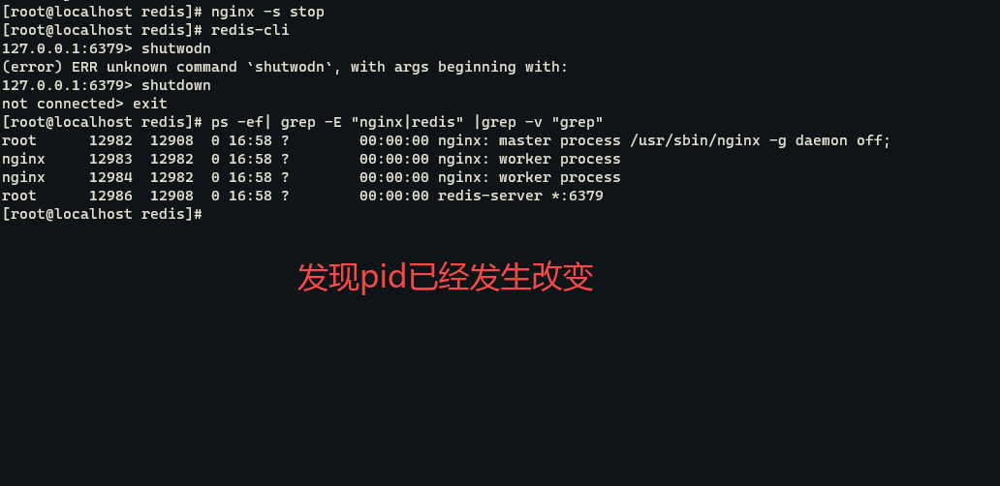
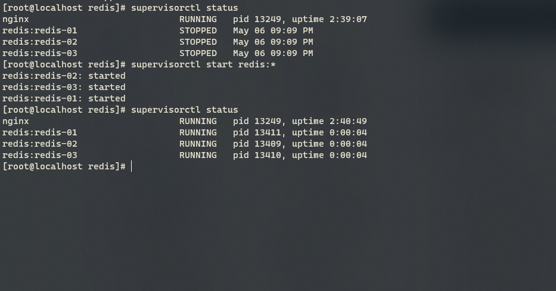

# Supervisor进程管理详解

# Supervisor进程管理详解


## 1. supervisor简介


Supervisor是用`Python`开发的进程管理工具，可以很方便的用来启动、重启、关闭进程(不仅仅是 Python 进程)。能将一个普通的命令行进程变为后台daemon，并监控进程状态，异常退出时能自动重启。除了对单个进程的控制，还可以同时启动、关闭多个进程，比如很不幸的服务器出问题导致所有应用程序都被杀死，此时可以用 supervisor 同时启动所有应用程序而不是一个一个地敲命令启动。


它是通过 `fork/exec` 的方式把这些被管理的进程当作supervisor的子进程来启动，这样只要在supervisor的配置文件中，把要管理的进程的可执行文件的路径写进去即可。也实现当子进程挂掉的时候，父进程可以准确获取子进程挂掉的信息的，可以选择是否自己启动和报警。supervisor还提供了一个功能，可以为supervisord或者每个子进程，设置一个非root的user，这个user就可以管理它对应的进程。


## 2. supervisor安装


### 2.1 安装方式


CentOS配置好yum源后，可以直接安装（个人用的这种，剩下的两种没有尝试）


```plain
yum install -y epel-release
yum -y install supervisor
```


Debian/Ubuntu可通过apt安装


```csharp
apt-get install supervisor
```


pip安装


```plain
pip install supervisor
```


### 2.2 验证


```bash
1.安装完成后，会在 /usr/bin 下加入三个命令：
[root@lqz bin]# ls /usr/bin/|grep super
echo_supervisord_conf  # 生成一个配置文件示例
supervisorctl          # 服务端
supervisord            # 客户端

2.安装完成后，会在 /etc 下创建一个 supervisord.d 目录用于存放supervisor的子配置文件,还有一个supervisord.conf配置文件（如果没有使用命令： echo_supervisord_conf > /etc/supervisord.conf 生成）
[root@lqz etc]# ls /etc|grep super
supervisord.conf
supervisord.d

3.启动Supervisor服务，后面会说system的启动方式
/usr/bin/supervisord -c /etc/supervisord.conf
```


## 3. supervisor配置文件


supervisor分为主配置文件和子配置文件，方便起见，把supervisor服务器相关的配置写入supervisord.conf中,把监控各个进程的配置，按照进程名存在 supervisord.conf 目录下。（这个可以在supervisord.conf中的[include]部分下配置）


### 3.1 主配置文件


主配置文件：`/etc/supervisord.conf`


```bash
# 简单配置
# 我们先修改supervisord.conf最后的[include]部分配置，这样就可以支持子配置文件，而不用改动主配置文件。
vim supervisord.conf 
[include]
files = supervisord.d/*.ini
```


以下配置为标准配置


```properties
[unix_http_server]
file=/var/run/supervisor/supervisor.sock   ; UNIX socket 文件，supervisorctl 会使用
;chmod=0700                 ; socket 文件的 mode，默认是 0700
;chown=nobody:nogroup       ; socket 文件的 owner，格式： uid:gid

;[inet_http_server]         ; HTTP 服务器，提供 web 管理界面
;port=127.0.0.1:9001        ; Web 管理后台运行的 IP 和端口，如果开放到公网，需要注意安全性
;username=user              ; 登录管理后台的用户名
;password=123               ; 登录管理后台的密码

[supervisord]
logfile=/var/log/supervisor/supervisord.log ; 日志文件，默认是 $CWD/supervisord.log
logfile_maxbytes=50MB        ; 日志文件大小，超出会 rotate，默认 50MB
logfile_backups=10           ; 日志文件保留备份数量默认 10
loglevel=info                ; 日志级别，默认 info，其它: debug,warn,trace
pidfile=/var/run/supervisord.pid ; pid 文件
nodaemon=false               ; 是否在前台启动，默认是 false，即以 daemon 的方式启动
minfds=1024                  ; 可以打开的文件描述符的最小值，默认 1024
minprocs=200                 ; 可以打开的进程数的最小值，默认 200

; the below section must remain in the config file for RPC
; (supervisorctl/web interface) to work, additional interfaces may be
; added by defining them in separate rpcinterface: sections
[rpcinterface:supervisor]
supervisor.rpcinterface_factory = supervisor.rpcinterface:make_main_rpcinterface

[supervisorctl]
serverurl=unix:///var/run/supervisor/supervisor.sock ; 通过 UNIX socket 连接 supervisord，路径与 unix_http_server 部分的 file 一致
;serverurl=http://127.0.0.1:9001 ; 通过 HTTP 的方式连接 supervisord

; 包含其他的配置文件
[include]
files = supervisord.d/*.ini    ; 可以是 *.conf 或 *.ini
```


### 3.2 子配置文件(program 配置)


子进程配置文件路径：`/etc/supervisord.d/*.ini`


注：默认子进程配置文件为ini格式，可在supervisor主配置文件中修改。


#### 3.2.1 详细配置


```bash
[program:theprogramname]
command=/bin/cat              ; 程序运行命令，建议使用绝对路径。
process_name=%(program_name)s ; 程序名称，可用的变量有 `group_name`, `host_node_name`, `process_num`, `program_name`, `here`（配置文件目录）。 一般程序需要运行多个副本的情况会使用。后面会有例子。
numprocs=1                    ; 程序运行的副本个数，默认为1，如果值大于1，则`process_name` 必须包含 `%(process_num)s`
numprocs_start=0              ; `%(process_num)s`起始数字，默认为0
00=/tmp                       ; 程序运行的所在目录，相当于先cd到指定目录，然后运行程序。
umask=022                     ; umask for process (default None)
priority=999                  ; 程序操作的的优先级，例如在start all/stop all,高优先级的程序会先关闭和重启。
autostart=true                ; 在supervisord启动时自动启动，默认为true
startsecs=1                   ; 程序启动前等待时间等待时间。默认为1。
startretries=3                ; 尝试重启最大次数。默认为3。
autorestart=unexpected        ; 是否自动重启，可选参数为 false, unexpected, true。如果为false则不自动重启，如果为unexpected表示如果程序退出信号不在 `exitcodes` 中，则自动重启。默认为unexpected
exitcodes=0,2                 ; 程序退出码。配合`autorestart`使用。默认为 0,2
stopsignal=QUIT               ; 杀死进程时发送的信号，默认为TREM。
stopwaitsecs=10               ; 发送SIGKILL信号前最大等待时间。默认为10。
user=dev                      ; 以指定用户身份启动程序。默认为当前用户。
stopasgroup=false             ; 是否向子进程发送停止信号，这对于Flask的debug模式很有用处，如果设置为true，则不向子进程发送停止信号。默认为false
killasgroup=false             ; 是否向子进程发送kill信号，默认为false
redirect_stderr=false         ; 将错误输出定向到标准输出，默认为false
stdout_logfile=/a/path        ; 标准输出日志路径，可选参数为 `自定义` `AUTO` `NONE`，`自定义`将日志写到自定义路径，可用的变量有`group_name`, `host_node_name`, `process_num`, `program_name`, `here`（配置文件目录）；`NONE`不创建日志；`AUTO` 又supervisord自动选择路径，并且当supervisord服务重新启动时原来自动创建的日志以及日志的备份文件会被删除。默认为AUTO
stdout_logfile_maxbytes=1MB   ; 标准输出日志单个文件最大大小，如果超过指定大小会将日志文件备份，可用的单位 KB MB GB。如果设置为0则表示不限制文件大小。默认为50MB
stdout_logfile_backups=10     ; 标准输出日志文件最大备份数。默认为10
stdout_capture_maxbytes=1MB   ; 当进程处于“stdout capture mode”模式下写入到FIFO队列最大字节数，可用单位 KB MB GB。默认为0，详细说明见[capture-mode](http://supervisord.org/logging.html#capture-mode)
stdout_events_enabled=false   ; 
                              ;以下配置项配置错误输出的日志参数。和上面标准输出配置相同。
stderr_logfile=/a/path        ;
stderr_logfile_maxbytes=1MB   ;
stderr_logfile_backups=10     ;
stderr_capture_maxbytes=1MB   ;
stderr_events_enabled=false   ;
environment=A="1",B="2"       ; 环境变量设置，可用的变量有 `group_name`, `host_node_name`, `process_num`, `program_name`, `here`。 默认为空。
serverurl=AUTO                ; override serverurl computation (childutils)
```


#### 3.2.2 公司配置


```properties
[program:gameserver]
command=/data/tencent/Build/Release/bin/gameserver /data/tencent/Build/Release/bin/conf/gs_conf.xml            ;
process_name=gameserver                                         ;
numprocs=1                                                      ;
directory=/data/tencent/Build/Release/bin                       ;
umask=022                                                       ;
priority=999                                                    ;
autostart=true                                                  ;
autorestart=unexpected                                          ;
startsecs=3                                                     ;
startretries=5                                                  ;
exitcodes=0,2                                                   ;
stopsignal=TERM                                                 ;
stopwaitsecs=120                                                ;
user=dev                                                        ;
redirect_stderr=true                                            ;
stdout_logfile=/var/log/supervisor/gameserver.log               ;
stdout_logfile_maxbytes=50MB                                    ;
stdout_logfile_backups=2                                        ;
stdout_capture_maxbytes=1MB                                     ;
stdout_events_enabled=false                                     ;
serverurl=AUTO                                                  ;
```


## 4. 进程管理命令


```bash
# 查看supervisord当前管理的所有进程的状态
supervisorctl status

# 启动进程
supervisorctl start usercenter    #启动单个进程
supervisorctl start all           #启动所有进程

# 停止进程
supervisorctl stop usercenter        
supervisorctl stop all

# 重启进程
supervisorctl restart usercenter   #或者使用supervisorctl reload: 重启
supervisorctl restart all

# 读取有更新（增加）的配置文件，不会启动新添加的程序
supervisorctl reread

# 将配置文件里新增的子进程加入进程组，如果设置了autostart=true则会启动新新增的子进程
supervisorctl update
```


## 5. web管理（不常用）


```bash
# 1 修改配置文件
vim /etc/supervisord.conf 
# 2 修改内容如下
[inet_http_server]         ; inet (TCP) server disabled by default
port=0.0.0.0:9001        ; (ip_address:port specifier, *:port for all iface)
;username=user              ; (default is no username (open server))
;password=123               ; (default is no password (open server))

# 3 重启
supervisorctl reload
# 4 在浏览器打开：http://101.133.225.166:8080/
可以看到
```


## 6. Supervisor配置systemctl服务


```bash
# 1 新建配置文件
vim  /usr/lib/systemd/system/supervisor.service
# 2 内容如下
[Unit]
Description=supervisor
After=network.target

[Service]
Type=forking
ExecStart=/usr/bin/supervisord -c /etc/supervisord.conf
ExecStop=/usr/bin/supervisorctl $OPTIONS shutdown
ExecReload=/usr/bin/supervisorctl $OPTIONS reload
KillMode=process
Restart=on-failure
RestartSec=42s

[Install]
WantedBy=multi-user.target

# 3 干掉原先的supervisor进程
[root@localhost redis]# ps -ef|grep super
 root     14465     1  0 00:58 ?        00:00:00 /usr/bin/python /usr/bin/supervisord -c /etc/supervisord.conf
[root@localhost redis]# kill 14465
#4 使用systemctl启动
systemctl daemon-reload
systemctl start supervisor.service
systemctl status supervisor.service
#5 开机自启
systemctl enable supervisor.service
```


## 7. Supervisor管理redis和nginx


### 7.1 安装nginx和redis


```bash
yum -y install nginx
yum -y install redis
```


### 7.2 配置文件


- nginx


```plain
vim /etc/supervisord.d/nginx.ini
[program:nginx]
command=/usr/sbin/nginx  -g 'daemon off;' 
autostart=true ; 自动启动
autorestart=true ; 自动重启
user=root ; 以哪个用户执行
stdout_logfile=/tmp/supervisor_nginx.log ; 日志路径
```


- redis


```plain
vim /etc/supervisord.d/redis.ini
[program:redis]
command=redis-server 
autostart=true ; 自动启动
autorestart=true ; 自动重启
user=root ; 以哪个用户执行
stdout_logfile=/tmp/supervisor_redis.log ; 日志路径
```


### 7.3 重新加载新配置文件


```plain
supervisorctl update
```


### 7.4 测试


```plain
# 杀死nginx进程
# 杀死redis进程
redis-cli
输入：shutdown
# 发现服务又自动重启了
```


测试前





测试后





## 8. 组管理


如果一台机器上有两个以上的项目进程，分为a项目和b项目。我只想要关闭a项目的进程，而不影响b项目的进程。这种情况就不能用 `supervisorctl stop all`，否则启动或停止时，两个项目则同时被操做。


此时就可以使用分组来进行管理，将两个项目分别加入不同的组进行管理。以下是举一个简单例子


### 8.1 部署三个redis


```plain
# 创建数据目录和日志
mkdir -p /data/{redis-01,redis-02,redis-03}/data
```


redis配置文件


```bash
[root@localhost redis]# vim /etc/redis-01.conf
bind 0.0.0.0
daemonize no
port 6379
dir /data/redis-01/data

[root@localhost redis]# vim /etc/redis-02.conf
bind 0.0.0.0
daemonize no
port 6380
dir /data/redis-02/data

[root@localhost redis]# vim /etc/redis-03.conf
bind 0.0.0.0
daemonize no
port 6381         
dir /data/redis-03/data
```


### 8.2 组管理配置文件


```bash
vim /etc/supervisord.d/redis-groups.ini
[group:redis]
programs=redis-01,redis-02,redis-03
```


```bash
# cat /etc/supervisord.d/redis-01.ini
[program:redis-01]
command=/usr/bin/redis-server /etc/redis-01.conf  ;
process_name=redis-01        ;
autostart=true               ;
autorestart=true             ;
user=root                    ;
stdout_logfile=/var/log/supervisor/redis-01.log ;

# cat /etc/supervisord.d/redis-02.ini
[program:redis-02]
command=/usr/bin/redis-server /etc/redis-02.conf  ;
process_name=redis-02        ;
autostart=true               ;
autorestart=true             ;
user=root                    ;
stdout_logfile=/var/log/supervisor/redis-02.log ;

# cat /etc/supervisord.d/redis-03.ini
[program:redis-03]
command=/usr/bin/redis-server /etc/redis-03.conf ;
process_name=redis-03        ;
autostart=true               ; 
autorestart=true             ; 
user=root                    ; 
stdout_logfile=/var/log/supervisor/redis-03.log ;
```


### 8.3 测试


```plain
[root@localhost redis]# supervisorctl start redis:*  #启动redis组的全部进程
[root@localhost redis]# supervisorctl start redis:redis-01  #启动redis组中的redis-01
```





## 9 .常见问题及解决


### 9.1 问题一


```plain
# 报错
BACKOFF   Exited too quickly (process log may have details)
# 原因
supervisor 比较适合监控业务应用，且只能监控前台程序，实现的daemon【后台启动】的程序不能用它监控，否则supervisor> status 会提示：BACKOFF  Exited too quickly (process log may have details)
```


### 9.2 问题二


```plain
# 报错
FATAL     Exited too quickly (process log may have details
# 原因
错误FATAL产生的原因可能是你的python命令的环境配置有问题，如果你是虚拟环境配置的话，必须使用虚拟环境的路径的python或gunicorn命令否则会失败！
# 解决
[program:gunicorn]
command=/root/.local/share/virtualenvs/blog/bin/gunicorn -c other_config/gunicorn.py main:app 
#; 这里的gunicorn必须是你运行python环境对应的环境【如果是虚拟环境就必须配置虚拟环境的路径下面的命令】
autostart = true     ; 在 supervisord 启动的时候也自动启动
```


### 9.3 问题三


```plain
# 报错
启动了多个supervisord服务，导致无法正常关闭服务
在运行supervisord -c /etc/supervisord.conf之前，直接运行过supervisord -c /etc/supervisord.d/xx.conf导致有些进程被多个superviord管理，无法正常关闭进程。
# 解决
使用ps -fe | grep supervisord查看所有启动过的supervisord服务，kill相关的进程。
```


### 9.4 问题四


```plain
# 报错
unix:///var/run/supervisor/supervisor.sock no such file
# 解决
sudo chmod 777 /run
sudo chmod 777 /var/log
```


### 9.5 问题五


```plain
# 报错
Unlinking stale socket /var/run/supervisor/supervisor.sock

# 解决（或者直接删除）
unlink /var/run/supervisor/supervisor.sock
```


### 9.6 问题六


```plain
#报错
Error: Another program is already listening on a port that one of our HTTP servers is configured to use.  Shut this program down first before starting supervisord.
# 解决
ps aux | grep supervisord
kill - 9 进程ID
```