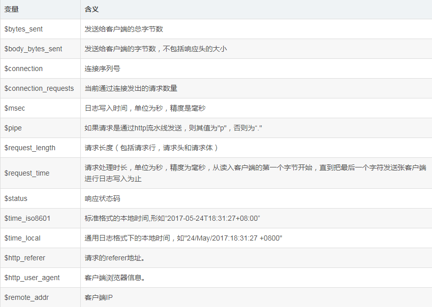
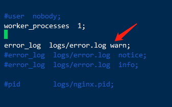
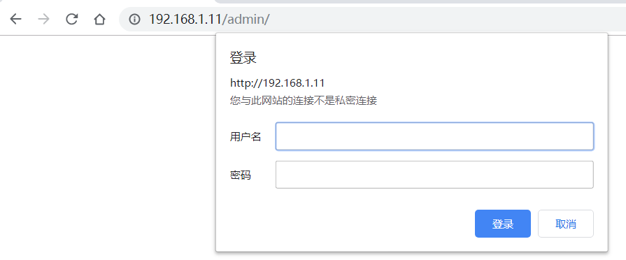

# Nginx 日志配置


## 1、Nginx 日志介绍

`Nginx` 有一个非常灵活的日志记录模式，每个级别的配置可以有各自独立的访问日志, 所需日志模块 `ngx_http_log_module` 的支持，日志格式通过 `log_format` 关键字来定义，日志对于统计和排错是非常有利的，下面总结了 `nginx` 日志相关的配置 包括 `access_log`、`rewrite_log`、`error_log`。


```shell
# 设置访问日志
access_log path 样式;
```


## 2、作用域


可以应用`access_log`指令的作用域分别有`http`，`server`，`location`。也就是说，在这几个作用域外使用该指令，Nginx会报错。


该例子指定日志的写入路径为`/var/logs/nginx-access.log`，日志格式使用默认的`combined`。


```shell
access_log /var/logs/nginx-access.log combined;
```


该例子指定日志的写入路径为`/var/logs/nginx-access.log`，日志格式使用默认的`combined`


## 3、log_format 指令


Nginx 预定义了名为 `combined` 日志格式，如果没有明确指定日志格式默认使用该格式：


```shell
log_format combined '$remote_addr - $remote_user [$time_local] '
                    '"$request" $status $body_bytes_sent '
                    '"$http_referer" "$http_user_agent"';
```


如果不想使用Nginx预定义的格式，可以通过`log_format`指令来自定义。


语法


```shell
log_format name [escape=default|json] string ...;
```


-  **name** 格式名称。在 access_log 指令中引用。 
-  **escape** 设置变量中的字符编码方式是`json`还是`default`，默认是`default`。 
-  **string** 要定义的日志格式内容。该参数可以有多个。参数中可以使用Nginx变量。 


`log_format` 指令中常用的一些变量：



## 4.自定义日志格式的使用


```shell
log_format  main  '$remote_addr - $remote_user [$time_local] "$request" '
                  '$status $body_bytes_sent "$http_referer" '
                  '"$http_user_agent" "$http_x_forwarded_for"';
                  
access_log /var/logs/nginx-access.log main;
server {
    ........
}
```


使用`log_format`指令定义了一个`main`的格式，并在`access_log`指令中引用了它。假如客户端有发起请求：`http://asuka.com/`，我们看一下我截取的一个请求的日志记录:


```shell
10.0.105.207 - - [01/Jul/2019:10:44:36 +0800] "GET / HTTP/1.1" 304 0 "-" "Mozilla/5.0 (Windows NT 10.0; Win64; x64) AppleWebKit/537.36 (KHTML, like Gecko) Chrome/75.0.3770.100 Safari/537.36" "-"
```


我们看到最终的日志记录中`$remote_user`、`$http_referer`、`$http_x_forwarded_for`都对应了一个`-`，这是因为这几个变量为空。

## 5、error_log 指令


错误日志在Nginx中是通过`error_log`指令实现的。该指令记录服务器和请求处理过程中的错误信息。


`语法`

配置错误日志文件的路径和日志级别。


```shell
error_log file [level];
Default:
error_log logs/error.log warn;
```


`file` 参数指定日志的写入位置。


`level` 参数指定日志的级别。level可以是`debug`, `info`, `notice`, `warn`, `error`, `crit`, `alert`,`emerg`中的任意值。可以看到其取值范围是按紧急程度从低到高排列的。只有日志的错误级别等于或高于level指定的值才会写入错误日志中。


`基本用法`


```shell
error_log /var/logs/nginx/nginx-error.log;
```


配置段：`http`,  `mail`,  `stream`,  `server`, `location`作用域。


例子中指定了错误日志的路径为：`/var/logs/nginx/nginx-error.log`，日志级别使用默认的 `error`。


由`ngx_http_rewrite_module`模块提供的。用来记录重写日志的。对于调试重写规则建议开启，启用时将在`error log`中记录重写日志。

## 6、rewrite_log 指令

```shell
rewrite_log on | off;

默认值: 
rewrite_log off;
```

rewrite_log属于notice级别。那么记得将error_log的级别设置为notice；


## 7、Nginx 日志配置总结

配置段:  `http`,  `server`, `location`,  `if`作用域。 
Nginx中通过`access_log`和`error_log`指令配置访问日志和错误日志，通过`log_format`我们可以自定义日志格式。
详细的日志配置信息可以参考[Nginx官方文档](https://link.juejin.im/?target=http%3A%2F%2Fnginx.org%2Fen%2Fdocs%2Fvarindex.html)

## 8、Nginx的日志轮转   

```shell
[root@192 ~]# rpm -ql nginx |grep log
/etc/logrotate.d/nginx
/var/log/nginx
[root@192 ~]# vim /etc/logrotate.d/nginx
/var/log/nginx/*.log {           #指定需要轮转处理的日志文件
        daily     #日志文件轮转周期，可用值为: daily/weekly/yearly
        missingok               # 忽略错误信息
        rotate 7               # 轮转次数，即最多存储7个归档日志，会删除最久的归档日志
        minsize 5M	       #限制条件，大于5M的日志文件才进行分割，否则不操作
        dateext             # 以当前日期作为命名格式
        compress         # 轮循结束后，已归档日志使用gzip进行压缩
        delaycompress    # 与compress共用，最近的一次归档不要压缩
        notifempty         # 日志文件为空，轮转不会继续执行
        create 640 nginx nginx     #新日志文件的权限
        sharedscripts     #有多个日志需要轮询时，只执行一次脚本
        postrotate    # 将日志文件转储后执行的命令。以endscript结尾，命令需要单独成行
                if [ -f /var/run/nginx.pid ]; then    #判断nginx的PID。# 默认logrotate会以root身份运行
                        kill -USR1 `cat /var/run/nginx.pid`
                fi
        endscript
}

执行命令:
[root@192 nginx]# /usr/sbin/logrotate -f /etc/logrotate.conf
创建计划任务:
[root@192 nginx]# crontab -e
59 23 * * * /usr/sbin/logrotate -f /etc/logrotate.conf
```

# Nginx 的平滑升级

## 1、为什么要平滑升级

随着 `nginx` 越来越流行，并且 `nginx` 的优势也越来越明显，`nginx` 的版本迭代也来时加速模式，1.9.0版本的nginx更新了许多新功能，伴随着 `nginx` 的广泛应用，版本升级必然越来越快，线上业务不能停，此时 `nginx` 的升级就需要平滑升级。


nginx 方便地帮助我们实现了平滑升级。其原理简单概括，就是：
（1）在不停掉老进程的情况下，启动新进程。
（2）老进程负责处理仍然没有处理完的请求，但不再接受新请求。
（3）新进程接受新请求。
（4）老进程处理完所有请求，关闭所有连接后，停止。
这样就很方便地实现了平滑升级。一般有两种情况下需要升级 nginx，一种是确实要升级 nginx 的版本，另一种是要为 nginx 添加新的模块。 


## 2、Nginx 平滑升级描述

多进程模式下的请求分配方式
nginx 默认工作在多进程模式下，即主进程（master process）启动后完成配置加载和端口绑定等动作，`fork`出指定数量的工作进程（worker process），这些子进程会持有监听端口的文件描述符（fd），并通过在该描述符上添加监听事件来接受连接
信号的接收和处理
nginx 主进程在启动完成后会进入等待状态，负责响应各类系统消息，如SIGCHLD、SIGHUP、SIGUSR2等。

`Nginx信号简介`
`主进程支持的信号 `

- - `TERM`, `INT`: 立刻退出
  - `QUIT`: 等待工作进程结束后再退出
  - `KILL`: 强制终止进程
  - `HUP`: 重新加载配置文件，使用新的配置启动工作进程，并逐步关闭旧进程。
  - `USR1`: 重新打开日志文件
  - `USR2`: 启动新的主进程，实现热升级
  - `WINCH`: 逐步关闭工作进程

`工作进程支持的信号`

- - `TERM`, `INT`: 立刻退出
  - `QUIT`: 等待请求处理结束后再退出
  - `USR1`: 重新打开日志文件

## 3、Nginx 平滑升级实战

1、查看现有的 nginx 编译参数 

```shell
[root@nginx-server ~]#  /usr/local/nginx/sbin/nginx -V
nginx version: nginx/1.18.0
built by gcc 4.8.5 20150623 (Red Hat 4.8.5-36) (GCC) 
built with OpenSSL 1.0.2k-fips  26 Jan 2017
TLS SNI support enabled
configure arguments: --prefix=/usr/local/nginx --group=nginx --user=nginx --sbin-path=/usr/local/nginx/sbin/nginx --conf-path=/etc/nginx/nginx.conf --error-log-path=/var/log/nginx/error.log --http-log-path=/var/log/nginx/access.log --http-client-body-temp-path=/tmp/nginx/client_body --http-proxy-temp-path=/tmp/nginx/proxy --http-fastcgi-temp-path=/tmp/nginx/fastcgi --pid-path=/var/run/nginx.pid --lock-path=/var/lock/nginx --with-http_stub_status_module --with-http_ssl_module --with-http_gzip_static_module --with-pcre --with-http_realip_module --with-stream
```

2.上传新版本的源码包nginx-1.20.2.tar.gz，解压到/usr/local/
按照原来的编译参数安装 nginx 的方法进行安装，**只需要到 make，千万不要 make install** 。如果make install 会将原来的配置文件覆盖 

```shell
[root@nginx-server2 ~]# cd /usr/local/nginx-1.20.2/
[root@nginx-server2 nginx-1.20.2]# ./configure --prefix=/usr/local/nginx --group=nginx --user=nginx --sbin-path=/usr/local/nginx/sbin/nginx --conf-path=/etc/nginx/nginx.conf --error-log-path=/var/log/nginx/error.log --http-log-path=/var/log/nginx/access.log --http-client-body-temp-path=/tmp/nginx/client_body --http-proxy-temp-path=/tmp/nginx/proxy --http-fastcgi-temp-path=/tmp/nginx/fastcgi --pid-path=/var/run/nginx.pid --lock-path=/var/lock/nginx --with-http_stub_status_module --with-http_ssl_module --with-http_gzip_static_module --with-pcre --with-http_realip_module --with-stream
[root@nginx-server2 nginx-1.20.2]# make
千万不要make install
```

3、备份原 nginx 二进制文件

备份二进制文件和 nginx 的配置文件（期间nginx不会停止服务） 

```shell
[root@nginx-server2 nginx-1.20.2]# mv /usr/local/nginx/sbin/nginx /usr/local/nginx/sbin/nginx_$(date +%F)
```

4、复制新的nginx二进制文件，进入新的nginx源码包 

```shell
[root@nginx-server2 nginx-1.20.2]# cp /usr/local/nginx-1.20.1/objs/nginx /usr/local/nginx/sbin/
```

5、测试新版本的nginx是否正常 

```shell
[root@nginx-server2 nginx-1.20.2]# /usr/local/nginx/sbin/nginx -t
```

6、给nginx发送平滑迁移信号（若不清楚pid路径，请查看nginx配置文件）
USR2: 启动新的主进程，实现热升级 

```shell
[root@nginx-server2 nginx-1.20.2]# kill -USR2 `cat /var/run/nginx.pid`
```

7、查看nginx pid，会出现一个nginx.pid.oldbin 

```shell
[root@nginx-server2 nginx-1.20.2]# ll /var/run/nginx.pid*
-rw-r--r-- 1 root root 5 Jul  1 11:29 /var/run/nginx.pid
-rw-r--r-- 1 root root 5 Jul  1 09:54 /var/run/nginx.pid.oldbin
```

8、从容关闭旧的Nginx进程(WINCH: 逐步关闭工作work进程) 

```shell
[root@nginx-server2 nginx-1.20.2]# kill -WINCH `cat /var/run/nginx.pid.oldbin`
```

9、此时不重载配置启动旧的工作进程
HUP: 重新加载配置文件，使用新的配置启动工作进程，并逐步关闭旧进程。 

```shell
[root@nginx-server2 nginx-1.20.2]# kill -HUP `cat /var/run/nginx.pid.oldbin`
```

10、结束工作进程，完成此次升级
QUIT: 等待请求处理结束后再退出 

```shell
[root@nginx-server2 nginx-1.20.2]# kill -QUIT `cat /var/run/nginx.pid.oldbin`
```

11、验证Nginx是否升级成功 

```shell
[root@nginx-server2 nginx-1.20.2]# /usr/local/nginx/sbin/nginx -V
```

12、访问验证 

```shell
[root@localhost nginx-1.20.2]# elinks 10.0.105.189
```

# Nginx 错误页面配置

nginx错误页面包括404 403 500 502 503 504等页面，只需要在server中增加以下配置即可： 

```shell
error_page  404 403 500 502 503 504  /404.html;
                location = /404.html {
                        root   /usr/local/nginx/html;
                }
```

**注意：**/usr/local/nginx/html/ 路径下必须有404.html这个文件！！！
404.html上如果引用其他文件的png或css就会有问题，显示不出来，因为其他文件的访问也要做配置；
为了简单，可以将css嵌入文件中，图片用base编码嵌入；如下： 

```shell
[root@localhost html]# vim 404.html
<!DOCTYPE html>
<html>
    <head>
        <meta charset="UTF-8" />
        <meta name="viewport" content="width=device-width, initial-scale=1, maximum-scale=1" />
        <title>404</title>
        <style>
            .layout-table{display:table;height:100%;width:100%;vertical-align: middle;margin-top:150px}
            .layout-table-cell{display: table-cell;vertical-align: middle;text-align:center}
            .layout-tip{font-size:28px;color:#373737;margin: 0 auto;margin-top:16px;border-bottom: 1px solid #eee;padding-bottom: 20px;width: 360px;}
            #tips{font-size:18px;color:#666666;margin-top:16px;}
        </style>
    </head>
    <body class="layui-layout-body">
        <div class="layui-layout layui-layout-admin">
            
            <div class="layui-body">
                <div class="layout-table">
                    <div class="layout-table-cell">
                        <img src="data:image/png;base64,iVBORw0.KGgoAAAANSUhEUgAAAV4AAACMCAYAAAA0qsGKAAAAGXRFWHRTb2Z0d2FyZQBBZG9iZSBJbWFnZVJlYWR5ccllPAAAAyBpVFh0WE1MOmNvbS5hZG9iZS54bXAAAAAAADw/eHBhY2tldCBiZWdpbj0i77u/IiBpZD0iVzVNME1wQ2VoaUh6cmVTek5UY3prYzlkIj8+IDx4OnhtcG1ldGEgeG1sbnM6eD0iYWRvYmU6bnM6bWV0YS8iIHg6eG1wdGs9IkFkb2JlIFhNUCBDb3JlIDUuMC1jMDYwIDYxLjEzNDc3NywgMjAxMC8wMi8xMi0xNzozMjowMCAgICAgICAgIj4gPHJkZjpSREYgeG1sbnM6cmRmPSJodHRwOi8vd3d3LnczLm9yZy8xOTk5LzAyLzIyLXJkZi1zeW50YXgtbnMjIj4gPHJkZjpEZXNjcmlwdGlvbiByZGY6YWJvdXQ9IiIgeG1sbnM6eG1wPSJodHRwOi8vbnMuYWRvYmUuY29tL3hhcC8xLjAvIiB4bWxuczp4bXBNTT0iaHR0cDovL25zLmFkb2JlLmNvbS94YXAvMS4wL21tLyIgeG1sbnM6c3RSZWY9Imh0dHA6Ly9ucy5hZG9iZS5jb20veGFwLzEuMC9zVHlwZS9SZXNvdXJjZVJlZiMiIHhtcDpDcmVhdG9yVG9vbD0iQWRvYmUgUGhvdG9zaG9wIENTNSBXaW5kb3dzIiB4bXBNTTpJbnN0YW5jZUlEPSJ4bXAuaWlkOkIwRDQ0ODRFMzMyODExRThBQ0Q5Q0UyNkNCMkE4MDk0IiB4bXBNTTpEb2N1bWVudElEPSJ4bXAuZGlkOkIwRDQ0ODRGMzMyODExRThBQ0Q5Q0UyNkNCMkE4MDk0Ij4gPHhtcE1NOkRlcml2ZWRGcm9tIHN0UmVmOmluc3RhbmNlSUQ9InhtcC5paWQ6QjBENDQ4NEMzMzI4MTFFOEFDRDlDRTI2Q0IyQTgwOTQiIHN0UmVmOmRvY3VtZW50SUQ9InhtcC5kaWQ6QjBENDQ4NEQzMzI4MTFFOEFDRDlDRTI2Q0IyQTgwOTQiLz4gPC9yZGY6RGVzY3JpcHRpb24+IDwvcmRmOlJERj4gPC94OnhtcG1ldGE+IDw/eHBhY2tldCBlbmQ9InIiPz4Qz6opAAAU5klEQVR42uxd3XXjthKe+Oy7dCsQU4GUAnLEfc7DKhWI20CsrcDcCiynAcsVhH7I81InBaxUQagKIlXga9wML2Ga4B9ACiC/7xyeXeuHpDD4PswMBuAPLy8vBAAAAPSHGzQBAAAAhBcAAADCCwAAAEB4AQAAILwAAAAAhBcAAMBKfCh68ec/f0PLAH1j+nosXg//9fCkY1bju6fXI3k9DtK/MZoUsAl//fJ7ufACQE9CK0R2xf/ONM4142OZe33/ekR8JGhywGqPFwA6xIqPdQ/XWvJx/3ocX48dH+eK73kQaqBL2JzjFV7QS0cHwtD+vdsNi9kfPYluHnMW4ITF1yv5bMCfC2A68HdswtslILz9IWQRu9dMJ5jChIX/7xIB3vJ7j3zvPswI/kJ49XFQvC7ItkC/NpZSEKJ1x2JnI9bcF8Lc62d+7Sf+/zcmuwezgr8QXrOGWzARv7NoAO3TChGnFGYO3O+EB4dDAWnT1x7o31yx+HsDE4O/EN7mSEuP8ghqjKhAOXxu208O3vucSRsWvCfE9lf+/z0PLFOYG/xtC5urGroK6+IS0RA4Ema02yBkz9EELpTV4iYV9vD48Nnr0U1r3FFW5iZXP0T8+o4HlpjJjkEa/IXwtjScxx5PmWEBNXakX6lwoazcS0fM0kUYgWTTpkjTCqvcvRz43DGfO+a/Ib7gL1INFYgKXlvlRASohymLjo7oitDxM2UlZ7oiJr6/ZQEWk2NPLc8zk4RVxpnP/cTedUwoOwN/ByS8fgfnPFJx8XwgiQC8l/qiG2t4lQJf2VvpiiwHtq0Q4H2L7wth/aYQ1kAS30eIL/gLj7c8JC4LUyLwpRfRPbIYhjWus2IPVlyvrKg+YfuFVFydIITgC6c0muKxQnzTz6AUEfx1XniXCFOsJkBb0d1TdV7U52v8Q/+Wpd3W6A8iNSAmvcTk2HcW4pDeVh9s+dwmxXfDAwnx4ADxBX8rYevkmtdRmJIgzWBEdNuWiz1VhOQLFsdlge0its9Z4Rmnk2pLSYjvWBi3kned1uZGLQaPR76+LABnejvhFvH5zyPuI+AvhLd0NFwgzdAIopOvNYhTtvhAvHcv/X2hbOlu0tAbWvG9igEiXSARUFalkPDfMTUvP9sVeOxn6XwzykrPILzgr1Ophi46bVQyWiLNUI0Fe3xtcGGbnktIJYtuOukWUruazIhF9sfX41nygL9LNj+07GdpJUN+AcVBOveSqvPXQwb466jwmh4xnxUEXiHNUAtTTY9iVSG6a8kO6aSbiVA94Wt/5HOn6YKdJJZfWopvpBCHB/7/3Yi9XvDXUeE1PUERKUblGdIMtbCl9vsuPJC6qF0W3SPbvQsCxXzutKRsLYnvltqVmqm82pCyybYdjXNpMfjrqPDODZ7roghDgpywAGpvda3R9qqQe5MTXZ+6nZBKJ8GeJPENCvpCExR5tWfKctmzkaYcwF8Hhdd0eLZThM4rifQJ9FWZYtDp1KqUgfCI7iViBdRfFUBAb2tvfbb/g0b/mhZ42On5bmlcJWbgL4RXORoKo03g7VZio5FiuJS07TYnzn3n52TxjTQHmBkVV2uElNULj6mPgb+OCq9J72BP1VvIIb9bDI/0dhvblojeUrLPtYgTsLc04XtIqP2+Dnf0fkJJTjksaTx7PIO/8HiVSwxT4j/RuAvdq9IEpj2V/HmDK//GFWWLM3S9p53itdPIvF7w10HhNbGfaoqTwnCbCsMC/3ZunR3HVIQIpNTFE10/N5dQtopN4EBZRUJTLBWiE0opiWDg/Qb8dVR4TY6WZaFuatgYGtuJtxtVtL2Ja3SFneF2k73ecOD9Bvx1VHhN5cHKSlAm8HY79XYvCuGVQ8Q92TsTrZMzrOP1DjnXC/46KrymdjTaUvm+nWUjKpWMtOkWhEOG7sMcoxrntZk0iUa6QeXVRpRVOAz5YZngr4PCa9ITKDLKgton5XXrWV3BlPTzkHEN+9o+E23a6z1Lg82ShvmYePB35MKrMoqOxxWRuUkD28mj+ztVaYZ0Uu2Z7J+JjjW/H1SIyWagfQf8dVB4fUPnCRUjnrw8NW54vmWNTjeE1Um6gqB6NItL3q4J4V3T+9VscgojoOEB/HVQeBfUfoVUfrRMKgSlScghDFJnEYE4/3dyuyZYeKW6a+zjGqSMHWmPveb3i8Q19dQmNKxJNvDXUeE15QGoRsvUcJcGYcqiRUjjcjrChBAcKoT3RO6sq+8i3RB1EJqDvw7y92ZApFeNlm3WdS+o3dMJxk6eWNGWE8e83bJBpC7m9H4STU43DEl4wV8HhddUmBJWvH6pabgxiq6JNAMpiLNwMM1gQnhVghQNLN0A/joqvCY8rQdSb6Yhb5Z8HoLROoBv4Bz7kjY1KWZ9Iemobw8t3QD+Oiq8up3vUmO0LBtRZSOPUXRNCe9hYMJbNpg0STcUPZvtYrDdwV8H+Xtt4TURppStcqm7IYsw6uNIRdeU53WuEN6jg+1y7qhtY/53Rm6XIYK/jgqvbt1oWd6nzmiZPsTxjsYLUztKxYr2nRgM3fuGCQ/dr2grl71e8LclPjjuaW00Rst0O8AZjRumPK7zwNIMpgYLv0LQXfZ4wV8HPd5A09NS7ddZZ7QUr32H6BolfpGweoZFzEXhndH7srIheLzgr6Me78qA4anhaOnxKDknwKTwXhSvQ3izNs6f68j9cMYhs2urHsFfBz1e0YCfNL6/J3VNaNlo6UF038HEVn4HCG/jwc3ldAP466jwBprf35QYzaZHy7hAoL7OP2Zb+BWi7lq6AfwdofA+KDysac6gIXS1N+Gtmji7ONxGewPnKPJo4x4HQPAXwvu/3FDbpHhVsfUE3q62J9YGVTW8h5G384TeL6Q4Oyq84K+jwrvR/K6qbOlWMu6GAFsEByj2euXBaOnQ7wB/HRReT6OTiVngneK9be7/Z/C8V4+3yjtx2R4Hg30/j1Mu1LYd4K+jwqszkgUloc9S6shjeDaabUgqhMblVIMpEfAq2s2Fygbw10Hh1XmQYllCXjZUCG9XWwxcOPdQ2tqlvgr+Oiq8wmhtcn5VCfk00b8nux8bbiOwcu+6wiuLkW/5/YO/jgrvRsPgVQl53TAIALpONbgO8NdB4Q1aelfiUeCqp9LuaoQyQD+INd+3Gab6VdGkVJILu232dsFfR4W3TYhStsJlXiOUAdToOrSdookrkeQ8QJuFF/x1THh9aleCEpJ6O7i7XIiCcNA+LNAEgxmgwV8HhbfNaCYS7dsaIQom1ACX4Dl4z+Cvg8LbZrS8lIQ2+RAlAJcBh4XXdk8P/HVUeMOW36kTomwJ+zEAbsP2rSHBXweFt81oWTdEORIm1IBhwbZ9LcBfR4W3acOWhR5bersBMlIMAGCXtwv+WiC8bUbLQBF6iHPJhdZfCTW7AGCbtwv+WiC8TUdLsf9mUaH1NPf6HikGALDO2wV/LRDepqOl2JFIVWi9oyz3hSoGALDP2wV/LRHeXcPPi23hispqhDE/5f5OYDIA6BTgr4PCK0a0Jmu6VfkeUXpynwtldjAXAHQK8NdB4c3vrVkFVb4nnxc6EnYe6wIxmsAqnK58ffDXUeEVjVu3FvHCIUoRImnUTfNC2IsBGDquHYaDvw4Kr0dvV6VUwVcYQ4ygy1xnQOmY/ah6fDlgN8BfR4V31+CzXxTGWOWMj7yQO+HtkLeANLmU91wgYDYA/HVQeFdUv/xEGGOr6NyykZAXGkd46wJMDio2en/gr4PC2yQhrzLGlN7X+6lKVACz6KuNsSm6PbYAfwcgvCHVKz8pS7ILo81z4Rc8sX5gygPzegzXYQtzAH8dFF7RwLc1PxsoOpYwvFxk/ZmQjHfRy/Is8eC6gGfoPHsFh64F8NdB4U3DizoQyfhIYUw5Gf9ASMYPycsaCgG9nq7T50AF/joqvHVDlLJk/Db3OSTj+4epkHBRg+ho6/J26XOgAn8dFN66IcqRijfFEJ0tpiwZr/oc4I7wVgmryzneRYdtfY12AX8dFN6pIuwoMppf02g+zHBV7DsMx48DaB9TT4Y4aL5vaoAEfx0U3l2Njlh3BvRE6hUwQH8wQXhV2HquEGbbYTJFUtTPlxXvmwb466Dw5rd5KwtlDgqjfZKMi1q/4QivSlzPFcI8ljQD0fsl1NOeIwPw10HhzW/zVha2FhlNjKBryWg+oexkDMJ76Mh7dM3jPVWIetcCBv46KLx180IqCKM9wmhWC+/FwHn8Hr1H1zzeQ8VAFXc8eIC/luFDjc9EDUJFkbN6KXlf5Je+D6DdXhq8J7ydhDvrgdvTthAtrhmGNvV4xXnvHPZ4uxRe+dxJh78B/LWQv1Ue746aP20UeIsZt+Etew7/sCAFlglvF6kG1z3eaYft24fwgr+W8vemIsRYo907wZKNmJAd5TiRod9UJjgLR+3Uh/B2kWoAfy3m702Jd/KI9u1lNP0mjZ4eXaf0KiEze/MWieuppkc81DTDXhEdyLWwXdw7+Gsxf286DrGAenikrHZSeJ+HK3jCJrxeXyHqAvORCm9c0U5dTFSBv5bz9wZtZg22Eik9Hkm3PV5/15FYxRXCPHThjSqEN0bXHx9/Ibz2QISeGx41hfFE6c4t9bfj08FAusFXnNe0mPUBE4PEReHRQnhHzt+bkvDohwEeHw01ctk1/sPXEYfYn7TJXggrSaxScq5J/URX29INswJxdVF4p4ZSI0Xt6VFW3nWibioawF/L+QuP1zzO3PFjHu38Bsab5wTrs5QG6CNvZyK1kfcUE8oWaLiSajB1n0gzgL+F/IXw2gfZK9yx0UUYE/Rw7YT0dysLFB5Y6hF7IxHek0J4VxBe8BfC2z1CalYPOlV4oX2lG3S93nmBuMYK4bEVJu5Rlbb5VOMzwMD5C+HtHk091UQhWn2tQIpIf5JtVSJCtqcbFmRmN7VtRbscCbt7jZa/dZYMvwzo+HYFwzUh8aXAcNcgZ6j5/U1BZzxJHt90QEQrwp6KJ81WOW51DfDXUv7e1OiETxj0KhFLnUOXKDZgp+n1zgo828iRdIOJewsVIei65zQD+Gspf29qGg/lKHreT93RMlSEvtdAaID0qk5p64MRfQNphiMVT5qtanjEXYkv+GsZf5Hj7R4bqt7vNt3n9FxiuH3P963r9QrvzpP+PlC2L8Gc7KzpNZFmCGukX3agxbj5C+HtHgdu/KcCA1749QWp1+wHPYampoUoL0Jbi71ej/R389qTunZ3Ltkcwjty/kJ4+0HCBpjmQqcpv64KO0V4urwiWUXI/GzQ642kzpt/79oIOzxHAG8X/IXwuoGFZKwtXa/0qE6oVZWySHHOeb2hJW1twtt9puLcbv7cW3Rt8BfC279Xtavh6flM4gmHMtcUqETz+kt6O7EkOuFJ8np9C+yiK4YXUqdO5LZ7ov4m1QCL+fsBbdl76C4M9zdl+cBDzjsKKCu2fiA7cqFbKWxq6/V6POqf+Tf9IZ37mhNtgiSfDBAyqeHthqAA+AvhvY7hPBaagMXsvsB7emZBii269xWLy6TFdyfcSVPvNmJPQIjSnH/rNQaYKennXPclHvMW3i74C+G1Bweyt5ZVhTN3tLarh5YscgH/veEOLIT3lttk1/NvEtfTqdu9kHrBRd6ThrcL/v4fyPECTUf8LxrfX0vCm24YfbpSymFjIMWwIvWkp+ztPsDbBSC8gA62pLcM9TEnviv2HCcs7H2Ib1AQIjbFl5JQMqS3dbvwdgEIL2BEuHTqex+ltEJaoH6UxHfV8b3rPoH3idR53UUuDN0QdiEDILyAQQHTeTT5mrLJioSynf6F+P7RkZcYGhLdoOT9HWUTkHvCggkAwgsYRJqj1RHfJWUTFen5vvJ7d2TuMfcei/yd5nmeK0R3m0sxrNBNAAivufxhWcH9mMiWiqVO2kF4h/eULcsUXumP7C0KEfvGotlGgKd8vr9JfyP5pwrbivducxEBUgzg7+iFd0P6Eyop8o9tjnKh5mJE7ZpOkOnu+zrjNEC6wEII5k+UbULyrUHYni7XTAx4uXXSC4vcvT0QHusD/pbgh5eX93v//vznb0MzmmjMdQfnlQkpX+PCxktGRo6A9HOoeewpywWTQnyn3N4L9ownBq//pcJDmnJKZCbdr08A+JvDX7/8PhrhnTJp5x1e40jZXpyxFNLKr48tHIzIzHPLrokTkzJu0L/GanPwt6Hw3gxcAA4dG434/DF3khW93ex7jOFmWh724PBveObfANEFfzvBUIU39VT68rpk4wWUbaO4pHGUE/n0Ni+W5mk/Uv9PztD1cj9S+Yq0ItG91PgOAP4OWnhD+jfPOOn5unPKdirypdfX5N6+DE2RbggS5F6PuS0+k/4j47sWXHGPHlVvTLQo8HTF9xLoJfg7RuFNd5q6u+I9TCTifpZevyczz/OyOSyMmDBFE1E7FqfPlnnAsuDW8Wx8pBfAXwjv+9BvbcG9pMYTZJTznI807DIz0THF4od0pzFPIcBCqH7itrlc4T7T52R9bCC4qSf2TfLEniG64O+YhTct+5hbdE/pstcDva1vjQcuvkKcfmVBK9s6L31vKonwscP7OvI1fqUsjxfX/G6afpA9MXEu5HTB39YYSx2vDaP5mMJTj1MPc04tbEj9FNaicH5B2YbT0wakPHK7HpjMBz7atnXI9z6RvOWAsDgC/G3Rp8ZUx2uT8RKJwEcax+q2LWXLaJ/InZ26Vnzv8qx6uk8DvFzwtxV/x1LHaxPSPQ3SnKYYPXcj+N1pSZmYxFpT9uDMqcWCG3OYOZO83F+RWgB/TfIXwtsfDvR2ZnRN43jUd8xpg6/sMYhc6T9kz54WUx4gEhbcpSS4XylLmwDgrzH+Qnj7hSCw/OicWxp2mZkM4en+SNlkhei43ymbaPN6FtuA7SEGgfuch5sKbggvF+iCv0PK8YoGeHTUoB/JricKd41U1PLlQ0fu3LHh9phyqJgeRZN1J/ZgdhBb8LcL/g55cs1V411YEA4jI5vHNguoeHnokbLqhITqrQ7z+JB3LJuUtHvEYhsTAP52yF9UNQA2Qgjkio8uazrTbSajEQ50wBUhC+8HNAdgCdKa25D/9ql9Pe9FEtWY3tb0AsDVUejxAgAAAN0BVQ0AAAAQXgAAAAgvAAAAAOEFAABwF/8VYAAXRwSpGfHzmgAAAABJRU5ErkJggg==" class="layout-img">
                        <p class="layout-tip">哎呀，找不到该页面啦！</p>
                        <p id="tips">请检查您的网络连接是否正常或者输入的网址是否正确</p>
                    </div>
                </div>
            </div>
        </div>
        
    </body>
</html>
```

展示效果； 

- -   

# Nginx 流量限制


**流量限制** (rate-limiting)，是Nginx中一个非常实用，却经常被错误理解和错误配置的功能。我们可以用来限制用户在给定时间内HTTP请求的数量。请求，可以是一个简单网站首页的GET请求，也可以是登录表单的 POST 请求。流量限制可以用作安全目的，比如可以减慢暴力密码破解的速率。通过将传入请求的速率限制为真实用户的典型值，并标识目标URL地址(通过日志)，还可以用来抵御 DDOS 攻击。更常见的情况，该功能被用来保护上游应用服务器不被同时太多用户请求所压垮。


以下将会介绍Nginx的 **流量限制** 的基础知识和高级配置；

## 1、Nginx如何限流

Nginx的”流量限制”使用漏桶算法(leaky bucket algorithm)，该算法在通讯和分组交换计算机网络中广泛使用，用以处理带宽有限时的突发情况。就好比，一个桶口在倒水，桶底在漏水的水桶。如果桶口倒水的速率大于桶底的漏水速率，桶里面的水将会溢出；同样，在请求处理方面，水代表来自客户端的请求，水桶代表根据”先进先出调度算法”(FIFO)等待被处理的请求队列，桶底漏出的水代表离开缓冲区被服务器处理的请求，桶口溢出的水代表被丢弃和不被处理的请求。


## 2、配置基本的限流

“流量限制”配置两个主要的指令，`limit_req_zone`和`limit_req`，如下所示：

```shell
192.168.62.155配置:
limit_req_zone $binary_remote_addr zone=mylimit:10m rate=1r/s;
upstream myweb {
        server 192.168.62.157:80 weight=1 max_fails=1 fail_timeout=1;
}
server {
        listen 80;
        server_name localhost;

        location /login {
                limit_req zone=mylimit;
                proxy_pass http://myweb;
                proxy_set_header Host $host:$server_port;
                proxy_set_header X-Real-IP $remote_addr;
                proxy_set_header X-Forwarded-For $proxy_add_x_forwarded_for;
       }
}
```


```shell
192.168.62.157配置:
server {
        listen 80;
        server_name localhost;
        location /login {
                root    /usr/share/nginx/html;
                index   index.html index.html;
        }
}
```


`limit_req_zone`指令定义了流量限制相关的参数，而`limit_req`指令在出现的上下文中启用流量限制(示例中，对于”/login”的所有请求)。


`limit_req_zone`指令通常在HTTP块中定义，使其可在多个上下文中使用，它需要以下三个参数：


- **Key** - 定义应用限制的请求特性。示例中的 Nginx 变量`$binary_remote_addr`，保存客户端IP地址的二进制形式。这意味着，我们可以将每个不同的IP地址限制到，通过第三个参数设置的请求速率。(使用该变量是因为比字符串形式的客户端IP地址`$remote_addr`，占用更少的空间)
- **Zone** - 定义用于存储每个IP地址状态以及被限制请求URL访问频率的共享内存区域。保存在内存共享区域的信息，意味着可以在Nginx的worker进程之间共享。定义分为两个部分：通过`zone=keyword`标识区域的名字，以及冒号后面跟区域大小。16000个IP地址的状态信息，大约需要1MB，所以示例中区域可以存储160000个IP地址。
- **Rate** - 定义最大请求速率。在示例中，速率不能超过每秒1个请求。Nginx实际上以毫秒的粒度来跟踪请求，所以速率限制相当于每1000毫秒1个请求。因为不允许”突发情况”(见下一章节)，这意味着在前一个请求1000毫秒内到达的请求将被拒绝。


`limit_req_zone`指令设置流量限制和共享内存区域的参数，但实际上并不限制请求速率。所以需要通过添加


`limit_req`指令，将流量限制应用在特定的`location`或者`server`块。在上面示例中，我们对`/login/`请求进行流量限制。


现在每个IP地址被限制为每秒只能请求1次`/login/`，更准确地说，在前一个请求的1000毫秒内不能请求该URL。


## 3、处理突发

如果我们在1000毫秒内接收到2个请求，怎么办？对于第二个请求，Nginx将给客户端返回错误。这可能并不是我们想要的结果，因为应用本质上趋向于突发性。相反地，我们希望缓冲任何超额的请求，然后及时地处理它们。我们更新下配置，在`limit_req`中使用`burst`参数：


```shell
limit_req_zone $binary_remote_addr zone=mylimit:10m rate=1r/s;
        upstream myweb {
                server 192.168.62.157:80 weight=1 max_fails=1 fail_timeout=1;
        }
              
        server {
                listen 80;
                server_name localhost;
                location /login {
                        limit_req zone=mylimit burst=20;
                        proxy_pass http://myweb;
                        proxy_set_header Host $host:$server_port;
                        proxy_set_header X-Real-IP $remote_addr;
                        proxy_set_header X-Forwarded-For $proxy_add_x_forwarded_for;
                }
        }
```


`burst`参数定义了超出zone指定速率的情况下(示例中的`mylimit`区域，速率限制在每秒1个请求，或每1000毫秒一个请求)，客户端还能发起多少请求。上一个请求1000毫秒内到达的请求将会被放入队列，我们将队列大小设置为20。


这意味着，如果从一个给定IP地址发送21个请求，Nginx会立即将第一个请求发送到上游服务器群，然后将余下20个请求放在队列中。然后每1000毫秒转发一个排队的请求，只有当传入请求使队列中排队的请求数超过20时，Nginx才会向客户端返回503错误。

### 3.1、无延迟的排队

配置burst参数将会使通讯更流畅，但是可能会不太实用，因为该配置会使站点看起来很慢。在上面的示例中，队列中的第20个包需要等待2秒才能被转发（rate=10r/s），此时返回给客户端的响应可能不再有用。要解决这个情况，可以在burst参数后添加nodelay参数

```shell
limit_req_zone $binary_remote_addr zone=mylimit:10m rate=10r/s;
        upstream myweb {
                server 10.0.105.196:80 weight=1 max_fails=1 fail_timeout=1;
                }
        server {
                listen 80;
                server_name localhost;

                location /login {
                        limit_req zone=mylimit burst=20 nodelay;
                        proxy_pass http://myweb;
                        proxy_set_header Host $host:$server_port;
                        proxy_set_header X-Real-IP $remote_addr;
                        proxy_set_header X-Forwarded-For $proxy_add_x_forwarded_for;
                        }
        }
```

使用nodelay参数，Nginx仍将根据burst参数分配队列中的位置，并应用已配置的速率限制，而不是清理队列中等待转发的请求。相反地，当一个请求到达“太早”时，只要在队列中能分配位置，Nginx将立即转发这个请求。将队列中的该位置标记为”taken”(占据)，并且不会被释放以供另一个请求使用，直到一段时间后才会被释放(在这个示例中是，100毫秒后)。


假设如前所述，队列中有20个空位，从给定的IP地址发出的21个请求同时到达。Nginx会立即转发这个21个请求，并且标记队列中占据的20个位置，然后每100毫秒释放一个位置。如果是25个请求同时到达，Nginx将会立即转发其中的21个请求，标记队列中占据的20个位置，并且返回503状态码来拒绝剩下的4个请求。


现在假设，第一组请求被转发后101毫秒，另20个请求同时到达。队列中只会有一个位置被释放，所以Nginx转发一个请求并返回503状态码来拒绝其他19个请求。如果在20个新请求到达之前已经过去了501毫秒，5个位置被释放，所以Nginx立即转发5个请求并拒绝另外15个。


效果相当于每秒10个请求的“流量限制”。如果希望不限制两个请求间允许间隔的情况下实施“流量限制”，nodelay参数是很实用的。


**注意：** 对于大部分部署，我们建议使用burst和nodelay参数来配置limit_req指令。

示例：

```shell
limit_req_zone $binary_remote_addr zone=mylimit:10m rate=2r/s;
server { 
    location / { 
        limit_req zone=mylimit burst=4 nodelay;
        limit_req_status 503;
    }
}
```

limit_req zone=mylimit burst=4 nodelay; 表示处理 mylimit 的请求队列， burst=4 表示2个并发堆满了之后会把请求放请求 mylimit 队列， nodelay 表示进入请求队列的请求也会被立即执行

limit_req_status （此行可选）为超出并发队列的请求返回的自定义http状态码

burst=4和nodelay为可选参数，写nodelay时必须写burst，写burst时不必写nodelay。

不加nodelay请求队列中请求会排队等待执行，此时并发限制死为burst。

加上nodelay表示队列中请求也会被立即执行，超出burst的请求会直接被拒绝，此模式可理解为nginx允许临时突破并发量到burst值。（上述示例表示并发限制为2，可以临时突破到4，超过4的直接返回503）

### 3.2、限制并发连接数

Nginx中的ngx_http_limit_conn_module模块提供了限制并发连接数的功能，可以使用limit_conn_zone指令以及limit_conn执行进行配置。接下来我们可以通过一个简单的例子来看下：

```shell
http {
        limit_conn_zone $binary_remote_addr zone=myip:10m;
        limit_conn_zone $server_name zone=myServerName:10m;
    
 
    server {
        location / {
            limit_conn myip 10;
            limit_conn myServerName 100;
            rewrite / http://www.lijie.net permanent;
        }
    }
}
```

上面配置了单个IP同时并发连接数最多只能10个连接，并且设置了整个虚拟服务器同时最大并发数最多只能100个连接。当然，只有当请求的header被服务器处理后，虚拟服务器的连接数才会计数。刚才Nginx是基于漏桶算法原理实现的，实际上限流一般都是基于漏桶算法和令牌桶算法实现的。


## 4、配置流量控制相关功能


### 1、配置日志记录

默认情况下，Nginx会在日志中记录由于流量限制而延迟或丢弃的请求，如下所示：

```shell
2019/02/13 04:20:00 [error] 120315#0: *32086 limiting requests, excess: 1.000 by zone "mylimit", client: 192.168.1.2, server: nginx.com, request: "GET / HTTP/1.0", host: "nginx.com"
```


日志条目中包含的字段：

- limiting requests - 表明日志条目记录的是被“流量限制”请求
- excess - 每毫秒超过对应“流量限制”配置的请求数量
- zone - 定义实施“流量限制”的区域
- client - 发起请求的客户端IP地址
- server - 服务器IP地址或主机名
- request - 客户端发起的实际HTTP请求
- host - HTTP报头中host的值


默认情况下，Nginx以`error`级别来记录被拒绝的请求，如上面示例中的`[error]`所示(Nginx以较低级别记录延时请求，一般是`info`级别)。如要更改Nginx的日志记录级别，需要使用`limit_req_log_level`指令。这里，我们将被拒绝请求的日志记录级别设置为`warn`：


一定要定义日志位置和级别才可以：





```shell
limit_req_zone $binary_remote_addr zone=mylimit:10m rate=1r/s;
        upstream myweb {
                server 192.168.62.157:80 weight=1 max_fails=1 fail_timeout=1;
                }
        server {
                listen 80;
                server_name localhost;

                location /login {
                        limit_req zone=mylimit;
                        limit_req_log_level warn;
                        proxy_pass http://myweb;
                        proxy_set_header Host $host:$server_port;
                        proxy_set_header X-Real-IP $remote_addr;
                        proxy_set_header X-Forwarded-For $proxy_add_x_forwarded_for;
                        }
        }
```


继续访问测试，看error.log日志


### 2、发送到客户端的错误代码

一般情况下，客户端超过配置的流量限制时，Nginx响应状态码为**503(Service Temporarily Unavailable)**。可以使用`limit_req_status`指令来设置为其它状态码(例如下面的**404**状态码)：


```shell
limit_req_zone $binary_remote_addr zone=mylimit:10m rate=1r/s;
	upstream myweb {
        	server 192.168.62.157:80 weight=1 max_fails=1 fail_timeout=1;
		}
	server {
        	listen 80;
        	server_name localhost;
		
        	location /login {
            limit_req zone=mylimit;
            limit_req_log_level warn;
            limit_req_status 404;
            proxy_pass http://myweb;
            proxy_set_header Host $host:$server_port;
            proxy_set_header X-Real-IP $remote_addr;
            proxy_set_header X-Forwarded-For $proxy_add_x_forwarded_for;
         }
	}
```


以上已经涵盖了Nginx提供的“流量限制”的很多功能，包括为HTTP请求的不同location设置请求速率，给“流量限制”配置`burst`参数。


# Nginx 访问控制

## 1、nginx 访问控制模块

（1）基于IP的访问控制：http_access_module
（2）基于用户的信任登录：http_auth_basic_module


## 2、基于IP的访问控制

### 1、配置语法

```shell
Syntax：allow address | CIDR | unix: | all;
default：默认无
Context：http，server，location

Syntax：deny address | CIDR | unix: | all;
default：默认无
Context：http，server，location
```


### 2、配置测试

修改`/etc/nginx/conf.d/access_mod.conf`内容如下：

```shell
server {
        listen 80;
        server_name localhost;
        location ~ ^/admin {
                root /home/www/html;
                index index.html index.hml
                deny 192.168.1.8;
                allow all;
                #deny 192.168.1.8;
        }
}
#需要注意:
如果先允许访问，在定义拒绝访问。那么拒绝访问不生效。
```


虚拟机宿主机IP为`192.168.1.8`，虚拟机IP为`192.168.1.11`，故这里禁止宿主机访问，允许其他所有IP访问。
宿主机访问`http://192.168.1.11/admin`，显示`403 Forbidden`。
当然也可以反向配置，同时也可以使用IP网段的配置方式，如`allow 192.168.1.0/24;`，表示满足此网段的IP都可以访问。


### 3、指定`location`拒绝所有请求

如果你想拒绝某个指定URL地址的所有请求，而不是仅仅对其限速，只需要在`location`块中配置`deny` **all**指令：


```shell
server {
        listen 80;
        server_name localhost;
        location /foo.html {
                root /home/www/html;
                deny all;
        }
}
```


## 3、基于用户的信任登录

### 1、配置语法

```shell
Syntax：auth_basic string | off;
default：auth_basic off;
Context：http，server，location，limit_except

Syntax：auth_basic_user_file file;
default：默认无
Context：http，server，location，limit_except
file：存储用户名密码信息的文件。
```


### 2、配置示例

改名`access_mod.conf`为`auth_mod.conf`，内容如下：

```shell
server {
	listen 80;
	server_name localhost;
	location ~ ^/admin {
		root /home/www/html;
		index index.html index.hml;
		auth_basic "Auth access test!";
		auth_basic_user_file /etc/nginx/auth_conf;
		}
}
```


`auth_basic`不为`off`，开启登录验证功能，`auth_basic_user_file`加载账号密码文件。


### 3、建立口令文件

```shell
[root@192 ~]# mkdir /home/www/html/admin -p
[root@192 ~]# vim /home/www/html/admin/index.html
hello
[root@192 ~]# yum install -y httpd-tools #htpasswd 是开源 http 服务器 apache httpd 的一个命令工具，用于生成 http 基本认证的密码文件
[root@192 ~]# htpasswd -cm /etc/nginx/auth_conf user10	//第一次新建用户
[root@192 ~]# htpasswd -m /etc/nginx/auth_conf user20	//第二次添加用户
[root@192 ~]# cat /etc/nginx/auth_conf
user10:$apr1$MOa9UVqF$RlYRMk7eprViEpNtDV0n40
user20:$apr1$biHJhW03$xboNUJgHME6yDd17gkQNb0
```


### 4、访问测试


测试失败





### 5、局限性

（1）用户信息依赖文件方式
（2）操作管理机械，效率低下