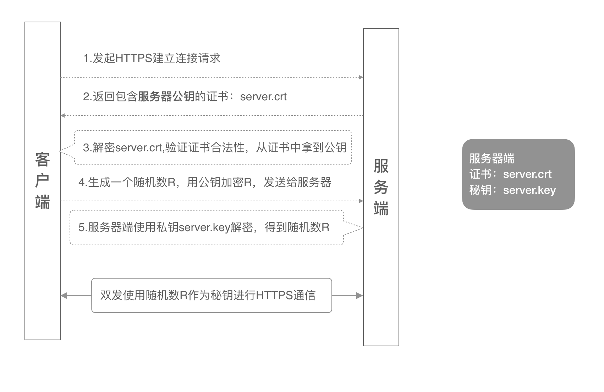
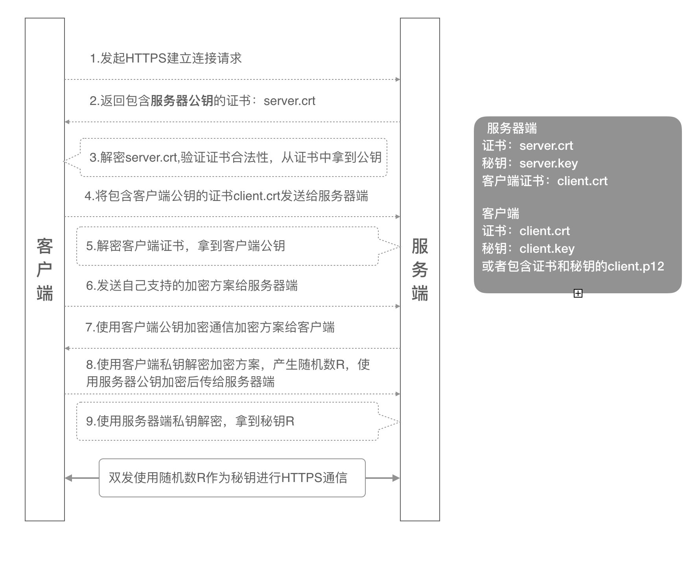
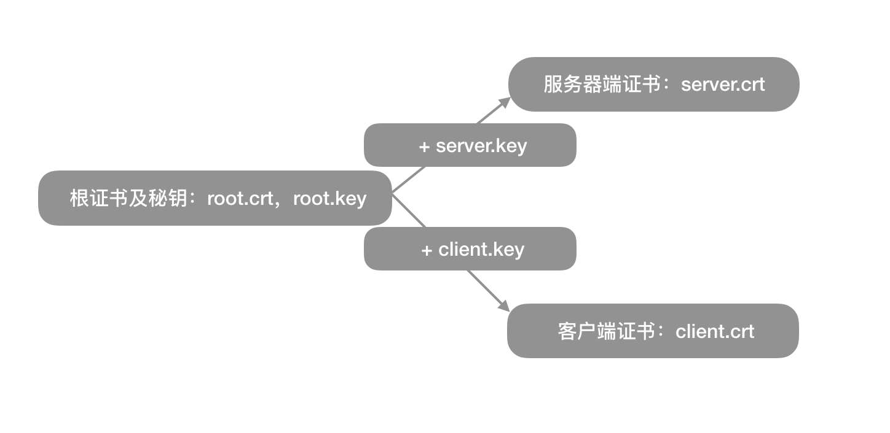

研究 `HTTPS` 的双向认证实现与原理，踩了不少坑，终于整个流程都跑通了，现在总结出一篇文档来，把一些心得，特别是容易踩坑的地方记录下来。

## 1.原理

双向认证，顾名思义，客户端和服务器端都需要验证对方的身份，在建立 `HTTPS` 连接的过程中，握手的流程比单向认证多了几步。单向认证的过程，客户端从服务器端下载服务器端公钥证书进行验证，然后建立安全通信通道。双向通信流程，客户端除了需要从服务器端下载服务器的公钥证书进行验证外，还需要把客户端的公钥证书上传到服务器端给服务器端进行验证，等双方都认证通过了，才开始建立安全通信通道进行数据传输。

### 1.1 单向认证流程

单向认证流程中，服务器端保存着公钥证书和私钥两个文件，整个握手过程如下：



1. 客户端发起建立 HTTPS 连接请求，将 SSL 协议版本的信息发送给服务器端；
2. 服务器端将本机的公钥证书（server.crt）发送给客户端；
3. 客户端读取公钥证书 (server.crt)，取出了服务端公钥；
4. 客户端生成一个随机数（密钥 R），用刚才得到的服务器公钥去加密这个随机数形成密文，发送给服务端；
5. 服务端用自己的私钥 (server.key) 去解密这个密文，得到了密钥 R
6. 服务端和客户端在后续通讯过程中就使用这个密钥R进行通信了。

### 1.2 双向认证流程



1. 客户端发起建立 HTTPS 连接请求，将 SSL 协议版本的信息发送给服务端；
2. 服务器端将本机的公钥证书 (server.crt) 发送给客户端；
3. 客户端读取公钥证书 (server.crt)，取出了服务端公钥；
4. 客户端将客户端公钥证书 (client.crt) 发送给服务器端；
5. 服务器端解密客户端公钥证书，拿到客户端公钥；
6. 客户端发送自己支持的加密方案给服务器端；
7. 服务器端根据自己和客户端的能力，选择一个双方都能接受的加密方案，使用客户端的公钥加密后发送给客户端；
8. 客户端使用自己的私钥解密加密方案，生成一个随机数 R，使用服务器公钥加密后传给服务器端；
9. 服务端用自己的私钥去解密这个密文，得到了密钥 R
10. 服务端和客户端在后续通讯过程中就使用这个密钥R进行通信了。


## 2. 证书生成

从上一章内容中，我们可以总结出来，如果要把整个双向认证的流程跑通，最终需要五个证书文件：

- 服务器端公钥证书：server.crt
- 服务器端私钥文件：server.key
- 客户端公钥证书：client.crt
- 客户端私钥文件：client.key
- 客户端集成证书（包括公钥和私钥，用于浏览器访问场景）：client.p12

生成这一些列证书之前，我们需要先生成一个 `CA` 根证书，然后由这个 `CA` 根证书颁发服务器公钥证书和客户端公钥证书。



我们可以全程使用 `Openssl` 来生成一些列的自签名证书，自签名证书没有通过证书机构的认证，很多浏览器会认为不安全，但我们用来实验是足够的。需要在本机安装了 `Openssl` 后才能继续本章的实验。

### 2.1 生成自签名根证书

1. 创建根证书私钥：

```
$ openssl genrsa -out root.key 1024
```

1. 创建根证书请求文件：

```
$ openssl req -new -out root.csr -key root.key

后续参数请自行填写，下面是一个例子：

Country Name (2 letter code) [XX]:cn
State or Province Name (full name) []:bj
Locality Name (eg, city) [Default City]:bj
Organization Name (eg, company) [Default Company Ltd]:alibaba
Organizational Unit Name (eg, section) []:test
Common Name (eg, your name or your servers hostname) []:www.yourdomain.com
Email Address []:a.alibaba.com
A challenge password []:
An optional company name []:
```

1. 创建根证书：

```
$ openssl x509 -req -in root.csr -out root.crt -signkey root.key -CAcreateserial -days 3650
```

在创建证书请求文件的时候需要注意三点，下面生成服务器请求文件和客户端请求文件均要注意这三点：

- Common Name 填写证书对应的服务域名；
- 所有字段的填写，根证书、服务器端证书、客户端证书需保持一致
- 最后的密码可以直接回车跳过。

经过上面三个命令行，我们最终可以得到一个签名有效期为 10 年的根证书 root.crt，后面我们可以用这个根证书去颁发服务器证书和客户端证书。

### 2.2 生成自签名服务器端证书

1. 生成服务器端证书私钥：

```
$ openssl genrsa -out server.key 1024
```

1. 生成服务器证书请求文件，过程和注意事项参考根证书，本节不详述：

```
$ openssl req -new -out server.csr -key server.key
```

1. 生成服务器端公钥证书

```
$ openssl x509 -req -in server.csr -out server.crt -signkey server.key -CA root.crt -CAkey root.key -CAcreateserial -days 3650
```

经过上面的三个命令，我们得到：

- server.key：服务器端的秘钥文件
- server.crt：有效期十年的服务器端公钥证书，使用根证书和服务器端私钥文件一起生成

### 2.3 生成自签名客户端证书

1. 生成客户端证书秘钥：

```
$ openssl genrsa -out client.key 1024
```

1. 生成客户端证书请求文件，过程和注意事项参考根证书，本节不详述：

```
$ openssl req -new -out client.csr -key client.key
```

1. 生客户端证书

```
$ openssl x509 -req -in client.csr -out client.crt -signkey client.key -CA root.crt -CAkey root.key -CAcreateserial -days 3650
```

1. 生客户端 P12 格式证书

```
$ openssl pkcs12 -export -clcerts -in client.crt -inkey client.key -out client.p12
```

经过上面的三个命令，我们得到：

- client.key：客户端的私钥文件
- client.crt：有效期十年的客户端证书，使用根证书和客户端私钥一起生成
- client.p12：客户端 p12 格式，这个证书文件包含客户端的公钥和私钥，主要用来给浏览器访问使用

## 3.Nginx 配置

有了上面的一些列证书，我们可以在 `Nginx` 服务器上配置双向认证的 `HTTPS` 服务了，具体配置方式如下：

```
server {
        listen       443 ssl;
        server_name  www.yourdomain.com;
        ssl                  on;  
        ssl_certificate      /data/sslKey/server.crt;  #server公钥证书
        ssl_certificate_key  /data/sslKey/server.key;  #server私钥
        ssl_client_certificate /data/sslKey/client.crt;  #客户端公钥证书
        ssl_verify_client on;  #开启客户端证书验证  

        location / {
            root   html;
            index  index.html index.htm;
        }
    }
```

具体就是将服务器端的两个证书文件 (server.crt/server.key) 和客户端的公钥证书文件 (client.crt) 的路径配置到 `Nginx` 的 `server` 节点配置中，并且把 `ssl_verify_client` 这个参数设置为 `on`。

有一点需要注意的就是，如果客户端证书不是由根证书直接颁发的，配置中还需要加一个配置：`ssl_verify_depth 1` ;

配置完成后，执行 `nginx -s reload` 重新加载下就生效了。

## 4.curl 调用

使用 `curl` 加上证书路径，可以直接测试 `Nginx` 的 `HTTPS` 双向认证是否配置成功。

1. 带证书的成功调用

```
# --cert指定客户端公钥证书的路径
# --key指定客户端私钥文件的路径
# -k不校验证书的合法性，因为我们用的是自签名证书，所以需要加这个参数
# 可以使用 -v 来观察具体的 SSL 握手过程

$ curl --cert ./client.crt --key ./client.key https://integration-fred2.fredhuang.com -k -v
* Rebuilt URL to: https://integration-fred2.fredhuang.com/
*   Trying 47.91.39.145...
* TCP_NODELAY set
* Connected to integration-fred2.fredhuang.com (47.91.39.145) port 443 (#0)
* ALPN, offering h2
* ALPN, offering http/1.1
* Cipher selection: ALL:!EXPORT:!EXPORT40:!EXPORT56:!aNULL:!LOW:!RC4:@STRENGTH
* successfully set certificate verify locations:
*   CAfile: /etc/ssl/cert.pem
  CApath: none
* TLSv1.2 (OUT), TLS handshake, Client hello (1):
* TLSv1.2 (IN), TLS handshake, Server hello (2):
* TLSv1.2 (IN), TLS handshake, Certificate (11):
* TLSv1.2 (IN), TLS handshake, Server key exchange (12):
* TLSv1.2 (IN), TLS handshake, Request CERT (13):
* TLSv1.2 (IN), TLS handshake, Server finished (14):
* TLSv1.2 (OUT), TLS handshake, Certificate (11):
* TLSv1.2 (OUT), TLS handshake, Client key exchange (16):
* TLSv1.2 (OUT), TLS handshake, CERT verify (15):
* TLSv1.2 (OUT), TLS change cipher, Client hello (1):
* TLSv1.2 (OUT), TLS handshake, Finished (20):
* TLSv1.2 (IN), TLS change cipher, Client hello (1):
* TLSv1.2 (IN), TLS handshake, Finished (20):
* SSL connection using TLSv1.2 / ECDHE-RSA-AES128-GCM-SHA256
* ALPN, server accepted to use h2
* Server certificate:
*  subject: C=CN; ST=BeiJing; L=BeiJing; O=Alibaba; OU=Test; CN=integration-fred2.fredhuang.com; emailAddress=a@alibaba.com
*  start date: Oct 30 06:43:19 2019 GMT
*  expire date: Oct 27 06:43:19 2029 GMT
*  issuer: C=CN; ST=BeiJing; L=BeiJing; O=Alibaba; OU=Test; CN=integration-fred2.fredhuang.com; emailAddress=a@alibaba.com
*  SSL certificate verify result: self signed certificate (18), continuing anyway.
* Using HTTP2, server supports multi-use
* Connection state changed (HTTP/2 confirmed)
* Copying HTTP/2 data in stream buffer to connection buffer after upgrade: len=0
* Using Stream ID: 1 (easy handle 0x7f8ae1809a00)
> GET / HTTP/2
> Host: integration-fred2.fredhuang.com
> User-Agent: curl/7.54.0
> Accept: */*
>
* Connection state changed (MAX_CONCURRENT_STREAMS updated)!
< HTTP/2 200
< server: Tengine
< date: Fri, 01 Nov 2019 11:16:39 GMT
< content-type: text/plain;charset=UTF-8
< content-length: 0
```

1. 不带证书的失败调用

```
$ curl  https://integration-fred2.fredhuang.com -k -v
* Rebuilt URL to: https://integration-fred2.fredhuang.com/
*   Trying 47.91.39.145...
* TCP_NODELAY set
* Connected to integration-fred2.fredhuang.com (47.91.39.145) port 443 (#0)
* ALPN, offering h2
* ALPN, offering http/1.1
* Cipher selection: ALL:!EXPORT:!EXPORT40:!EXPORT56:!aNULL:!LOW:!RC4:@STRENGTH
* successfully set certificate verify locations:
*   CAfile: /etc/ssl/cert.pem
  CApath: none
* TLSv1.2 (OUT), TLS handshake, Client hello (1):
* TLSv1.2 (IN), TLS handshake, Server hello (2):
* TLSv1.2 (IN), TLS handshake, Certificate (11):
* TLSv1.2 (IN), TLS handshake, Server key exchange (12):
* TLSv1.2 (IN), TLS handshake, Request CERT (13):
* TLSv1.2 (IN), TLS handshake, Server finished (14):
* TLSv1.2 (OUT), TLS handshake, Certificate (11):
* TLSv1.2 (OUT), TLS handshake, Client key exchange (16):
* TLSv1.2 (OUT), TLS change cipher, Client hello (1):
* TLSv1.2 (OUT), TLS handshake, Finished (20):
* TLSv1.2 (IN), TLS change cipher, Client hello (1):
* TLSv1.2 (IN), TLS handshake, Finished (20):
* SSL connection using TLSv1.2 / ECDHE-RSA-AES128-GCM-SHA256
* ALPN, server accepted to use h2
* Server certificate:
*  subject: C=CN; ST=BeiJing; L=BeiJing; O=Alibaba; OU=Test; CN=integration-fred2.fredhuang.com; emailAddress=a@alibaba.com
*  start date: Oct 30 06:43:19 2019 GMT
*  expire date: Oct 27 06:43:19 2029 GMT
*  issuer: C=CN; ST=BeiJing; L=BeiJing; O=Alibaba; OU=Test; CN=integration-fred2.fredhuang.com; emailAddress=a@alibaba.com
*  SSL certificate verify result: self signed certificate (18), continuing anyway.
* Using HTTP2, server supports multi-use
* Connection state changed (HTTP/2 confirmed)
* Copying HTTP/2 data in stream buffer to connection buffer after upgrade: len=0
* Using Stream ID: 1 (easy handle 0x7fcc52805e00)
> GET / HTTP/2
> Host: integration-fred2.fredhuang.com
> User-Agent: curl/7.54.0
> Accept: */*
>
* Connection state changed (MAX_CONCURRENT_STREAMS updated)!
< HTTP/2 400
< server: Tengine
< date: Fri, 01 Nov 2019 11:25:28 GMT
< content-type: text/html
< content-length: 685
<
<!DOCTYPE HTML PUBLIC "-//IETF//DTD HTML 2.0//EN">
<html>
<head><title>400 No required SSL certificate was sent</title></head>
<body>
<center><h1>400 Bad Request</h1></center>
<center>No required SSL certificate was sent</center>
 Sorry for the inconvenience.<br/>
Please report this message and include the following information to us.<br/>
Thank you very much!</p>
<table>
<tr>
<td>URL:</td>
<td>https://integration-fred2.fredhuang.com:444/</td>
</tr>
<tr>
<td>Server:</td>
<td>cag-access-tengine011192099198.au49</td>
</tr>
<tr>
<td>Date:</td>
<td>2019/11/01 19:25:28</td>
</tr>
</table>
<hr/>Powered by Tengine<hr><center>tengine</center>
</body>
</html>
```

## 5.Java 调用

由于使用的是自签名证书，使用 `ApacheHttpClient` 去调用的话，需要将服务器证书加入可信任证书库中，才能成功调用，也可以在代码中简单忽略证书。

```
$ cd $JAVA_HOME
$ sudo ./bin/keytool -import -alias ttt -keystore cacerts -file /Users/fred/temp/cert5/server.crt
```

将服务器端公钥证书设置为可信证书后，使用以下代码可以直接发起带客户端证书的 `HTTPS` 请求：

```
import org.apache.http.HttpEntity;
import org.apache.http.client.methods.CloseableHttpResponse;
import org.apache.http.client.methods.HttpGet;
import org.apache.http.conn.ssl.SSLConnectionSocketFactory;
import org.apache.http.impl.client.CloseableHttpClient;
import org.apache.http.impl.client.HttpClients;
import org.apache.http.ssl.SSLContexts;
import org.apache.http.util.EntityUtils;

import javax.net.ssl.SSLContext;
import java.io.File;
import java.io.FileInputStream;
import java.io.InputStream;
import java.security.KeyStore;

public class HttpClientWithClientCert {

    private final static String PFX_PATH = "/Users/fred/temp/cert5/client.p12";    //客户端证书路径
    private final static String PFX_PWD = "123456";    //客户端证书密码

    public static String sslRequestGet(String url) throws Exception {
        KeyStore keyStore = KeyStore.getInstance("PKCS12");
        InputStream instream = new FileInputStream(new File(PFX_PATH));
        try {
            keyStore.load(instream, PFX_PWD.toCharArray());
        } finally {
            instream.close();
        }
        SSLContext sslcontext = SSLContexts.custom().loadKeyMaterial(keyStore, PFX_PWD.toCharArray()).build();
        SSLConnectionSocketFactory sslsf = new SSLConnectionSocketFactory(sslcontext
                , new String[] { "TLSv1" }    // supportedProtocols ,这里可以按需要设置
                , null    // supportedCipherSuites
                , SSLConnectionSocketFactory.getDefaultHostnameVerifier());

        CloseableHttpClient httpclient = HttpClients.custom().setSSLSocketFactory(sslsf).build();
        try {
            HttpGet httpget = new HttpGet(url);
            //httpget.addHeader("host", "integration-fred2.fredhuang.com");// 设置一些heander等
            CloseableHttpResponse response = httpclient.execute(httpget);
            try {
                HttpEntity entity = response.getEntity();
                String jsonStr = EntityUtils.toString(response.getEntity(), "UTF-8");//返回结果
                EntityUtils.consume(entity);
                return jsonStr;
            } finally {
                response.close();
            }
        } finally {
            httpclient.close();
        }
    }

    public static void main(String[] args) throws Exception {
        System.out.println(System.getProperty("java.home"));
        System.out.println(sslRequestGet("https://integration-fred2.fredhuang.com/test"));
    }

}
```

## 6. 存疑

网上很多文章都描述到 `Nginx` 配置中的客户端证书（`ssl_client_certificate`）可以配置根证书 root.crt，然后就可以适配所有这个根证书办法的客户端公钥证书了。我试了，使用 root.crt 作为 `ssl_client_certificate` 的值，然后使用 client.crt 来访问，发现不行，`Nginx` 会报这个错误：

```
<html>
<head><title>400 The SSL certificate error</title></head>
<body>
<center><h1>400 Bad Request</h1></center>
<center>The SSL certificate error</center>
<hr><center>nginx/1.17.5</center>
</body>
</html>
```

这个特性原作者一直没有配置成功 (我也没配置成功)，有可能是配置有问题，也有可能是网上文章不靠谱，写错了。

> 本文转载自：「阿里云开发者社区」，原文：https://tinyurl.com/yaamh7vf，版权归原作者所有。欢迎投稿，投稿邮箱: [editor@hi-linux.com](mailto:editor@hi-linux.com)。

## 扩展阅读 (本文核心)

在原文基础上，我在分享一个你在大多数网站和搜索引擎中都找不到的很实用的小技巧，说得这么神秘到底是什么呢？

那就是使用受信证书进行双向认证，网上大多数文章介绍的实现 `HTTPS` 双向认证的文章都是使用 `CA` 自签的方式进行。虽然这能实现目的，但方法不太优雅。

在 `SSL` 证书全面普及的当下，你其实很有必要申请一个受信证书来进行 `HTTPS` 双向认证。这样看上去不但更权威，而且实现上也更便捷一些。

### 使用受信证书进行双向认证

要使用受信证书进行认证的前提条件：当然是你必须有一个权威 CA 机构给你签发的证书。

- 如果你是土豪，随便购买一个就行了。
- 如果你囊中羞涩，也不要紧，可以去申请一个免费的 `SSL` 证书。目前 `Let's Encrypt`、`阿里云` 都可以申请，具体方法就不在这展开了，你可以直接在公众号上搜索相关文章。
- 为了便于管理和多场景使用，建议直接申请通配证书。

证书准备完成后，接下来当然是直接使用它。因为是受信证书，上面所有的证书自签操作都不需要了，你只需直接配置 `Nginx` 就可以了。

```
server {
                listen       443 ssl;
                access_log  /var/log/nginx/accesse.log  main;
                server_name  ci.hi-linux.com;

                
                ssl_certificate      /etc/ssl/certs/hi-linux.com/hi-linux.com.pem;
                ssl_certificate_key  /etc/ssl/certs/hi-linux.com/hi-linux.com.key;
                ssl_client_certificate /etc/ssl/certs/hi-linux.com/hi-linux.com.pem;

                ssl_verify_depth 3;
                ssl_session_timeout  5m;
                ssl_verify_client on;

                ssl_protocols  SSLv2 SSLv3 TLSv1;
                ssl_ciphers ALL:!ADH:!EXPORT56:RC4+RSA:+HIGH:+MEDIUM:+LOW:+SSLv2:+EXP;
                ssl_prefer_server_ciphers   on;

                location / {
                        proxy_pass   http://ci/;
                        proxy_set_header Host $host:$server_port;
                        proxy_set_header X-Real-IP $remote_addr;
                        proxy_set_header X-Forwarded-Proto $scheme;
                        }
                }
```

> 注意：`ssl_certificate` 指定的是证书，`ssl_certificate_key` 指定是证书对应的私钥，请自行将对应证书文件放到配置文件中指定的目录中。

以上配置段和上面的自签证书大同小异，主要需注意的有 `ssl_client_certificate` 和 `ssl_verify_depth` 这两个参数。

- `ssl_client_certificate` 主要用于指定客户端所使用的证书，这里可以直接使用受信证书机构签发的证书文件。
- `ssl_verify_depth` 这个参数是使用受信证书能成功进行客户端验证的关键，注意它的值是 `3`。

因为当 `ssl_verify_depth` 设置为 `1`（ `Nginx` 的默认值）的时候，服务端只会接受直接被 `CA` 签发的客户端证书或自签名的证书。也就是说，直接尝试使用中级 `CA` 来验证客户端是无法通过的，`OpenSSL` 会自动的去找中级 `CA` 的签发者并一层层验证上去，直到找到根证书。

所以，就算将中级 `CA` 和根 `CA` 都放在信任证书列表中，由于最终 `ssl_verify_depth` 为 `2` 的缘故，验证还是通不过的。

因此，在实际使用的时候，需要注意以下两点：

- CA 文件中必须同时存在 中级 `CA` 和根 `CA`，必须构成完整证书链，不能少任何一个；
- 默认的验证深度 `ssl_verify_depth` 是 1，中级 `CA` 签发的客户端证书一律无法通过认证，需要增大该值，所以我们上面配置中 `ssl_verify_depth` 值为 `3` 。

为了客户端方便导入，你同样还是需要将证书文件转换成 P12 格式。当然你还可以在转换的过程中给证书加个密码，以保证证书的安全。

```
$ openssl pkcs12 -export -clcerts -in hi-linux.com.pem -inkey hi-linux.com.key -out hi-linux.com-client.p12
```

至此，`HTTPS` 双向证书的实现就讲完了