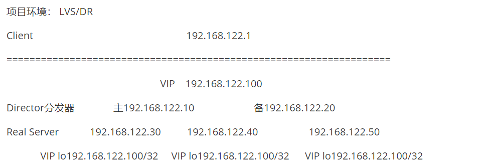
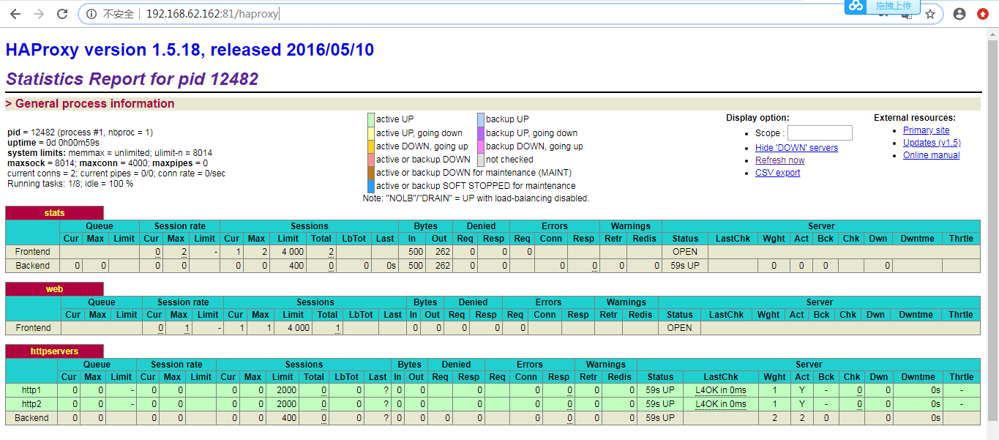
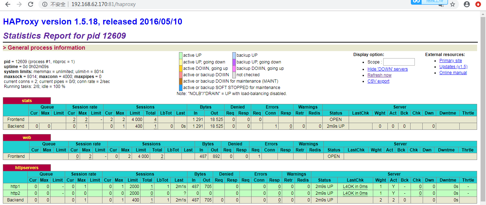

### 企业 keepalived 高可用项目实战

#### 1、Keepalived VRRP 介绍

```shell
keepalived是什么
    keepalived是集群管理中保证集群高可用的一个服务软件，用来防止单节点故障。

keepalived工作原理
    keepalived是以VRRP协议为实现基础的，VRRP全称Virtual Router Redundancy Protocol，即虚拟路由冗余协议。

    虚拟路由冗余协议，可以认为是实现高可用的协议，即将N台提供相同功能的路由器组成一个路由器组，这个组里面有一个master和多个backup，master上面有一个对外提供服务的vip（该路由器所在局域网内其他机器的默认路由为该vip），master会发组播，当backup收不到vrrp包时就认为master宕掉了，这时就需要根据VRRP的优先级来选举一个backup当master。这样的话就可以保证路由器的高可用了。

keepalived主要有三个模块，分别是core、check和vrrp。core模块为keepalived的核心，负责主进程的启动、维护以及全局配置文件的加载和解析。check负责健康检查，包括常见的各种检查方式。vrrp模块是来实现VRRP协议的。
=========================================================================================
脑裂(裂脑)：
Keepalived的BACKUP主机在收到不MASTER主机报文后就会切换成为master，如果是它们之间的通信线路出现问题，无法接收到彼此的组播通知，但是两个节点实际都处于正常工作状态，这时两个节点均为master强行绑定虚拟IP，导致不可预料的后果，这就是脑裂。
解决方式:
1、添加更多的检测手段，比如冗余的心跳线（两块网卡做健康监测），ping对方等等。尽量减少"裂脑"发生机会。(治标不治本，只是提高了检测到的概率)；
2、做好对裂脑的监控报警（如邮件及手机短信等或值班）.在问题发生时人为第一时间介入仲裁，降低损失。例如，百度的监控报警短倍就有上行和下行的区别。报警消息发送到管理员手机上，管理员可以通过手机回复对应数字或简单的字符串操作返回给服务器.让服务器根据指令自动处理相应故障，这样解决故障的时间更短；
3、爆头，将master停掉。然后检查机器之间的防火墙。网络之间的通信;
```

#### 2、Nginx+keepalived实现七层的负载均衡(同类服务)

Nginx通过Upstream模块实现负载均衡

#### upstream 支持的负载均衡算法

```shell
轮询（默认）:可以通过weight指定轮询的权重，权重越大，被调度的次数越多
ip_hash：可以实现会话保持，将同一客户的IP调度到同一样后端服务器，可以解决session的问题，不能使用weight
fair：可以根据请求页面的大小和加载时间长短进行调度，使用第三方的upstream_fair模块
url_hash：按请求的url的hash进行调度，从而使每个url定向到同一服务器，使用第三方的url_hash模块
```

```shell
配置安装nginx 所有的机器，关闭防火墙和selinux
[root@nginx-proxy ~]# cd /etc/yum.repos.d/
[root@nginx-proxy yum.repos.d]# vim nginx.repo
[nginx-stable]
name=nginx stable repo
baseurl=http://nginx.org/packages/centos/$releasever/$basearch/
gpgcheck=0
enabled=1
[root@nginx-proxy yum.repos.d]# yum install yum-utils -y
[root@nginx-proxy yum.repos.d]# yum install nginx -y
```

```shell
调度到不同组后端服务器
网站分区进行调度
=================================================================================
拓扑结构

							[vip: 20.20.20.20]

						[LB1 Nginx]		[LB2 Nginx]
					    192.168.1.2		192.168.1.3

		[index]		[milis]		 [videos]	   [images]  	  [news]
		 1.11		 1.21		   1.31			  1.41		   1.51
		 1.12		 1.22		   1.32			  1.42		   1.52
		 1.13		 1.23		   1.33			  1.43		   1.53
		 ...		 ...		    ...			  ...		    ...
		 /web     /web/milis    /web/videos     /web/images   /web/news
	  index.html  index.html     index.html      index.html   index.html
一、实施过程 
1、选择两台nginx服务器作为代理服务器。
2、给两台代理服务器安装keepalived制作高可用集群，生成VIP
3、配置nginx的负载均衡
以上两台nginx服务器配置文件一致
根据站点分区进行调度
配置upstream文件

所有机器关闭防火墙selinux
systemctl stop firewalld && setenforce 0

[root@nginx-proxy ~]# cd /etc/nginx/conf.d/
[root@nginx-proxy conf.d]# mv default.conf default.conf.bak
[root@nginx-proxy conf.d]# vim upstream.conf
upstream index {
        server 192.168.246.162:80 weight=1 max_fails=2 fail_timeout=2;
        server 192.168.246.163:80 weight=2 max_fails=2 fail_timeout=2;
}       
[root@nginx-proxy conf.d]# vim proxy.conf
server {
        listen 80;
        server_name     localhost;
        access_log  /var/log/nginx/host.access.log  main;
        
        location / {
         proxy_pass http://index;
         proxy_redirect default;
         proxy_set_header Host $http_host;
         proxy_set_header X-Real-IP $remote_addr;
         proxy_set_header X-Forwarded-For $proxy_add_x_forwarded_for;
        }
}
将nginx的配置文件拷贝到另一台代理服务器中:
[root@nginx-proxy-master conf.d]# scp proxy.conf 192.168.246.161:/etc/nginx/conf.d/
[root@nginx-proxy-master conf.d]# scp upstream.conf 192.168.246.161:/etc/nginx/conf.d/
二、Keepalived实现调度器HA
注：主/备调度器均能够实现正常调度
1. 主/备调度器安装软件
[root@nginx-proxy-master ~]# yum install -y keepalived
[root@nginx-proxy-slave ~]# yum install -y keepalived
[root@nginx-proxy-slave ~]# cd /etc/nginx/conf.d/
[root@nginx-proxy-slave conf.d]# mv default.conf default.conf.bak
[root@nginx-proxy-master ~]# mv /etc/keepalived/keepalived.conf /etc/keepalived/keepalived.conf.bak
[root@nginx-proxy-master ~]# vim /etc/keepalived/keepalived.conf
! Configuration File for keepalived

global_defs {
   router_id directory1   #辅助改为directory2
}

vrrp_instance VI_1 {
    state MASTER        #定义主还是备
    interface ens33     #VIP绑定接口
    virtual_router_id 80  #整个集群的调度器一致
    priority 100         #优先级，backup改为50
    advert_int 1		 #心跳检测的时间间隔1s
    authentication {
        auth_type PASS
        auth_pass 1111
    }
    virtual_ipaddress {
        192.168.246.16/24
    }
}

[root@nginx-porxy-slave ~]# mv /etc/keepalived/keepalived.conf /etc/keepalived/keepalived.conf.bak
[root@nginx-proxy-slave ~]# vim /etc/keepalived/keepalived.conf
! Configuration File for keepalived

global_defs {
   router_id directory2
}

vrrp_instance VI_1 {
    state BACKUP    #设置为backup
    interface ens33
    nopreempt        #设置到back上面，不抢占资源(VIP)
    virtual_router_id 80
    priority 50   #辅助改为50
    advert_int 1	#检测间隔1s
    authentication {
        auth_type PASS
        auth_pass 1111
    }
    virtual_ipaddress {
        192.168.246.16/24
    }
}
3. 启动KeepAlived（主备均启动）
[root@nginx-proxy-master ~]# systemctl start keepalived
[root@nginx-proxy-master ~]# systemctl enable keepalived
[root@nginx-porxy-slave ~]# systemctl start keepalived
[root@nginx-porxy-slave ~]# systemctl enable keepalived
[root@nginx-proxy-master ~]# ip addr
: lo: <LOOPBACK,UP,LOWER_UP> mtu 65536 qdisc noqueue state UNKNOWN qlen 1
    link/loopback 00:00:00:00:00:00 brd 00:00:00:00:00:00
    inet 127.0.0.1/8 scope host lo
       valid_lft forever preferred_lft forever
    inet6 ::1/128 scope host 
       valid_lft forever preferred_lft forever
2: ens33: <BROADCAST,MULTICAST,UP,LOWER_UP> mtu 1500 qdisc pfifo_fast state UP qlen 1000
    link/ether 00:0c:29:48:07:7d brd ff:ff:ff:ff:ff:ff
    inet 192.168.246.169/24 brd 192.168.246.255 scope global dynamic ens33
       valid_lft 1726sec preferred_lft 1726sec
    inet 192.168.246.16/24 scope global ens33
       valid_lft forever preferred_lft forever
    inet6 fe80::23e9:de18:1e67:f152/64 scope link 
       valid_lft forever preferred_lft forever

测试：
浏览器访问：http://192.168.246.16
如能正常访问，将keepalived主节点关机，测试vip是否漂移

到此：
可以解决心跳故障keepalived
不能解决Nginx服务故障，也就是心跳检测，确认的是keepalived主节点是否存活，而不是nginx服务是否正常运行

4. 扩展对调度器Nginx健康检查（可选）两台都设置
思路：
让Keepalived以一定时间间隔执行一个外部脚本，脚本的功能是当Nginx失败，则关闭本机的Keepalived
(1) script
[root@nginx-proxy-master ~]# vim /etc/keepalived/check_nginx_status.sh
#!/bin/bash					        
/usr/bin/curl -I http://localhost &>/dev/null
if [ $? -ne 0 ];then						    
#	/etc/init.d/keepalived stop
	systemctl stop keepalived
fi														        	
[root@nginx-proxy-master ~]# chmod a+x /etc/keepalived/check_nginx_status.sh

(2). keepalived使用script
[root@nginx-proxy-master ~]# vim /etc/keepalived/keepalived.conf
! Configuration File for keepalived

global_defs {
   router_id directory1
}
vrrp_script check_nginx {
   script "/etc/keepalived/check_nginx_status.sh"
   interval 5
}

vrrp_instance VI_1 {
    state MASTER
    interface ens33
    virtual_router_id 80
    priority 100
    advert_int 1
    authentication {
        auth_type PASS
        auth_pass 1111
    }
    virtual_ipaddress {
        192.168.246.16/24
    }
    track_script {
        check_nginx
    }
}
注：必须先启动Nginx，再启动keepalived

测试访问：  
将keepalived集群的主节点的Nginx服务关闭，查看vip是否漂移，如果漂移，即成功
```

#### 3、LVS_Director + KeepAlived



```shell
LVS_Director + KeepAlived

KeepAlived在该项目中的功能：
1. 管理IPVS的路由表（包括对RealServer做健康检查）
2. 实现调度器的HA(高可用)
http://www.keepalived.org

Keepalived所执行的外部脚本命令建议使用绝对路径
=================================================================================
实施步骤：
1. 主/备调度器安装软件
[root@lvs-keepalived-master ~]# yum -y install ipvsadm keepalived 
[root@lvs-keepalived-slave ~]# yum -y install ipvsadm keepalived
2. Keepalived
lvs-master
[root@lvs-keepalived-master ~]# vim /etc/keepalived/keepalived.conf
! Configuration File for keepalived

global_defs {
   router_id lvs-keepalived-master    #辅助改为lvs-backup
}

vrrp_instance VI_1 {
    state MASTER
    interface ens33                #VIP绑定接口
    virtual_router_id 80         #VRID 同一组集群，主备一致          
    priority 100            #本节点优先级，辅助改为50
    advert_int 1            #检查间隔，默认为1s
    authentication {
        auth_type PASS
        auth_pass 1111
    }
    virtual_ipaddress {
        192.168.246.110/24
    }
}

virtual_server 192.168.246.110 80 {    #LVS配置
	delay_loop 3  #启动3个进程
	lb_algo rr     #LVS调度算法
	lb_kind DR     #LVS集群模式（路由模式）
	nat_mask 255.255.255.0
	protocol TCP      #健康检查使用的协议
	real_server 192.168.246.162 80 {
		weight 1
		inhibit_on_failure   #当该节点失败时，把权重设置为0，而不是从IPVS中删除
		TCP_CHECK {          #健康检查
			connect_port 80   #检查的端口
			connect_timeout 3  #连接超时的时间
			}
		}
	real_server 192.168.246.163 80 {
		weight 1
		inhibit_on_failure
		TCP_CHECK {
			connect_timeout 3
			connect_port 80
			}
		}
}

[root@lvs-keepalived-slave ~]# vim /etc/keepalived/keepalived.conf
! Configuration File for keepalived

global_defs {
   router_id lvs-keepalived-slave
}

vrrp_instance VI_1 {
    state BACKUP
    interface ens33
    nopreempt                    #不抢占资源
    virtual_router_id 80
    priority 50
    advert_int 1
    authentication {
        auth_type PASS
        auth_pass 1111
    }
    virtual_ipaddress {
        192.168.246.110/24
    }
}
virtual_server 192.168.246.110 80 {
	delay_loop 3
	lb_algo rr
	lb_kind DR
	nat_mask 255.255.255.0
	protocol TCP
	real_server 192.168.246.162 80 {
		weight 1
		inhibit_on_failure
		TCP_CHECK {
			connect_port 80
			connect_timeout 3
			}
		}
	real_server 192.168.246.163 80 {
		weight 1
		inhibit_on_failure
		TCP_CHECK {
			connect_timeout 3
			connect_port 80
			}
		}
}
3. 启动KeepAlived（主备均启动）
[root@lvs-keepalived-master ~]# systemctl start keepalived
[root@lvs-keepalived-master ~]# systemctl enable keepalived

[root@lvs-keepalived-master ~]# ipvsadm -Ln
IP Virtual Server version 1.2.1 (size=4096)
Prot LocalAddress:Port Scheduler Flags
  -> RemoteAddress:Port           Forward Weight ActiveConn InActConn
TCP  192.168.246.110:80 rr persistent 20
  -> 192.168.246.162:80           Route   1      0          0         
  -> 192.168.246.163:80           Route   0      0          0

4. 所有RS配置(nginx1,nginx2)
配置好网站服务器，测试所有RS
[root@test-nginx1 ~]# yum install -y nginx
[root@test-nginx2 ~]# yum install -y nginx

[root@test-nginx1 ~]# ip addr add dev lo 192.168.246.110/32
[root@test-nginx2 ~]# ip addr add dev lo 192.168.246.110/32

[root@test-nginx1 ~]# echo 1 > /proc/sys/net/ipv4/conf/all/arp_ignore #忽略arp广播
[root@test-nginx1 ~]# echo 2 > /proc/sys/net/ipv4/conf/all/arp_announce #匹配精确ip地址回包

[root@test-nginx2 ~]# echo 1 > /proc/sys/net/ipv4/conf/all/arp_ignore #忽略arp广播
[root@test-nginx2 ~]# echo 2 > /proc/sys/net/ipv4/conf/all/arp_announce #匹配精确ip地址回包

[root@test-nginx1 ~]# echo "web1..." >> /usr/share/nginx/html/index.html
[root@test-nginx2 ~]# echo "web2..." >> /usr/share/nginx/html/index.html
[root@test-nginx1 ~]# systemctl start nginx

LB集群测试
所有分发器和Real Server都正常

主分发器故障及恢复
```

### MySQL+Keepalived

```shell
Keepalived+mysql 自动切换

项目环境：
VIP 192.168.246.100
mysql1 192.168.246.162      keepalived-master
mysql2 192.168.246.163      keepalived-slave

一、mysql 主主同步(互为主从)        （不使用共享存储，数据保存本地存储）
二、安装keepalived
三、keepalived主备配置文件
四、mysql状态检测脚本/root/bin/keepalived_check_mysql.sh
五、测试及诊断
＝＝＝＝＝＝＝＝＝＝＝＝＝＝＝＝＝＝＝＝＝＝＝＝＝＝＝＝＝＝＝＝＝＝＝＝＝＝＝＝＝＝＝＝＝＝＝＝＝＝＝＝＝＝

实施步骤：
一、mysql 主主同步 <略>
===================================================================================
mysql两个节点均操作
[root@mysql-keepalived-master ~]# yum -y install mariadb-server mariadb
[root@mysql-keepalived-master ~]# systemctl start mariadb
[root@mysql-keepalived-master ~]# mysql
节点1创建Ayanami1库名，以便测试
MariaDB [(none)]> create database Ayanami1;
创建一个客户端能够测试连接的用户
MariaDB [(none)]> grant all privileges on *.* to root@'%' identified by '123456';
MariaDB [(none)]> flush privileges;
MariaDB [(none)]> quit;

[root@mysql-keepalived-slave ~]# yum -y install mariadb-server mariadb
[root@mysql-keepalived-slave ~]# systemctl start mariadb
[root@mysql-keepalived-slave ~]# mysql
节点1创建Ayanami2库名，以便测试
MariaDB [(none)]> create database Ayanami2;
创建一个客户端能够测试连接的用户
MariaDB [(none)]> grant all privileges on *.* to root@'%' identified by '123456';
MariaDB [(none)]> flush privileges;
MariaDB [(none)]> quit;
====================================================================================

二、安装keepalived---两台机器都操作
[root@mysql-keepalived-master ~]# yum -y install keepalived
[root@mysql-keepalived-slave ~]# yum -y install keepalived
三、keepalived 主备配置文件
192.168.246.162 master配置
[root@mysql-keepalived-master ~]# mv /etc/keepalived/keepalived.conf /etc/keepalived/keepalived.conf.bak
[root@mysql-keepalived-master ~]# vim /etc/keepalived/keepalived.conf
! Configuration File for keepalived

global_defs {
   router_id master
}
vrrp_script check_run {
   script "/etc/keepalived/keepalived_chech_mysql.sh"
   interval 5
}

vrrp_instance VI_1 {
    state MASTER
    interface ens33
    virtual_router_id 89
    priority 100
    advert_int 1
    authentication {
        auth_type PASS
        auth_pass 1111
    }
    virtual_ipaddress {
        192.168.246.18/24
    }
    track_script {
        check_run
    }
}
======================================================================================
slave 192.168.246.163 配置
[root@mysql-keepalived-slave ~]# cp /etc/keepalived/keepalived.conf /etc/keepalived/keepalived.conf.bak
[root@mysql-keepalived-slave ~]# vim /etc/keepalived/keepalived.conf
! Configuration File for keepalived

global_defs {
   router_id backup
}
vrrp_script check_run {
   script "/etc/keepalived/keepalived_chech_mysql.sh"
   interval 5
}

vrrp_instance VI_1 {
    state BACKUP
    nopreempt
    interface ens33
    virtual_router_id 89
    priority 50
    advert_int 1
    authentication {
        auth_type PASS
        auth_pass 1111
    }
    virtual_ipaddress {
        192.168.246.18/24
    }
    track_script {
        check_run
    }
}

四、mysql状态检测脚本/root/keepalived_check_mysql.sh（两台MySQL同样的脚本）
版本一：简单使用：
[root@mysql-keepalived-master ~]# vim /etc/keepalived/keepalived_chech_mysql.sh
#!/bin/bash
/usr/bin/mysql -uroot -p'QianFeng@2019!' -e "show status" &>/dev/null 
if [ $? -ne 0 ] ;then 
#	service keepalived stop
	systemctl stop keepalived
fi

[root@mysql-keepalived-master ~]# chmod +x /etc/keepalived/keepalived_chech_mysql.sh
==========================================================================
两边均启动keepalived
方式一:
[root@mysql-keepalived-master ~]# systemctl restart keepalived
[root@mysql-keepalived-master ~]# systemctl enable keepalived
方式二:
# /etc/init.d/keepalived start
# chkconfig --add keepalived
# chkconfig keepalived on
注意:在任意一台机器作为客户端。在测试的时候记得检查mysql用户的可不可以远程登录。
用客户端去连接测试
[root@client ~]# mysql -uroot -p -h 192.168.246.18
Enter password: 
MariaDB [(none)]> show databases;
+--------------------+
| Database           |
+--------------------+
| information_schema |
| mysql              |
| performance_schema |
| Ayanami1                |
| test               |
+--------------------+
可以看到Ayanami1库

停止节点1的mariadb服务，查看vip是否漂移
[root@mysql-keepalived-master ~]# systemctl stop mariadb
可以看到vip会漂移到节点2上面
再次用客户端去连接测试
[root@client ~]# mysql -uroot -p -h 192.168.246.18
Enter password: 
MariaDB [(none)]> show databases;
+--------------------+
| Database           |
+--------------------+
| information_schema |
| mysql              |
| performance_schema |
| Ayanami2                |
| test               |
+--------------------+
可以看到Ayanami1库
```

### Haproxy 基础


```shell
软件：haproxy---主要是做负载均衡的7层，也可以做4层负载均衡
apache也可以做7层负载均衡，但是很麻烦。实际工作中没有人用。
负载均衡是通过OSI协议对应的
7层负载均衡：用的7层http协议，
4层负载均衡：用的是tcp协议加端口号做的负载均衡

-----------------------------------------------------------------------------------------
ha-proxy概述
ha-proxy是一款`高性能的负载均衡软件`。因为其专注于负载均衡这一件事情，因此与nginx比起来在负载均衡这件事情上做更好，更专业。

ha-proxy的特点
ha-proxy 作为目前流行的负载均衡软件，必须有其出色的一面。下面介绍一下ha-proxy相对LVS，Nginx等负载均衡软件的优点。

•支持tcp/http两种协议层的负载均衡，使得其负载均衡功能非常丰富。
•支持8种左右的负载均衡算法，尤其是在http模式时，有许多非常实在的负载均衡算法，适用各种需求。
•性能非常优秀，基于单进程处理模式（和Nginx类似）让其性能卓越。
•拥有一个功能出色的监控页面，实时了解系统的当前状况。
•功能强大的ACL支持，给用户极大的方便。

haproxy算法：
1.roundrobin
轮询,在服务器的处理时间保持均匀分布时,这是最平衡,最公平的算法.此算法是动态的,这表示其权重可以在运行时进行调整.
2.static-rr
基于权重进行轮询,与roundrobin类似,但是为静态方法,在运行时调整其服务器权重不会生效.不过,其在后端服务器连接数上没有限制
3.leastconn
新的连接请求被派发至具有最少连接数目的后端服务器.
```

**1、Haproxy 实现七层负载**

```shell
Keepalived + Haproxy
=================================================================================
/etc/haproxy/haproxy.cfg
global												      //关于进程的全局参数
    log         		    127.0.0.1 local2 info  #日志服务器
    pidfile     		    /var/run/haproxy.pid  #pid文件
    maxconn     	4000     #最大连接数
    user        		    haproxy   #用户
    group       	    haproxy      #组
    daemon			#守护进程方式后台运行
    nbproc 1		#工作进程数量  cpu内核是几就写几
defaults 段用于为其它配置段提供默认参数
listen是frontend和backend的结合体

frontend        虚拟服务VIrtual Server
backend        真实服务器Real Server

调度器可以同时为多个站点调度，如果使用frontend、backend的方式：
frontend1 backend1
frontend2 backend2
frontend3 backend3
```

```shell
Keepalived + Haproxy
=================================================================================
拓扑结构

							[vip: 192.168.246.17]

						[LB1 Haproxy]		[LB2 Haproxy]
						192.168.246.169	    192.168.246.161

				       [httpd]				      [httpd] 
				    192.168.246.162		         192.168.246.163

一、Haproxy实施步骤				
1. 准备工作（集群中所有主机）
[root@ha-proxy-master ~]# cat /etc/hosts
127.0.0.1      	localhost
192.168.246.169	ha-proxy-master
192.168.246.161	ha-proxy-slave
192.168.246.162	test-nginx1 
192.168.246.163	test-nginx2

2. RS配置
配置好网站服务器，测试所有RS,所有机器安装nginx
[root@test-nginx1 ~]# yum install -y nginx
[root@test-nginx1 ~]# systemctl start nginx
[root@test-nginx1 ~]# echo "test-nginx1" >> /usr/share/nginx/html/index.html
# 所有nginx服务器按顺序输入编号，方便区分。
3. 调度器配置Haproxy（主/备）都执行
[root@ha-proxy-master ~]# yum -y install haproxy
[root@ha-proxy-master ~]# cp -rf /etc/haproxy/haproxy.cfg{,.bak}
[root@ha-proxy-master ~]# sed -i -r '/^[ ]*#/d;/^$/d' /etc/haproxy/haproxy.cfg
[root@ha-proxy-master ~]# vim /etc/haproxy/haproxy.cfg
global
    log         127.0.0.1 local2 info
    pidfile     /var/run/haproxy.pid
    maxconn     4000   #最大连接数
    user        haproxy
    group       haproxy
    daemon               #以后台形式运行ha-proxy
    nbproc 1		    #工作进程数量  cpu内核是几就写几
defaults
    mode                    http  #工作模式 http ,tcp 是 4 层,http是 7 层	
    log                     global
    retries                 3   #健康检查。3次连接失败就认为服务器不可用，主要通过后面的check检查
    option                  redispatch  #服务不可用后重定向到其他健康服务器。
    maxconn                 4000  #优先级中
    contimeout	            5000  #ha服务器与后端服务器连接超时时间，单位毫秒ms
    clitimeout	            50000 #客户端超时
    srvtimeout	            50000 #后端服务器超时
listen stats
    bind			*:81
    stats                   	enable
    stats uri              	/haproxy  #使用浏览器访问 http://192.168.246.169:81/haproxy,可以看到服务器状态  
    stats auth           	qianfeng:123  #用户认证，客户端使用elinks浏览器的时候不生效
frontend  web
    mode                   	http  
    bind                    	    *:80   #监听哪个ip和什么端口
    option                  httplog		#日志类别 http 日志格式
    acl html url_reg  -i  \.html$  #1.访问控制列表名称html。规则要求访问以html结尾的url(可选)
    use_backend httpservers if  html #2.如果满足acl html规则，则推送给后端服务器httpservers
    default_backend    httpservers   #默认使用的服务器组
backend httpservers    #名字要与上面的名字必须一样
    balance     roundrobin  #负载均衡的方式
    server  http1 192.168.246.162:80 maxconn 2000 weight 1  check inter 1s rise 2 fall 2
    server  http2 192.168.246.163:80 maxconn 2000 weight 1  check inter 1s rise 2 fall 2
将配置文件拷贝到slave服务器
[root@ha-proxy-master ~]# scp  /etc/haproxy/haproxy.cfg 192.168.246.161:/etc/haproxy/
两台机器启动设置开机启动
[root@ha-proxy-master ~]# systemctl start haproxy
[root@ha-proxy-master ~]# systemctl enable haproxy
```

4.测试主/备(浏览器访问)

主:



备:



```shell
页面主要参数解释
Queue
Cur: current queued requests //当前的队列请求数量
Max：max queued requests     //最大的队列请求数量
Limit：           //队列限制数量

Errors
Req：request errors             //错误请求
Conn：connection errors          //错误的连接

Server列表：
Status:状态，包括up(后端机活动)和down(后端机挂掉)两种状态
LastChk:    持续检查后端服务器的时间
Wght: (weight) : 权重
========================================================
2.测试访问
通过访问haparoxy的ip地址访问到后端服务器
# curl http://192.168.246.169
```

```shell
如果出现bind失败的报错，执行下列命令
setsebool -P haproxy_connect_any=1
```

```shell
二、Keepalived实现调度器HA
注：主/备调度器均能够实现正常调度
1. 主/备调度器安装软件
[root@ha-proxy-master ~]# yum install -y keepalived
[root@ha-proxy-slave ~]# yum install -y keepalived
[root@ha-proxy-master ~]# mv /etc/keepalived/keepalived.conf /etc/keepalived/keepalived.conf.bak
[root@ha-proxy-master ~]# vim /etc/keepalived/keepalived.conf
! Configuration File for keepalived

global_defs {
   router_id director1
}
vrrp_instance VI_1 {
    state MASTER
    interface ens33
    virtual_router_id 80
    priority 100
    advert_int 1
    authentication {
        auth_type PASS
        auth_pass 1111
    }
    virtual_ipaddress {
        192.168.246.17/24
    }
}

[root@ha-proxy-slave ~]# mv /etc/keepalived/keepalived.conf /etc/keepalived/keepalived.conf.bak
[root@ha-proxy-slave ~]# vim /etc/keepalived/keepalived.conf
! Configuration File for keepalived

global_defs {
   router_id directory2
}
vrrp_instance VI_1 {
    state BACKUP
    interface ens33
    nopreempt
    virtual_router_id 80
    priority 50
    advert_int 1
    authentication {
        auth_type PASS
        auth_pass 1111
    }
    virtual_ipaddress {
        192.168.246.17/24
    }
}
3. 启动KeepAlived（主备均启动）
[root@ha-proxy-master ~]# systemctl start keepalived 
[root@ha-proxy-master ~]# systemctl enable keepalived
[root@ha-proxy-master ~]# ip a

4. 扩展对调度器Haproxy健康检查（可选）
思路：两台机器都做
让Keepalived以一定时间间隔执行一个外部脚本，脚本的功能是当Haproxy失败，则关闭本机的Keepalived
a. script
[root@ha-proxy-master ~]# cat /etc/keepalived/check_haproxy_status.sh
#!/bin/bash
/usr/bin/curl -I http://localhost &>/dev/null   
if [ $? -ne 0 ];then                                                                     
#       /etc/init.d/keepalived stop
        systemctl stop keepalived
fi													        	
[root@ha-proxy-master ~]# chmod a+x /etc/keepalived/check_haproxy_status.sh
b. keepalived使用script
[root@ha-proxy-master keepalived]# cd /etc/keepalived/
[root@ha-proxy-master keepalived]# vim keepalived.conf
! Configuration File for keepalived

global_defs {
   router_id director1
}
vrrp_script check_haproxy {
   script "/etc/keepalived/check_haproxy_status.sh"
   interval 5
}

vrrp_instance VI_1 {
    state MASTER
    interface ens33
    virtual_router_id 80
    priority 100
    advert_int 1
    authentication {
        auth_type PASS
        auth_pass 1111
    }
    virtual_ipaddress {
        192.168.246.17/24
    }
    track_script {
        check_haproxy
    }
}
[root@ha-proxy-slave keepalived]# vim keepalived.conf
! Configuration File for keepalived

global_defs {
   router_id directory2
}
vrrp_script check_haproxy {
   script "/etc/keepalived/check_haproxy_status.sh"
   interval 5
}

vrrp_instance VI_1 {
    state BACKUP
    interface ens33
    nopreempt
    virtual_router_id 80
    priority 50
    advert_int 1
    authentication {
        auth_type PASS
        auth_pass 1111
    }
    virtual_ipaddress {
        192.168.246.17/24
    }
    track_script {
        check_haproxy
    }
}
[root@ha-proxy-master keepalived]# systemctl restart keepalived
[root@ha-proxy-slave keepalived]# systemctl restart keepalived
注：必须先启动haproxy，再启动keepalived
两台机器都配置haproxy的日志:需要打开注释并添加
[root@ha-proxy-master ~]# vim /etc/rsyslog.conf 
# Provides UDP syslog reception  #由于haproxy的日志是用udp传输的,所以要启用rsyslog的udp监听
$ModLoad imudp
$UDPServerRun 514
找到  #### RULES ####   下面添加
local2.*                       /var/log/haproxy.log
[root@ha-proxy-master ~]# systemctl restart rsyslog
[root@ha-proxy-master ~]# systemctl restart haproxy
[root@ha-proxy-master ~]# tail -f /var/log/haproxy.log
2019-07-13T23:11:35+08:00 localhost haproxy[906]: Connect from 192.168.246.1:56866 to 192.168.246.17:80 (web/HTTP)
2019-07-13T23:11:35+08:00 localhost haproxy[906]: Connect from 192.168.246.1:56867 to 192.168.246.17:80 (web/HTTP)
2019-07-13T23:13:39+08:00 localhost haproxy[906]: Connect from 192.168.246.1:56889 to 192.168.246.17:80 (stats/HTTP)
2019-07-13T23:13:39+08:00 localhost haproxy[906]: Connect from 192.168.246.1:56890 to 192.168.246.17:80 (web/HTTP)
2019-07-13T23:14:07+08:00 localhost haproxy[906]: Connect from 192.168.246.1:56895 to 192.168.246.17:80 (web/HTTP)
2019-07-13T23:14:07+08:00 localhost haproxy[906]: Connect from 192.168.246.1:56896 to 192.168.246.17:80 (stats/HTTP)
```

### **Haproxy 实现四层负载均衡**

```shell
两台haproxy配置文件:
[root@ha-proxy-master ~]# cat /etc/haproxy/haproxy.cfg
Haproxy L4
===================================================================================
global
    log         127.0.0.1 local2
    pidfile     /var/run/haproxy.pid
    maxconn     4000
    user        haproxy
    group       haproxy
    daemon
    nbproc      1
defaults
    mode                    http
    log                     global
    option                  redispatch
    retries                 3
    maxconn                 4000
    contimeout	            5000
    clitimeout	            50000
	srvtimeout	            50000
listen stats
    bind			*:81
    stats                   	enable
    stats uri              	/haproxy
    stats auth           	qianfeng:123
frontend  web
    mode                   	http
    bind                    	    *:80
    option                  httplog
    default_backend    httpservers
backend httpservers
    balance     roundrobin
    server  http1 192.168.246.162:80 maxconn 2000 weight 1  check inter 1s rise 2 fall 2
    server  http2 192.168.246.163:80 maxconn 2000 weight 1  check inter 1s rise 2 fall 2
listen mysql
    bind *:3306
    mode tcp
    balance roundrobin
    server mysql1 192.168.246.163:3306 weight 1  check inter 1s rise 2 fall 2
    server mysql2 192.168.246.162:3306 weight 1  check inter 1s rise 2 fall 2
```

```
inter表示健康检查的间隔，单位为毫秒 可以用1s等，fall代表健康检查失败2回后放弃检查。rise代表连续健康检查成功2此后将认为服务器可用。默认的，haproxy认为服务时永远可用的，除非加上check让haproxy确认服务是否真的可用。
```

```shell
找一台机器做为客户端去测试，在测试的时候注意mysql的远程登录权限
```