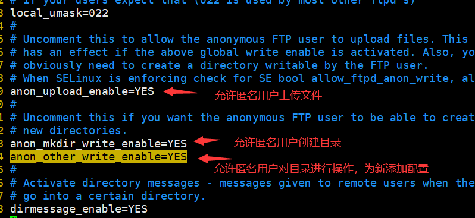
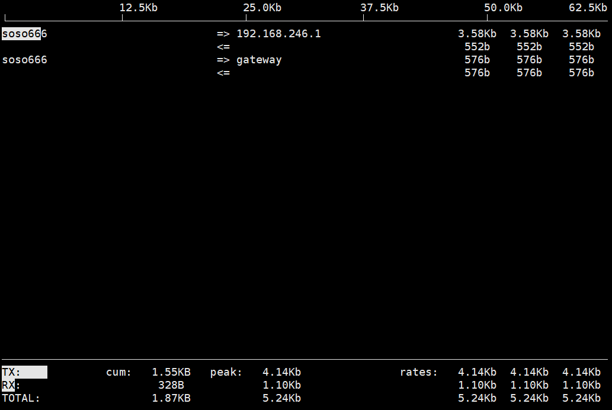

# 一、文件服务器

## 1、构建NFS远程共享存储

```shell
文件系统级别共享（是NAS存储） ---------  已经做好了格式化，可以直接用。 速度慢比如：nfs，samba
=====================================================
因为NFS有很多功能， 不同的功能需要使用不同的端口。因此NFS无法固定端口。而RPC会记录NFS端口的信息，这样就能够通过RPC实现服务端和客户端的RPC来沟通端口信息。

那RPC和NFS之间又是如何之间相互通讯的？

首先当NFS启动后，就会随机的使用一些端口，然后NFS就会向RPC去注册这些端口。RPC就会记录下这些端口。并且RPC会开启111端口，等待客户端RPC的请求，如果客户端有请求，那服务端的RPC就会将记录的NFS端口信息告知客户端。
```

```shell
NFS 
NFS：Network File System 网络文件系统，NFS 和其他文件系统一样，是在 Linux 内核中实现的，因此 NFS 很难做到与 Windows 兼容。NFS 共享出的文件系统会被客户端识别为一个文件系统，客户端可以直接挂载并使用。是Unix系统之间共享文件的一种协议
NFS 文件系统仅支持基于 IP 的用户访问控制，NFS 的客户端主要为Linux。
```

```shell
实验环境准备两台机器
支持多节点同时挂载以及并发写入
服务端：nfs-server 192.168.246.160
客户端：web1 192.168.246.161
```

```shell
centos7（服务端和客户端都关闭防火墙和selinux内核防火墙）

#systemctl stop firewalld

#systemctl disable firewalld	

#setenforce 0
```

## 2、实战

```shell
NFS-server操作
[root@nfs-server ~]# yum -y install rpcbind  #安装rpc协议的包
[root@nfs-server ~]# yum -y install nfs-utils #安装nfs服务,提供文件系统
启动服务
[root@nfs-server ~]# systemctl start nfs
[root@nfs-server ~]# systemctl start rpcbind
[root@nfs-server ~]# mkdir /nfs-dir   #创建存储目录
[root@nfs-server ~]# echo "nfs-test" >> /nfs-dir/index.html  #制作test文件
[root@nfs-server ~]# vim /etc/exports   #编辑共享文件
/nfs-dir        192.168.246.0(rw,no_root_squash,sync)

可选参数注释：
ro：只读
rw：读写
*:表示共享给所有网段。
sync：所有数据在请求时写入共享
root_squash： 对于使用分享目录的使用者如果是root用户，那么这个使用者的权限将被压缩成为匿名使用者，只读权限。
no_root_squash：使用分享目录的使用者，如果是 root 的话，那么对于这个分享的目录来说，他就具有 root 的权限。
```


```shell
[root@nfs-server ~]# systemctl restart nfs-server #重启服务。
[root@nfs-server ~]# systemctl enable nfs-server #制作开机启动

[root@testpm-server ~]# exportfs -v   #确认 NFS 服务器启动
/nfs-dir        192.168.246.0/24(sync,wdelay,hide,no_subtree_check,sec=sys,rw,secure,no_root_squash,no_all_squash)
```

```shell
web1  客户端操作
[root@web1 ~]# yum -y install rpcbind
[root@web1 ~]# yum -y install nfs-utils
[root@web1 ~]# mkdir /Cj #创建挂载点
[root@web1 ~]# mount -t nfs 192.168.246.160:/nfs-dir /Cj  #挂载
[root@web1 ~]# df -Th
Filesystem               Type      Size  Used Avail Use% Mounted on
/dev/mapper/centos-root  xfs        17G  1.1G   16G   7% /
tmpfs                    tmpfs      98M     0   98M   0% /run/user/0
192.168.246.160:/nfs-dir nfs4       17G  1.4G   16G   8% /Cj
[root@web1 ~]# ls /Cj
index.html
[root@web1 ~]# umount /Cj  #取消挂载


制作开机挂载
[root@client.Asuka.com ~]# vim /etc/fstab
192.168.246.160:/nfs-dir    /Cj          nfs     defaults        0 0
[root@client.Asuka.com ~]# mount -a
```

# 二、ftp及lftp

## 1、Ftp 介绍

- 文件传输协议（File Transfer Protocol，FTP），基于该协议FTP客户端与服务端可以实现共享文件、上传文件、下载文件。 FTP 基于TCP协议生成一个虚拟的连接，用户可以通过客户端向FTP服务器端上传、下载、删除文件，FTP服务器端可以同时提供给多人共享使用。

- FTP服务是Client/Server（简称C/S）模式，基于FTP协议实现FTP文件对外共享及传输的软件称之为FTP服务器源端，客户端程序基于FTP协议，则称之为FTP客户端，FTP客户端可以向FTP服务器上传、下载文件。

```shell
FTP Server
作用：提供文件共享服务,实现上传下载
端口：
21号，建立tcp连接  默认端口
20号：传输数据
```

## 2、FTP基础

```shell
软件包:        vsftpd
FTP端口:         控制端口 command 21/tcp 
配置文件:          /etc/vsftpd/vsftpd.conf
```

### 2.1、ftp主动模式

```shell
ftp主动模式：客户端开启一个端口N（>1023）向服务端的21端口，建立连接，同时开启一个N+1，告诉服务端，我监听的是N+1端口，服务端接到请求之后，用自己的20端口连接到客户端的N+1端口，进行传输

21端口建立连接
20端口传输数据
```

### 2.2、ftp被动模式

```shell
ftp被动模式：客户端同时开启两个端口（1024，1025），一个端口（1024）跟服务端的21端口建立连接，并请求，大哥，我连上了，你再开一个端口呗。服务端接到请求之后，随机会开启一个端口（1027）并告诉客户端我开启的是1027端口，客户端用另一个端口（1025）与服务端的（1027）端口进行连接，传输数据
```

# 三、Vsftp 服务器简介

- 非常安全的FTP服务进程（Very Secure FTP daemon，Vsftpd），Vsftpd在Unix/Linux发行版中最主流的FTP服务器程序，优点小巧轻快，安全易用、稳定高效、满足企业跨部门、多用户的使用（1000用户）等。

## 1、vsftpd配置

```shell
FTP Server（服务端）
实验环境--准备两台机器
关闭防火墙和selinux
#systemctl stop firewalld
#systemctl disable firewalld	
#setenforce 0
=========================================
ftp-server 192.168.246.160
client 192.168.246.161
==========================================
[root@ftp-server ~]# yum install -y vsftpd
[root@ftp-server ~]# systemctl start vsftpd
```

```shell
FTP默认共享目录：/var/ftp
[root@ftp-server ~]# touch /var/ftp/pub/test.txt  #创建文件到共享目录
[root@ftp-server ~]# systemctl enable vsftpd
[root@ftp-server ~]# cd /var/ftp/
[root@ftp-server ftp]# ls
pub
[root@ftp-server ftp]# chown ftp.ftp pub/ -R  #修改根目录的属主与属组
[root@ftp-server ftp]# ll 
total 0
drwxr-xr-x. 2 ftp ftp 22 Aug  3 03:15 pub
```

- 重点：改变根目录的属主，如果不改变的话，只能访问，其他权限不能生效。因为我们是以ftp用户的身份访问的，而pub默认的属主属组是root。

- 注意：

  ```shell
  - 修改完配置之后需要重启完服务才能生效
  - 还需要从新从客户端登陆，否则修改后的配置看不到效果。
  ```

## 2、编辑配置文件

```shell
[root@ftp-server ~]# vi /etc/vsftpd/vsftpd.conf ----找到29行将下面的注释取消
34 anon_other_write_enable=YES
anon_umask=000  #匿名用户上传下载目录权限掩码
```



```shell
35 anon_umask=000
```

```shell
[root@ftp-server ~]# systemctl restart vsftpd
```

```shell
FTP Clinet（客户端）
关闭防火墙和selinux
[root@client ~]# yum -y install lftp #安装客户端
get命令（下载，首先要开启下载功能）
[root@client ~]# lftp 192.168.246.160
lftp 192.168.246.160:~> ls
drwxr-xr-x    2 0        0               6 Oct 30  2018 pub
lftp 192.168.246.160:/> cd pub/
lftp 192.168.246.160:/pub> ls
-rw-r--r--    1 14       50              0 Aug 02 19:14 test.txt
lftp 192.168.246.160:/pub> get test.txt   #下载
lftp 192.168.246.160:/pub> exit
[root@client ~]# ls  #会下载到当前目录
anaconda-ks.cfg  test.txt

[root@client ~]# lftp 192.168.246.160
lftp 192.168.246.160:/pub> mkdir dir  #也可以创建目录
mkdir ok, `dir' created

put命令（上传命令，上传之前请在服务端进行配置，将上传功能打开）
[root@client ~]# touch upload.txt  #创建测试文件
[root@client ~]# mkdir /test/  #创建测试目录
[root@client ~]# touch /test/test1.txt #在测试目录下面创建测试文件
[root@client ~]# lftp 192.168.246.160
lftp 192.168.246.160:~> cd pub/
lftp 192.168.246.160:/pub> put /root/upload.txt  #上传文件
lftp 192.168.246.160:/pub> ls
-rw-------    1 14       50              0 Nov 16 12:14 upload.txt
drwx------    2 14       50              6 Aug 02 19:17 dir
lftp 192.168.246.160:/pub> mirror -R /test/  #上传目录以及目录中的子文件
Total: 1 directory, 1 file, 0 symlinks
New: 1 file, 0 symlinks
lftp 192.168.246.160:/pub> ls
drwx------    2 14       50             23 Nov 16 12:18 test
-rw-------    1 14       50              0 Nov 16 12:14 upload.txt

mirror 下载目录
```

## 3、ftp配置本地用户登录

### 3.1、创建测试用户

`创建 zhangsan、lisi  密码都设置为 “123456”`

```shell
[root@ftp-server ~]# useradd zhangsan 
[root@ftp-server ~]# useradd lisi
[root@ftp-server ~]# echo '123456' | passwd --stdin  zhangsan  #设置密码
Changing password for user zhangsan.
passwd: all authentication tokens updated successfully.
[root@ftp-server ~]# echo '123456' | passwd --stdin  lisi 
Changing password for user lisi.
passwd: all authentication tokens updated successfully.
```

### 3.2、配置本地用户ftp配置文件

```shell
[root@ftp-server ~]# vim /etc/vsftpd/vsftpd.conf  ---添加注释并修改 
anonymous_enable=NO           #将允许匿名登录关闭   12行
#anon_umask=022                #匿名用户所上传文件的权限掩码 
#anon_upload_enable=YES        #允许匿名用户上传文件
#anon_mkdir_write_enable=YES   #允许匿名用户创建目录
#anon_other_write_enable=YES    #是否允许匿名用户有其他写入权（改名，删除，覆盖）
新添加
local_root=/home/zhangsan       # 设置本地用户的FTP根目录，一般为用户的家目录
local_max_rate=0                # 限制最大传输速率（字节/秒）0为无限制
```


### 3.3、重启vsftpd

```shell
[root@ftp-server ~]# systemctl restart vsftpd
```

### 3.4、客户端操作

```shell
[root@ftp-client ~]# lftp 192.168.153.137 -u zhangsan
Password: 
lftp zhangsan@192.168.153.137:~> ls
lftp zhangsan@192.168.153.137:~> mkdir aaa
mkdir ok, `aaa' created
lftp zhangsan@192.168.153.137:~> ls
drwxr-xr-x    2 1000     1000            6 Aug 02 20:55 aaa
lftp zhangsan@192.168.153.137:~> put /root/test.txt 
lftp zhangsan@192.168.153.137:~> ls
drwxr-xr-x    2 1000     1000            6 Aug 02 20:55 aaa
-rw-r--r--    1 1000     1000            0 Aug 02 20:59 test.txt

服务器端查看
[root@ftp-server ~]# cd /home/zhangsan/
[root@ftp-server zhangsan]# ls
aaa  test.txt
[root@ftp-server zhangsan]# ll
total 0
drwxr-xr-x. 2 zhangsan zhangsan 6 Aug  3 04:55 aaa
-rw-r--r--. 1 zhangsan zhangsan 0 Aug  3 04:59 test.txt
```

# 四、系统优化检测常用命令

`知识点`

```shell
（简介：系统优化其本质是系统在提供服务的同时，承受压力过大需进行参数调优）
```

## 1、查看平均负载 

```shell
系统负载System Load：系统CPU繁忙程度的度量，即有多少进程在等待被CPU调度,平均负载（Load Average）：一段时间内系统的平均负载，这个一段时间一般取1分钟、5分钟、15分钟
```

```shell
[root@linux-server ~]# uptime
20:42:26 up  6:12,  2 users,  load average: 0.00, 0.01, 0.05
1分钟平均负载，5分钟平均负载，15分钟平均负载分别是0.00,0.01,0.05
```

## 2、释放buffer和cache

```shell
[root@linux-server ~]# echo 3 > /proc/sys/vm/drop_caches
```

## 3、带宽使用情况

```shell
[root@linux-server ~]# yum install -y iftop.x86_64
```



```shell
第一行：界面上面显示的是类似刻度尺的刻度范围，为显示流量图形的长条作标尺用的。
中间部分：中间的<= =>这两个左右箭头，表示的是流量的方向。=>代表发送，<=代表接收。
TX：发送流量
RX：接收流量
TOTAL：总流量
Cum：运行iftop到目前时间的总流量
peak：流量峰值
rates：分别表示过去 2s 10s 40s 的平均流量
```

## 4、网络接口统计报告

```shell
[root@linux-server ~]# yum install -y nethogs.x86_64
[root@linux-server ~]# nethogs
```


```shell
 实例1：监视ens33网络带宽 
# nethogs ens33 
实例2：同时监视ens33和ens34接口 
# nethogs ens33 ens34
```
