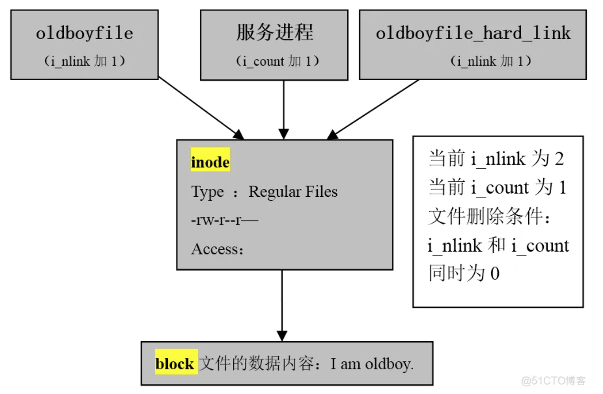
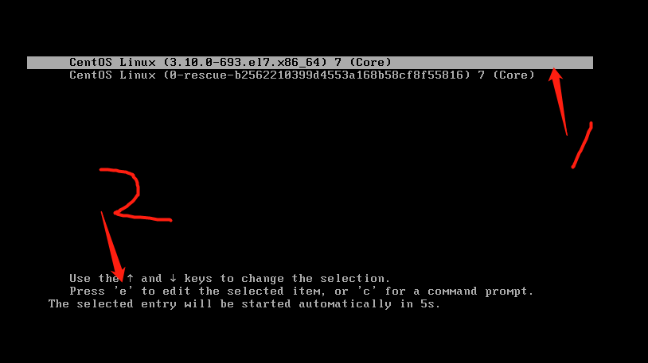
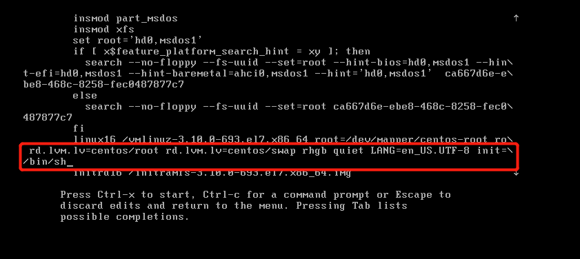

# 一、文件查找与打包压缩

## 1、grep:  文件内容过滤 

```shell
[root@Asuka.com ~]# grep 'root' /etc/passwd  #从/etc/passwd文件中过滤root字段
root:x:0:0:root:/root:/bin/bash
operator:x:11:0:operator:/root:/sbin/nologin
```

## 2、查找命令

```shell
[root@Asuka.com ~]# which ls
alias ls='ls --color=auto'
        /usr/bin/ls
[root@Asuka.com ~]# which cd
/usr/bin/cd
[root@Asuka.com ~]# which rm
alias rm='rm -i'
        /usr/bin/rm
```

## 3、查询命令和配置文件的位置

```shell
[root@Asuka.com ~]# whereis rpm 
rpm: /usr/bin/rpm /usr/lib/rpm /etc/rpm /usr/share/man/man8/rpm.8.gz
[root@Asuka.com ~]# whereis passwd
passwd: /usr/bin/passwd /etc/passwd /usr/share/man/man1/passwd.1.gz
```

# 二、find详解:   文件查找，针对文件名

```shell
语法：
#find 路径 条件 跟条件相关的操作符   [-exec 动作]
路径:
1.默认不写路径时查找的是当前路径.
2.加路径。
条件：
1.指定的名称  -name
2.文件类型  -type
3.权限
4.时间
```

## 1、按文件名

```shell
从根开始找文件
[root@Asuka.com ~]# find / -name “file2” #从根开始找文件
/root/file2
/var/tmp/file2
[root@Asuka.com ~]# find /etc -name "ifcfg-ens33" #以名字的方式查找 
[root@Asuka.com ~]# find /etc -iname "Ifcfg-ens33" #-i忽略大小写
```

`熟用*通配符`

```shell
[root@Asuka.com ~]# find /etc -iname "*.txt"
参数解释：
*：表示所有字符
```

## 2、按文件大小    -size

```shell
[root@Asuka.com ~]# find /etc -size +5M		#大于5M
[root@Asuka.com ~]# find /etc -size 5M		#等于5M
[root@Asuka.com ~]# find /etc -size -5M      #小于5M
[root@Asuka.com ~]# find / -size +3M -a -size -5M  #查找/下面大于3M而且小于5M的文件
-a：add
[root@Asuka.com ~]# find / -size -1M -o -size +80M #查找/下面小于1M或者大于80M的文件
-o：or
[root@Asuka.com ~]# find / -size -3M -a -name "*.txt" #查找/ 下面小于3M而且名字是.txt的文件
```

## 3、按时间查找

```shell
按时间找(atime,mtime,ctime)
-atime=  access访问时间
-mtime = modify改变时间  内容修改时间会改变
-ctime =change修改时间   属性修改时间会改变

-amin  #分钟
-mmin
-cmin
```

```shell
[root@Asuka.com ~]# find /opt -mtime +5		#修改时间5天之前
[root@Asuka.com ~]# find /opt -atime +1     #访问时间1天之前
[root@Asuka.com ~]# find . -mtime -2		#修改时间2天之内

[root@Asuka.com ~]# find . -amin +1         #访问时间在1分钟之前
[root@Asuka.com ~]# find /opt -amin -4      #访问时间在4分钟之内
[root@Asuka.com ~]# find /opt -mmin -2      #修改时间在2分钟之内
```

## 4、按文件类型

```shell
[root@Asuka.com ~]# find /dev -type f	#f普通文件
[root@Asuka.com ~]# find / -type f -size -1M -o -name "*.txt"

[root@Asuka.com ~]# find /dev -type d	#d目录
[root@Asuka.com ~]# find /etc/ -type d -name "*.conf.d"

[root@Asuka.com ~]# find /etc -type l	#l链接

[root@Asuka.com ~]# find /dev -type b	#b块设备
[root@Asuka.com ~]# find /dev/ -type b -name "sd*"
```

## 5、按文件权限

```shell
[root@Asuka.com ~]# find . -perm 644            #.是当前目录    精确查找644  
[root@Asuka.com ~]# find /usr/bin  -perm -4000  #包含set uid
[root@Asuka.com ~]# find /usr/bin  -perm -2000  #包含set gid
[root@Asuka.com ~]# find /usr/bin  -perm -1000  #包含sticky
```

## 6、找到后处理的动作        

```shell
-name "ifcfg*" | xargs
-name "ifcfg*" -print   #打印
```

```shell
[root@Asuka.com ~]# find /etc -name "ifcfg*" -exec cp -rf {} /tmp \; #exec命令对之前查找出来的文件做进一步操作-----  查找带ifcfg开头的文件复制到tmp下
[root@Asuka.com ~]# touch /home/test{1..20}.txt
[root@Asuka.com ~]# find /home/ -name test* -exec rm -rf {} \; #｛｝为前面查找到的内容,\; 格式
```

`find使用xargs`

```shell
[root@Asuka.com ~]# touch /home/test{1..20}.txt
[root@Asuka.com ~]# # find /home/ -name "test*" | xargs -i cp {} /tmp/ #找到之后删除处理xargs 参数传递
```

`-exec和xargs的区别`

```shell
-exec:参数是一个一个传递的，传递一个参数执行一次命令。
xargs:将前一个命令的标准输出传递给下一个命令，作为它的参数转换成下一个命令的参数列表。
===============
1、exec 每处理一个文件或者目录，它都需要启动一次命令，效率不好; 
2、exec 格式麻烦，必须用 {} 做文件的代位符，必须用 \来转义; 作为命令的结束符，书写不便。 
3、xargs不能操作文件名有空格的文件；

综上，如果要使用的命令支持一次处理多个文件，并且也知道这些文件里没有带空格的文件，
那么使用 xargs比较方便; 否则，就要用 exec了。
```

## 7、并集：查找名为hosts，或者类型为d

```bash
[root@oldboy ~]# find / -name "hosts" -o -type d -name "oldboy"
/etc/hosts
/tmp/hosts
/tmp/etc/hosts
/home/oldboy
/home/oldboy/hosts
/opt/etc/hosts
```

## 8、取反：!查找名字不是file1

```bash
[root@oldboy ~]# mkdir /data -p
[root@oldboy ~]# touch /data/file{1..3}
[root@oldboy ~]# find /data -name "file1"
/data/file1
[root@oldboy ~]# find /data ! -name "file1"
/data
/data/file2
/data/file3
```

# 三、打包压缩

`window打包压缩工具`

```shell
结尾：.rar     .zip
打包工具：winrar zip 7zip 好压
```

`linux打包压缩工具`

```shell
结尾：.tar.gz      .tar.bz2     .zip
```

```shell
工具：gzip和tar(打包)  unzip 解决  .zip 

bzip2（只压缩）
```

## 1、打包

```shell
语法:
#tar cvf xxxx.tar filename   被打包的文件 ...
c ：create  创建
v ：verbose 详细信息
f ：file  文件
```

## 2、解包

```shell
#tar xvf filename.tar [-C /root/Desktop]
x： extract  解压缩  解包
-C： 指定解包路径
```

`案例`

```shell
[root@Asuka.com ~]# tar cvf dir1.tar /home/dir10/ #打包目录dir10，将包命名为dir1.tar
[root@Asuka.com ~]# tar xf dir1.tar -C /usr/local/ #将dir1包解压到指定目录
```

## 3、压缩

```shell
gzip bzip2

语法:
压缩:
	#gzip  源文件   #格式  file.gz结尾
	#bzip2 源文件   #格式  file.bz2结尾
```

`bzip2需要安装`

```shell
[root@Asuka.com ~]# yum -y install bzip2  #打包bzip2需要安装
```

## 4、解压缩

```shell
语法:
#gunzip    压缩文件
#bunzip2   压缩文件
#gzip 	-d 压缩文件  
#bzip2  -d 压缩文件
-d：dicompress 解压缩
```

`案例`

```shell
[root@Asuka.com ~]# gzip file1  #压缩
[root@Asuka.com ~]# gzip -d file1.gz #解压缩
[root@Asuka.com ~]# gunzip file1.gz  #也是解压缩包
[root@Asuka.com ~]# gzip -c file1 > /usr/local/file1.gz  #压缩到指定位置(注意以.gz结尾)
[root@Asuka.com ~]# gunzip -c /usr/local/file1.gz > /opt/file1 #解压到指定位置（解压出的名字可以自定义）
-c, --stdout
```

## 5、打包压缩一起

```shell
语法:
#tar cvzf file.tar.gz  源文件
#tar cvjf file.tar.bz2 源文件
z：表示gz压缩
j：表示bz2压缩
```

## 6、解压解包一起

```shell
语法:
#tar xvzf 压缩文件 [-C 解压路径]
#tar xvjf 压缩文件 [-C 解压路径]
```

`案例`

```shell
[root@Asuka.com ~]# tar czf dir1.tar.gz dir1              #打包并压缩
[root@Asuka.com ~]# tar xzf dir1.tar.gz -C /usr/local/    #解压到指定位置
```

`打包到指定路径`

```shell
[root@Asuka.com ~]# tar czf /tmp/`date +%F-%X`-etc.tar.gz /etc/  #将打包的文件放到/tmp目录下，并以当前时间开头命名
```

`扩展--按时间创建目录或者文件`

```shell
# mkdir `date +%F`-upload
# touch file-`date +%F`.txt
```


# 四、链接文件

**文件核心属性知识**

## 1、inode介绍

### 1.1、什么是索引节点（inode）

中文意思是索引节点(index node)
是磁盘上的一块【存储空间】。
一个inode大小256字节。
看到形态是一个串数字（身份证）。

### 1.2、索引节点的作用

存储文件的属性信息(大小、用户、组、修改时间 ls -l的信息都在里面放着)。
还存放一个重要的东西，指向文件真正实体的位置信息（指针）。

### 1.3、inode是怎样产生的

```bash
1）买回来磁盘，要使用的4个步骤。
  （1）分区（打隔断），c,d,e/ sda1/sda2
  （2）格式化（装修），创建文件系统。
  什么是文件系统？组织和存储数据的一种机制。（装修风格）
  （3）挂载（搞个门搞个窗户）
  （4）使用（拎包入住）。
2）inode是在磁盘格式化，创建[文件系统]的时候产生的。
Linux文件系统ext4,xfs，windows文件系统,ntfs,fat32
创建[文件系统]的时候就会生成inode和block.
inode和block都是磁盘空间的组成。
```

```bash
数据分为两种形式：
1）AV实体称之为真正数据。
2）AV属性信息（40G），美国生产。元数据：数据的数据信息。
找女生，先要获取元数据，然后在需要数据。

元数据就要放在inode里。
真正数据就放在block里。
```

### 1.4、inode的特点

```bash
1）是文件的唯一标识（身份证）。
2）大小256字节。
3）存放文件属性信息及指向文件所在位置信息。
4）创建文件的时候就分配inode。
5）一个文件有且只有一个inode（分区或磁盘内）。
6）多个文件有相同的inode，是同一个文件的不同文件名。
   这样的文件被称为硬链接文件。
```

### 1.5、Linux系统读取文件的原理


```bash
创建文件。/Asuka.txt
1.文件名放到/etc下block里。
2.分配inode（256字节），放文件属性。
3.分配block，放文件内容（多个block）。
```

### 1.6、什么情况会导致inode满？

```
1）小文件特别多的时候。
2）多数情况下是基于日常Linux定时任务crond配置不当导致的。
```

## 2、block介绍

```bash
1）存放文件实体内容的空间。
2）默认大小1,2,4K。
3）一个block只能被一个文件占有，不能放两个文件。
   如果文件大小0.1K,也会占一个block。剩余3.9K浪费了。
4）block是文件系统存储大小的基本单位。
   如果文件较大，block就是大点好，读数据是按block读取，block是4K，一次读4K。
   如果文件小，
   分布式文件系统，block可能到64K
```

`block特点`

```bash
磁盘读取数据是按Block为单位读取的。
每读取一个Block就会消耗一次磁盘I/O（input/output 磁盘读写）。
若文件比较大，一个文件可能占用多个Block。
若文件比较小，一个Block剩余空间会被浪费，无论内容有多小。
```

## 3、和磁盘block，inode有关的命令

```bash
#1）查看文件inode
[root@oldboy ~]# ls -li
总用量 29724
33583628 -rw-r--r--. 1 root root      184 5月  12 2021 ab.txt
```

```bash
#2)查看磁盘和分区的inode
[root@oldboy ~]# df -i
文件系统                  Inode 已用(I) 可用(I) 已用(I)% 挂载点
devtmpfs                 500271     337  499934       1% /dev
tmpfs                    503267       1  503266       1% /dev/shm
tmpfs                    503267    1217  502050       1% /run
tmpfs                    503267      16  503251       1% /sys/fs/cgroup
/dev/mapper/centos-root 8910848   67454 8843394       1% /
/dev/sda1                524288     326  523962       1% /boot
tmpfs                    503267       1  503266       1% /run/user/0
```

```bash
#3)查看磁盘和分区的大小（block）
[root@oldboy ~]# df -h
文件系统                 容量  已用  可用 已用% 挂载点
devtmpfs                 2.0G     0  2.0G    0% /dev
tmpfs                    2.0G     0  2.0G    0% /dev/shm
tmpfs                    2.0G  100M  1.9G    6% /run
tmpfs                    2.0G     0  2.0G    0% /sys/fs/cgroup
/dev/mapper/centos-root   17G  2.1G   15G   13% /
/dev/sda1               1014M  138M  877M   14% /boot
tmpfs                    394M     0  394M    0% /run/user/0
```

`软链接 或 符号链接 硬链接`

## 4、硬链接 

### 4.1、什么是硬链接

```bash
1）具有【相同索引节点号】的文件，互相称之为硬链接文件。
2）具有【相同索引节点号】的文件，指向同一个文件实体。
```

### 4.2、硬链接文件的作用

```bash
用于备份，防止误删文件。
```

### 4.3、硬链接知识

```bash
1）具有相同Inode节点号的多个文件互为硬链接文件，本质是相同文件不同文件名。
2）删除硬链接文件或者删除源文件任意之一，文件实体并未被删除。
只有删除了源文件及所有对应的硬链接文件，文件实体才会被删除。
3）待所有的硬链接文件及源文件被删除后，
  a.存放新的数据会占用这个文件的空间，
  b.磁盘fsck检查（定时或人工）的时候，删除的数据也会被系统回收
（养成删除及使用多套环境测试的好习惯）。
4）硬链接文件就是文件的另一个入口（相当于超市的前门、后门）。
5）可以通过给文件设置硬链接文件，来防止重要文件被误删。
6）通过执行命令“ln 源文件 硬链接文件”，即可完成创建硬链接。
7)硬链接文件是普通文件，因此可以用rm命令删除。
8)创硬链接只能针对文件，不能针对目录。
```

```shell
[root@Asuka.com ~]# echo 222 > /file2
[root@Asuka.com ~]# ll -i /file2                 #-i：显示inode编号
34045994 -rw-r--r-- 1 root root 4 Dec 29 20:52 file2
[root@Asuka.com ~]# ln /file2 /file2-h1
[root@Asuka.com ~]# ll -i /file2 /file2-h1       #查看inode号
34045994 -rw-r--r-- 2 root root 4 7月  30 22:25 /file2
34045994 -rw-r--r-- 2 root root 4 7月  30 22:25 /file2-h1

[root@Asuka.com ~]# rm -rf /file2        #删除源文件
[root@Asuka.com ~]# ll -i /file2-h1      #查看链接文件
34045994 -rw-r--r--. 3 root root 4 Nov  9 15:01 /file2-h1
查看:
[root@Asuka.com ~]# cat /file2-h1
222
```

```shell
运行上面这条命令以后，源文件与目标文件的inode号码相同，都指向同一个inode。inode信息中有一项叫做"链接数"，记录指向该inode的文件名总数，这时就会增加1。

反过来，删除一个文件名，就会使得inode节点中的"链接数"减1。当这个值减到0，表明没有文件名指向这个inode，系统就会回收这个inode号码，以及其所对应block区域。
```

## 5、软连接

### 5.1、什么是软链接

```bash
软链接就是快捷方式，指向源文件的位置。
```

### 5.2、软连接企业意义

```bash
nginx web服务
安装目录：/application/nginx-1.19.1
使用方面：/application/nginx  #简单方便，程序软件配置的都是这个。
升级版本：/application/nginx-1.20.2 #正式使用。。
升级操作：
rm -f /application/nginx
ln -s /application/nginx-1.20.2 /application/nginx
```

### 5.3、软链接知识

```bash
1）软链接类似Windows的快捷方式（可以通过readlink查看其指向）。
2）软链接类似一个文本文件，里面存放的是源文件的路径，指向源文件实体。
3）删除源文件，软链接文件依然存在，但是无法访问指向源文件路径内容了。
链接失效的时候一般是白字红底闪烁提示。
4）执行命令“ln -s 源文件 软链接文件”，即可完成创建软链接（目标不能存在）。
5）软链接和源文件是不同类型的文件，也是不同的文件，Inode号也不相同。
6）软链接文件的文件类型为字母(l)，可以用rm命令删除。
7）软链接文件不仅可以针对文件，更可以针对目录（企业中常用）。
```

## 6、Linux系统文件删除原理

```bash
1）静态文件
i_link=0，解释硬链接数为0，所有的硬链接都删除文件就被删除了。
2）动态文件
i_count=0, 进程引用计数为0，没有被进程调用（使用）的文件。
3）原理见图
```



`ln -s 命令可以创建软链接`

```shell
语法：ln -s  源文件  链接文件

[root@Asuka.com ~]# echo 111 > /file1
[root@Asuka.com ~]# ll -i /file1 
545310 -rw-r--r-- 1 root root 4 7月  30 22:06 /file1
[root@Asuka.com ~]# ln -s /file1 /file11		#将文件file1软链接到file11
[root@Asuka.com ~]# ll /file11 
lrwxrwxrwx 1 root root 6 Dec 20 17:58 /file11 -> /file1

[root@Asuka.com ~]# ll -i /file11 /file1    #查看inode号
545310 -rw-r--r-- 1 root root 4 7月  30 22:06 /file1
545343 lrwxrwxrwx 1 root root 6 7月  30 22:06 /file11 -> /file1

[root@Asuka.com ~]# cat /file1 
111
[root@Asuka.com ~]# cat /file11 
111

[root@Asuka.com ~]# rm -rf /file11 #取消软连接。

[root@Asuka.com ~]# ln -s /file1 /file11
[root@Asuka.com ~]# rm -rf /file1  #删除源文件
[root@Asuka.com ~]# ll /file11 
lrwxrwxrwx 1 root root 6 Dec 20 17:58  /file11 -> /file1   #已失效

#给目录设置软链接必须是绝对路劲
[root@Asuka.com ~]# ln -s /root/aaa/ /usr/bbb
[root@Asuka.com ~]# ll /usr/bbb
lrwxrwxrwx 1 root root 10 Dec 29 21:08 /usr/bbb -> /root/aaa/
[root@Asuka.com ~]# rm -rf /usr/bbb  #取消链接，注意:删除目录链接时目录后面加“/”是删除目录，不加是删除链接
```

`把一些重要文件做多个链接`

```shell
注：硬链接 
1. 不能跨文件系统
2. 不支持目录做硬链接
```

```shell
 [root@Asuka.com ~]# ln /root/aaa/ /mnt/bbb
ln: "/root/aaa/": 不允许将硬链接指向目录
```

# 五、破解密码---扩展

```shell
# cat /etc/redhat-release 
CentOS Linux release 7.7.1908 (Core)
```

```shell
修复模式：
1，特权模式：不需要root密码，直接以root账户身份登陆。
破解密码时特权模式。
```

```shell
1.重起系统,进入grub菜单
2.选择要使用的内核
3.按e
```



```shell
4.找到linux16那一行，把光标移动到最后，添加 init=/bin/sh
5.ctrl+x #保存退出
```



```shell
6.进入系统后，以rw方式重新挂载/分区
#mount -o remount,rw   /
7.永久关闭selinux
#vim /etc/sysconfig/selinux
8.修改密码
```


```shell
9.  # touch /.autorelabcl  #重新识别新的root密码
10. # exec /sbin/init  #重启机器，
```

